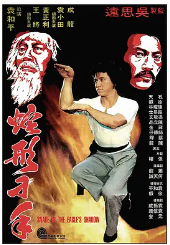
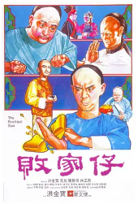
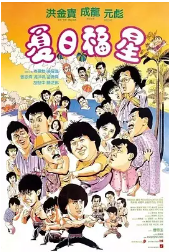
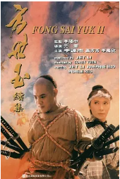
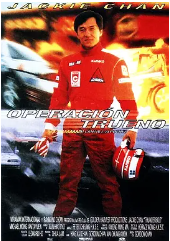
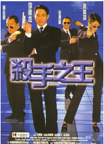
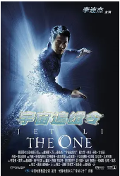
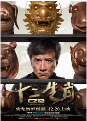

## 

[豆瓣评分: ]()

## 蛇形刁手

[豆瓣评分: 7.4](https://movie.douban.com/subject/1498658/)

导演: [袁和平](https://www.douban.com/personage/27504123/)

编剧: [萧龙](https://movie.douban.com/subject_search?search_text=萧龙) / [吴思远](https://www.douban.com/personage/27521403/) / [蔡继光](https://movie.douban.com/subject_search?search_text=蔡继光)

主演: [成龙](https://www.douban.com/personage/27260298/) / [袁小田](https://www.douban.com/personage/27549803/) / [黄正利](https://www.douban.com/personage/27242874/) / [石天](https://www.douban.com/personage/27351873/) / [陈龙](https://www.douban.com/personage/27494246/) / [赵志凌](https://www.douban.com/personage/27502643/) / [徐虾](https://www.douban.com/personage/27542301/)

上映日期: 1978-03-01

片长: 98分钟 / 90分钟(日本)

## 笑拳怪招

[豆瓣评分: 7.0](https://movie.douban.com/subject/1295273/)

导演: [成龙](https://www.douban.com/personage/27260298/)

编剧: [成龙](https://www.douban.com/personage/27260298/)

主演: [成龙](https://www.douban.com/personage/27260298/) / [田俊](https://www.douban.com/personage/27565171/) / [李昆](https://www.douban.com/personage/27213911/) / [石天](https://www.douban.com/personage/27351873/) / [任世官](https://www.douban.com/personage/27371564/) / [程天赐](https://www.douban.com/personage/27543002/) / [韩鹰](https://www.douban.com/personage/27559221/) / [金世玉](https://www.douban.com/personage/27559222/) / [万里鹏](https://www.douban.com/personage/27559223/) / [朱少华](https://www.douban.com/personage/27559224/) / [江志平](https://www.douban.com/personage/27559225/) / [徐沅](https://www.douban.com/personage/27559226/) / [陈慧楼](https://www.douban.com/personage/27487288/) / [马场](https://www.douban.com/personage/27559227/) / [王耀](https://www.douban.com/personage/27559228/) / [王圻生](https://www.douban.com/personage/27557794/) / [何兴南](https://www.douban.com/personage/27559229/)

上映日期: 1979-02-17

片长: 92分钟

## 师弟出马

[豆瓣评分: 7.3](https://movie.douban.com/subject/1294131/)

导演: [成龙](https://www.douban.com/personage/27260298/)

编剧: [成龙](https://www.douban.com/personage/27260298/) / [邓景生](https://movie.douban.com/subject_search?search_text=邓景生) / [刘天赐](https://movie.douban.com/subject_search?search_text=刘天赐) / [童路](https://movie.douban.com/subject_search?search_text=童路)

主演: [成龙](https://www.douban.com/personage/27260298/) / [元彪](https://www.douban.com/personage/27369644/) / [李丽丽](https://movie.douban.com/subject_search?search_text=李丽丽) / [李海生](https://www.douban.com/personage/27495114/) / [田丰](https://www.douban.com/personage/27225346/) / [太保](https://www.douban.com/personage/27541055/) / [石坚](https://www.douban.com/personage/27346563/)

上映日期: 1980-02-09(中国香港)

片长: 106分钟

## 蛇猫鹤混型掌

[豆瓣评分: 6.5](https://movie.douban.com/subject/4092954/)

导演: [罗文](https://movie.douban.com/subject_search?search_text=罗文) / [萧龙](https://movie.douban.com/subject_search?search_text=萧龙)

主演: [恬妞](https://movie.douban.com/subject_search?search_text=恬妞) / [石坚](https://movie.douban.com/subject_search?search_text=石坚) / [高飞](https://movie.douban.com/subject_search?search_text=高飞) / [黄正利](https://www.douban.com/personage/27242874/)

上映日期: 1980-03-06(中国香港)

片长: 102 分钟

## 败家仔

[豆瓣评分: 7.7](https://movie.douban.com/subject/1292601/)

导演: [洪金宝](https://movie.douban.com/celebrity/1055887/)

编剧: [黄炳耀](https://movie.douban.com/celebrity/1014964/) / [洪金宝](https://movie.douban.com/celebrity/1055887/) / [王晶](https://movie.douban.com/celebrity/1274331/)

主演: [元彪](https://movie.douban.com/celebrity/1163752/) / [林正英](https://movie.douban.com/celebrity/1016823/) / [陈勋奇](https://movie.douban.com/celebrity/1280419/) / [洪金宝](https://movie.douban.com/celebrity/1055887/) / [陈龙](https://movie.douban.com/celebrity/1321791/) / [钟发](https://movie.douban.com/celebrity/1314531/) / [狄威](https://movie.douban.com/celebrity/1318441/) / [钱月笙](https://movie.douban.com/subject_search?search_text=钱月笙) / [午马](https://movie.douban.com/celebrity/1054282/)

上映日期: 1981-12-22
片长: 104分钟

## 龙少爷

[豆瓣评分: 6.9](https://movie.douban.com/subject/1297213/)

导演: [成龙](https://www.douban.com/personage/27260298/)

编剧: [黄炳耀](https://www.douban.com/personage/27220679/) / [邓景生](https://movie.douban.com/subject_search?search_text=邓景生) / [成龙](https://www.douban.com/personage/27260298/)

主演: [成龙](https://www.douban.com/personage/27260298/) / [元奎](https://movie.douban.com/subject_search?search_text=元奎) / [冯克安](https://movie.douban.com/subject_search?search_text=冯克安) / [陈惠敏](https://www.douban.com/personage/27218391/) / [郑康业](https://www.douban.com/personage/27279487/) / [火星](https://www.douban.com/personage/27238797/)

上映日期: 1982-01-21

片长: 102分钟

## 五福星 1：奇谋妙计五福星

[豆瓣评分: 7.9](https://movie.douban.com/subject/1293658/)

导演: [洪金宝](https://www.douban.com/personage/27261621/)

编剧: [洪金宝](https://www.douban.com/personage/27261621/) / [黄炳耀](https://www.douban.com/personage/27220679/)

主演: [洪金宝](https://www.douban.com/personage/27261621/) / [吴耀汉](https://www.douban.com/personage/27243159/) / [冯淬帆](https://www.douban.com/personage/27481706/) / [岑建勋](https://www.douban.com/personage/27487357/) / [秦祥林](https://www.douban.com/personage/27254218/) / [钟楚红](https://www.douban.com/personage/27211232/) / [成龙](https://www.douban.com/personage/27260298/) / [叶童](https://www.douban.com/personage/27239225/) / [林正英](https://www.douban.com/personage/27222546/) / [夏文汐](https://www.douban.com/personage/27480537/) / [太保](https://movie.douban.com/subject_search?search_text=太保) / [元彪](https://www.douban.com/personage/27369644/) / [李赛凤](https://www.douban.com/personage/27211186/) / [午马](https://www.douban.com/personage/27260050/)

上映日期: 1983-07-07

片长: 108 分钟

## 快餐车

[豆瓣评分: 7.9](https://movie.douban.com/subject/1292867/)

导演: [洪金宝](https://www.douban.com/personage/27261621/)

编剧: [邓景生](https://www.douban.com/personage/27527184/) / [李炯楷](https://www.douban.com/personage/27569847/)

主演: [成龙](https://www.douban.com/personage/27260298/) / [洪金宝](https://www.douban.com/personage/27261621/) / [元彪](https://www.douban.com/personage/27369644/) / [劳拉·福纳](https://www.douban.com/personage/27224674/) / [张冲](https://www.douban.com/personage/27503179/) / [吴耀汉](https://www.douban.com/personage/27243159/) / [岑建勋](https://www.douban.com/personage/27487357/) / [午马](https://www.douban.com/personage/27260050/) / [冯淬帆](https://www.douban.com/personage/27481706/) / [柯受良](https://www.douban.com/personage/27493382/)

上映日期: 1984-08-17(中国香港)

片长: 108分钟(香港) / 98分钟(西班牙)

## 五福星 2：福星高照

[豆瓣评分: 7.5](https://movie.douban.com/subject/1293732/)

导演: [洪金宝](https://www.douban.com/personage/27261621/)

编剧: [黄炳耀](https://www.douban.com/personage/27220679/)

主演: [洪金宝](https://www.douban.com/personage/27261621/) / [成龙](https://www.douban.com/personage/27260298/) / [元彪](https://www.douban.com/personage/27369644/) / [胡慧中](https://www.douban.com/personage/27251571/) / [吴耀汉](https://www.douban.com/personage/27243159/) / [曾志伟](https://www.douban.com/personage/27208552/) / [秦祥林](https://www.douban.com/personage/27254218/) / [西协美智子](https://www.douban.com/personage/27247742/) / [冯淬帆](https://www.douban.com/personage/27481706/) / [林正英](https://www.douban.com/personage/27222546/) / [元华](https://www.douban.com/personage/27256003/) / [曹达华](https://www.douban.com/personage/27276186/) / [刘雅丽](https://www.douban.com/personage/27487372/)

上映日期: 1985-02-10

片长: USA: 96 分钟

## 五福星 3：夏日福星

[豆瓣评分: 7.4](https://movie.douban.com/subject/1303717/)

导演: [洪金宝](https://www.douban.com/personage/27261621/)

编剧: [黄炳耀](https://www.douban.com/personage/27220679/)

主演: [洪金宝](https://www.douban.com/personage/27261621/) / [吴耀汉](https://www.douban.com/personage/27243159/) / [冯淬帆](https://www.douban.com/personage/27481706/) / [苗侨伟](https://www.douban.com/personage/27321255/) / [曾志伟](https://www.douban.com/personage/27208552/) / [胡慧中](https://www.douban.com/personage/27251571/) / [成龙](https://www.douban.com/personage/27260298/) / [元彪](https://www.douban.com/personage/27369644/) / [刘德华](https://www.douban.com/personage/27260192/) / [岑建勋](https://www.douban.com/personage/27487357/) / [关之琳](https://www.douban.com/personage/27233801/) / [陈友](https://www.douban.com/personage/27234686/) / [午马](https://www.douban.com/personage/27260050/) / [仓田保昭](https://www.douban.com/personage/27238119/) / [吴君如](https://www.douban.com/personage/27333665/) / [惠英红](https://www.douban.com/personage/27222570/) / [杨紫琼](https://www.douban.com/personage/27228391/) / [曹达华](https://www.douban.com/personage/27276186/) / [理查德·诺顿](https://www.douban.com/personage/27342551/) / [林正英](https://www.douban.com/personage/27222546/) / [楼南光](https://www.douban.com/personage/27517780/) / [钟发](https://www.douban.com/personage/27488614/) / [白彪](https://www.douban.com/personage/27566207/) / [秦祥林](https://www.douban.com/personage/27254218/) / [田俊](https://www.douban.com/personage/27565171/) / [马斯晨](https://www.douban.com/personage/27502027/) / [吴夏萍](https://www.douban.com/personage/27558034/) / [刘家荣](https://www.douban.com/personage/27518441/) / [黄锦燊](https://www.douban.com/personage/27243196/) / [戚美珍](https://www.douban.com/personage/27221068/) / [高飞](https://www.douban.com/personage/27566733/) / [狄威](https://www.douban.com/personage/27555917/) / [林子祥](https://www.douban.com/personage/27234992/) / [叶德娴](https://www.douban.com/personage/27222587/) / [张坚庭](https://www.douban.com/personage/27222702/) / [姜大卫](https://www.douban.com/personage/27219409/) / [王晶](https://www.douban.com/personage/27503085/) / [陈百祥](https://www.douban.com/personage/27276355/) / [陈欣健](https://www.douban.com/personage/27212936/) / [李赛凤](https://www.douban.com/personage/27211186/) / [王小凤](https://www.douban.com/personage/27504175/) / [钱小豪](https://www.douban.com/personage/27211106/) / [杨雪仪](https://www.douban.com/personage/27488647/) / [钱慧仪](https://www.douban.com/personage/27558213/) / [杨群](https://www.douban.com/personage/27503181/) / [刘天兰](https://www.douban.com/personage/27558212/) / [惠天赐](https://www.douban.com/personage/27541015/) / [何家劲](https://www.douban.com/personage/27220628/) / [孟海](https://www.douban.com/personage/27515056/) / [林威](https://www.douban.com/personage/27517585/) / [太保](https://www.douban.com/personage/27541055/) / [梁家仁](https://www.douban.com/personage/27213816/)

上映日期: 1985-08-15

片长: 96分钟

## 上帝武装 1：龙兄虎弟

[豆瓣评分: 7.5](https://movie.douban.com/subject/1299858/)

导演: [成龙](https://www.douban.com/personage/27260298/) / [曾志伟](https://www.douban.com/personage/27208552/)

编剧: [黄炳耀](https://www.douban.com/personage/27220679/) / [邓景生](https://www.douban.com/personage/27527184/) / [司徒卓汉](https://www.douban.com/personage/27498040/) / [约翰·谢泼德](https://www.douban.com/personage/27589124/) / [成龙](https://www.douban.com/personage/27260298/)

主演: [成龙](https://www.douban.com/personage/27260298/) / [谭咏麟](https://www.douban.com/personage/27256411/) / [劳拉·福纳](https://www.douban.com/personage/27224674/) / [关之琳](https://www.douban.com/personage/27233801/) / [肯·博伊尔](https://www.douban.com/personage/27541417/) / [约翰·拉达尔斯基](https://www.douban.com/personage/27308763/) / [博日达尔·斯米利亚尼奇](https://www.douban.com/personage/27361891/) / [陈友](https://www.douban.com/personage/27234686/) / [刘嘉玲](https://www.douban.com/personage/27242654/) / [霍耀良](https://www.douban.com/personage/27512197/) / [钟镇涛](https://www.douban.com/personage/27238967/) / [彭健新](https://www.douban.com/personage/27496507/) / [Steve Bulen](https://www.douban.com/personage/27275185/) / [Richard Cansino](https://www.douban.com/personage/27282592/) / [Jake Eberle](https://www.douban.com/personage/27511237/) / [理查德·埃帕卡](https://www.douban.com/personage/27254020/) / [布里奇特·霍夫曼](https://www.douban.com/personage/34468452/) / [帕特丽夏·伦茨](https://www.douban.com/personage/30174939/) / [鲍勃·帕朋布鲁克](https://www.douban.com/personage/27337380/) / [柯克·桑顿](https://www.douban.com/personage/27365431/) / [火星](https://www.douban.com/personage/27238797/) / [Ivan Pavletic](https://www.douban.com/personage/27207115/) / [Dragomir Stanojevic-Bata Kameni](https://www.douban.com/personage/27359460/) / [博·史文森](https://www.douban.com/personage/27212756/) / [易天雄](https://www.douban.com/personage/35058801/)

上映日期: 1987-01-21(中国香港) / 1986-08-16(日本)

片长: 98分钟

## 飞龙猛将

[豆瓣评分: 7.6](https://movie.douban.com/subject/1300714/)

导演: [洪金宝](https://www.douban.com/personage/27261621/) / [元奎](https://movie.douban.com/subject_search?search_text=元奎)

编剧: [司徒卓汉](https://movie.douban.com/subject_search?search_text=司徒卓汉) / [陈嘉上](https://movie.douban.com/subject_search?search_text=陈嘉上) / [梁耀明](https://movie.douban.com/subject_search?search_text=梁耀明)

主演: [成龙](https://www.douban.com/personage/27260298/) / [洪金宝](https://www.douban.com/personage/27261621/) / [元彪](https://www.douban.com/personage/27369644/) / [叶德娴](https://www.douban.com/personage/27222587/) / [杨宝玲](https://www.douban.com/personage/27207249/) / [元华](https://www.douban.com/personage/27256003/) / [周比利](https://www.douban.com/personage/27256264/) / [冯淬帆](https://www.douban.com/personage/27481706/) / [乔宏](https://www.douban.com/personage/27238172/) / [袁祥仁](https://movie.douban.com/subject_search?search_text=袁祥仁) / [钱嘉乐](https://www.douban.com/personage/27231209/) / [太保](https://www.douban.com/personage/27541055/)

上映日期: 1988-02-11

片长: 94分钟

## 虎胆龙威

[豆瓣评分: 8.2](https://movie.douban.com/subject/1292697/)

导演: [约翰·麦克蒂尔南](https://www.douban.com/personage/27219678/)

编剧: [罗德里戈·索普](https://www.douban.com/personage/27256262/) / [杰布·斯图尔特](https://www.douban.com/personage/27210936/) / [斯蒂芬·E.德·索萨](https://www.douban.com/personage/27247095/)

主演: [布鲁斯·威利斯](https://www.douban.com/personage/27216200/) / [邦妮·比蒂丽娅](https://www.douban.com/personage/27205839/) / [雷金纳德·维尔约翰逊](https://www.douban.com/personage/27260462/) / [保罗·格里森](https://www.douban.com/personage/27307135/) / [艾伦·瑞克曼](https://www.douban.com/personage/27230885/) / [威廉·阿瑟东](https://www.douban.com/personage/27228456/) / [哈特·巴克纳](https://www.douban.com/personage/27233088/) / [詹姆斯·繁田](https://www.douban.com/personage/27349557/) / [德沃罗·怀特](https://www.douban.com/personage/36592114/) / [亚历山大·乔杜诺夫](https://www.douban.com/personage/27242332/) / [布鲁诺·杜扬](https://www.douban.com/personage/36680378/) / [安德雷斯·魏斯涅夫斯基](https://www.douban.com/personage/27371626/) / [小克拉伦斯·吉尔亚德](https://www.douban.com/personage/27307661/) / [约瑟夫·普列娃](https://www.douban.com/personage/36680377/) / [洛伦佐·卡恰兰萨](https://www.douban.com/personage/27283867/) / [热拉尔·波恩](https://www.douban.com/personage/36680376/) / [丹尼斯海顿](https://www.douban.com/personage/27206294/) / [阿尔·梁](https://www.douban.com/personage/27329838/) / [汉斯·布尔林格](https://www.douban.com/personage/27277488/)

上映日期: 1988-07-20(美国)

片长: 132分钟

## 群龙戏凤

[豆瓣评分: 7.2](https://movie.douban.com/subject/1305420/)

导演: [洪金宝](https://www.douban.com/personage/27261621/)

编剧: [阮继志](https://www.douban.com/personage/27566979/) / [黄炳耀](https://www.douban.com/personage/27220679/) / [洪金宝](https://www.douban.com/personage/27261621/) / [卢坚](https://www.douban.com/personage/27559448/)

主演: [洪金宝](https://www.douban.com/personage/27261621/) / [利智](https://www.douban.com/personage/27330206/) / [孙越](https://www.douban.com/personage/27359279/) / [莫少聪](https://www.douban.com/personage/27243597/) / [袁洁莹](https://www.douban.com/personage/27256846/) / [卢冠廷](https://www.douban.com/personage/27518533/) / [孟海](https://www.douban.com/personage/27515056/) / [岑建勋](https://www.douban.com/personage/27487357/) / [刘家良](https://www.douban.com/personage/27492138/) / [元奎](https://www.douban.com/personage/27517429/) / [林正英](https://www.douban.com/personage/27222546/) / [张坚庭](https://www.douban.com/personage/27222702/) / [曾志伟](https://www.douban.com/personage/27208552/) / [玛利亚](https://www.douban.com/personage/27509556/) / [楼南光](https://www.douban.com/personage/27517780/) / [文隽](https://www.douban.com/personage/27480667/) / [陈龙](https://www.douban.com/personage/27494246/) / [狄威](https://www.douban.com/personage/27555917/) / [叶璇](https://www.douban.com/personage/27211228/) / [钟发](https://www.douban.com/personage/27488614/) / [周比利](https://www.douban.com/personage/27256264/) / [埃迪·马赫](https://www.douban.com/personage/27559449/) / [米奇](https://www.douban.com/personage/27559233/)

上映日期: 1989-02-24(中国香港)

片长: 95 分钟

## 奇迹

[豆瓣评分: 8.1](https://movie.douban.com/subject/1293941/)

导演: [成龙](https://www.douban.com/personage/27260298/)

编剧: [成龙](https://www.douban.com/personage/27260298/) / [邓景生](https://www.douban.com/personage/27527184/)

主演: [成龙](https://www.douban.com/personage/27260298/) / [梅艳芳](https://www.douban.com/personage/27253738/) / [归亚蕾](https://www.douban.com/personage/27264135/) / [柯俊雄](https://www.douban.com/personage/27306961/) / [午马](https://www.douban.com/personage/27260050/) / [董骠](https://www.douban.com/personage/27503087/)

上映日期: 1989-06-15(中国香港)

片长: 127分钟(香港) / 107分钟(国际)

## 上帝武装 2：飞鹰计划

[豆瓣评分: 7.2](https://movie.douban.com/subject/1302753/)

导演: [成龙](https://www.douban.com/personage/27260298/)

编剧: [邓景生](https://www.douban.com/personage/27527184/) / [成龙](https://www.douban.com/personage/27260298/) / [马美萍](https://www.douban.com/personage/27498738/)

主演: [成龙](https://www.douban.com/personage/27260298/) / [郑裕玲](https://www.douban.com/personage/27275808/) / [依华歌宝](https://www.douban.com/personage/27251051/) / [池田昌子](https://www.douban.com/personage/27313432/) / [阿尔多·桑布雷利](https://www.douban.com/personage/27238375/) / [卢惠光](https://www.douban.com/personage/27238373/)

上映日期: 1991-02-07(中国香港)

片长: 106分钟

## 双龙会

[豆瓣评分: 7.7](https://movie.douban.com/subject/1296978/)

导演: [徐克](https://www.douban.com/personage/27212843/) / [林岭东](https://www.douban.com/personage/27504162/)

编剧: [黄炳耀](https://www.douban.com/personage/27220679/) / [徐克](https://www.douban.com/personage/27212843/) / [张同祖](https://www.douban.com/personage/27482313/)

主演: [成龙](https://www.douban.com/personage/27260298/) / [张曼玉](https://www.douban.com/personage/27480234/) / [利智](https://www.douban.com/personage/27330206/) / [泰迪·罗宾](https://www.douban.com/personage/27480236/) / [黄霑](https://www.douban.com/personage/27213782/) / [张艾嘉](https://www.douban.com/personage/27218338/) / [姜大卫](https://www.douban.com/personage/27219409/) / [张坚庭](https://www.douban.com/personage/27222702/) / [张婉婷](https://www.douban.com/personage/27248289/) / [陈友](https://www.douban.com/personage/27234686/) / [刘家良](https://www.douban.com/personage/27492138/) / [麦灵芝](https://www.douban.com/personage/30409818/)

上映日期: 1992-01-15(中国香港)

片长: 104分钟

## 城市猎人

[豆瓣评分: 7.8](https://movie.douban.com/subject/1295064/)

导演: [王晶](https://www.douban.com/personage/27503085/)

编剧: [王晶](https://www.douban.com/personage/27503085/)

主演: [成龙](https://www.douban.com/personage/27260298/) / [王祖贤](https://www.douban.com/personage/27372793/) / [邱淑贞](https://www.douban.com/personage/27254057/) / [后藤久美子](https://www.douban.com/personage/27206788/) / [单立文](https://www.douban.com/personage/27503084/) / [黎明](https://www.douban.com/personage/27242727/) / [王敏德](https://www.douban.com/personage/27368029/)

上映日期: 1993-01-16(中国香港) / 1993-03-20(日本)

片长: 100分钟

## 东方三侠

[豆瓣评分: 7.5](https://movie.douban.com/subject/1304091/)

导演: [杜琪峰](https://www.douban.com/personage/27366073/)

编剧: [邵丽琼](https://www.douban.com/personage/27556684/)

主演: [梅艳芳](https://www.douban.com/personage/27253738/) / [杨紫琼](https://www.douban.com/personage/27228391/) / [张曼玉](https://www.douban.com/personage/27480234/) / [刘松仁](https://www.douban.com/personage/27234427/) / [黄秋生](https://www.douban.com/personage/27255839/) / [白石千](https://www.douban.com/personage/27487516/) / [朱咪咪](https://www.douban.com/personage/27481661/) / [任世官](https://www.douban.com/personage/27371564/) / [秦沛](https://www.douban.com/personage/27254237/) / [林迪安](https://www.douban.com/personage/27517568/)

上映日期: 1993-02-12

片长: 88 分钟

## 方世玉

[豆瓣评分: 8.1](https://movie.douban.com/subject/1297763/)

导演: [元奎](https://www.douban.com/personage/27517429/)

编剧: [刘镇伟](https://www.douban.com/personage/27480368/) / [陈建忠](https://www.douban.com/personage/27508706/) / [蔡康永](https://www.douban.com/personage/27479396/)

主演: [李连杰](https://www.douban.com/personage/27230878/) / [萧芳芳](https://www.douban.com/personage/27238840/) / [陈松勇](https://www.douban.com/personage/27504149/) / [李嘉欣](https://www.douban.com/personage/27345399/) / [胡慧中](https://www.douban.com/personage/27251571/) / [赵文卓](https://www.douban.com/personage/27206216/) / [朱江](https://www.douban.com/personage/27509041/) / [郑少秋](https://www.douban.com/personage/27238928/) / [郭涛](https://www.douban.com/personage/27481231/) / [高西安](https://www.douban.com/personage/27561565/) / [刘金山](https://www.douban.com/personage/27480656/) / [俞立文](https://www.douban.com/personage/27483232/) / [刘红梅](https://www.douban.com/personage/27493423/) / [杨青](https://www.douban.com/personage/27487508/) / [潘粤明](https://www.douban.com/personage/27252720/)

上映日期: 1993-03-04(中国香港)

片长: 106分钟

## 方世玉续集

[豆瓣评分: 7.9](https://movie.douban.com/subject/1295485/)

导演: [元奎](https://www.douban.com/personage/27517429/)

编剧: [陈建忠](https://www.douban.com/personage/27508706/) / [刘镇伟](https://www.douban.com/personage/27480368/)

主演: [李连杰](https://www.douban.com/personage/27230878/) / [萧芳芳](https://www.douban.com/personage/27238840/) / [李嘉欣](https://www.douban.com/personage/27345399/) / [郭蔼明](https://www.douban.com/personage/27234808/) / [元奎](https://www.douban.com/personage/27517429/) / [郑少秋](https://www.douban.com/personage/27238928/) / [计春华](https://www.douban.com/personage/27491954/)

上映日期: 1993-07-30(中国香港)

片长: 95分钟

## 东方三侠 2

[豆瓣评分: 7.2](https://movie.douban.com/subject/1295858/)

导演: [杜琪峰](https://www.douban.com/personage/27366073/) / [程小东](https://www.douban.com/personage/27508943/)

编剧: [陈淑贤](https://www.douban.com/personage/27508718/)

主演: [杨紫琼](https://www.douban.com/personage/27228391/) / [梅艳芳](https://www.douban.com/personage/27253738/) / [张曼玉](https://www.douban.com/personage/27480234/) / [黄秋生](https://www.douban.com/personage/27255839/) / [刘松仁](https://www.douban.com/personage/27234427/) / [金城武](https://www.douban.com/personage/27233620/) / [刘青云](https://www.douban.com/personage/27212942/) / [秦沛](https://www.douban.com/personage/27254237/) / [高雄](https://www.douban.com/personage/27541374/)

上映日期: 1993-09-30

片长: 101分钟(香港) / 97分钟(美国)

## 中南海保镖

[豆瓣评分: 7.8](https://movie.douban.com/subject/1297068/)

导演: [元奎](https://movie.douban.com/celebrity/1289150/)

编剧: [陈嘉上](https://movie.douban.com/celebrity/1274245/) / [陈建忠](https://movie.douban.com/celebrity/1280427/)

主演: [李连杰](https://movie.douban.com/celebrity/1025146/) / [钟丽缇](https://movie.douban.com/celebrity/1050179/) / [郑则仕](https://movie.douban.com/celebrity/1019278/) / [邹兆龙](https://movie.douban.com/celebrity/1022821/) / [梁荣忠](https://movie.douban.com/celebrity/1315034/) / [黄锦江](https://movie.douban.com/celebrity/1275605/) / [元奎](https://movie.douban.com/celebrity/1289150/) / [伍卫国](https://movie.douban.com/celebrity/1275915/) / [朱威廉](https://movie.douban.com/subject_search?search_text=朱威廉) / [迈克尔·米勒](https://movie.douban.com/subject_search?search_text=迈克尔·米勒)

上映日期: 1994-07-28(中国香港)

片长: 93分钟

## 红番区

[豆瓣评分: 7.8](https://movie.douban.com/subject/1296011/)

导演: [唐季礼](https://www.douban.com/personage/27527661/)

编剧: [马美萍](https://www.douban.com/personage/27498738/) / [邓景生](https://www.douban.com/personage/27527184/)

主演: [成龙](https://www.douban.com/personage/27260298/) / [梅艳芳](https://www.douban.com/personage/27253738/) / [叶芳华](https://www.douban.com/personage/27255630/) / [董骠](https://www.douban.com/personage/27503087/) / [马克·阿克斯](https://www.douban.com/personage/27498739/) / [加文·克罗斯](https://www.douban.com/personage/27498740/) / [Morgan Lam](https://www.douban.com/personage/27498742/) / [薛春炜](https://www.douban.com/personage/27525994/) / [陈文清](https://www.douban.com/personage/27542291/) / [弗雷德·安德鲁奇](https://www.douban.com/personage/27498781/) / [马克·安东尼克](https://www.douban.com/personage/27498782/) / [劳洛·查坦德](https://www.douban.com/personage/27233237/) / [克里斯·弗兰科](https://www.douban.com/personage/27498783/) / [兰斯·吉布森](https://www.douban.com/personage/27498784/) / [David Hooper](https://www.douban.com/personage/27498785/) / [克里斯·洛德](https://www.douban.com/personage/27498741/) / [Richard Faraci](https://www.douban.com/personage/27498745/) / [Carrie Cain-Sparks](https://www.douban.com/personage/27498744/) / [Guyle Fraizer](https://www.douban.com/personage/27498746/) / [David Fredericks](https://www.douban.com/personage/27498747/) / [程可为](https://www.douban.com/personage/27485462/) / [陆剑明](https://www.douban.com/personage/27518724/) / [高雄](https://www.douban.com/personage/27541374/) / [雷安娜](https://www.douban.com/personage/27518621/) / [周华健](https://www.douban.com/personage/27243796/) / [杜德伟](https://www.douban.com/personage/27212543/) / [陈英明](https://www.douban.com/personage/27211316/) / [Lee Sollenberger](https://www.douban.com/personage/27362036/) / [岳华](https://www.douban.com/personage/27218480/)

上映日期: 1995-01-29(中国大陆) / 1995-01-21(中国香港) / 1996-02-23(美国)

片长: 90分钟

## 鼠胆龙威

[豆瓣评分: 7.4](https://movie.douban.com/subject/1295106/)

导演: [王晶](https://www.douban.com/personage/27503085/)

编剧: [王晶](https://www.douban.com/personage/27503085/)

主演: [李连杰](https://www.douban.com/personage/27230878/) / [张学友](https://www.douban.com/personage/27218255/) / [邱淑贞](https://www.douban.com/personage/27254057/) / [曹查理](https://www.douban.com/personage/27491955/) / [周比利](https://www.douban.com/personage/27256264/) / [杨采妮](https://www.douban.com/personage/27224097/) / [周嘉玲](https://www.douban.com/personage/27242764/) / [午马](https://www.douban.com/personage/27260050/) / [李力持](https://www.douban.com/personage/27480354/) / [王霄](https://www.douban.com/personage/27547113/) / [关秀媚](https://www.douban.com/personage/27239028/)

上映日期: 1995-07-01(中国香港)

片长: 101分钟

## 霹雳火

[豆瓣评分: 7.1](https://movie.douban.com/subject/1299502/)

导演: [陈嘉上](https://www.douban.com/personage/27481213/)

编剧: [陈庆嘉](https://www.douban.com/personage/27480348/) / [陈嘉上](https://www.douban.com/personage/27481213/) / [郭伟钟](https://www.douban.com/personage/27570277/)

主演: [成龙](https://www.douban.com/personage/27260298/) / [袁咏仪](https://www.douban.com/personage/27256456/) / [王敏德](https://www.douban.com/personage/27368029/) / [黄子华](https://www.douban.com/personage/27257240/) / [托斯顿·尼克尔](https://www.douban.com/personage/27333548/) / [文颂娴](https://www.douban.com/personage/27216960/) / [加山雄三](https://www.douban.com/personage/27316724/) / [泽田谦也](https://www.douban.com/personage/27211222/) / [楚原](https://www.douban.com/personage/27482592/) / [元奎](https://www.douban.com/personage/27517429/) / [钱嘉乐](https://www.douban.com/personage/27231209/)

上映日期: 1995-08-05(中国香港)

片长: 110分钟

## 黑侠

[豆瓣评分: 6.9](https://movie.douban.com/subject/1295746/)

导演: [李仁港](https://www.douban.com/personage/27482412/)

编剧: [许安](https://movie.douban.com/subject_search?search_text=许安) / [陈德森](https://movie.douban.com/subject_search?search_text=陈德森) / [马伟豪](https://movie.douban.com/subject_search?search_text=马伟豪) / [徐克](https://www.douban.com/personage/27212843/)

主演: [李连杰](https://www.douban.com/personage/27230878/) / [刘青云](https://www.douban.com/personage/27212942/) / [莫文蔚](https://www.douban.com/personage/27223972/) / [叶芳华](https://www.douban.com/personage/27255630/) / [黄秋生](https://www.douban.com/personage/27255839/) / [龙刚](https://movie.douban.com/subject_search?search_text=龙刚) / [陈豪](https://www.douban.com/personage/27209283/) / [熊欣欣](https://www.douban.com/personage/27238831/) / [方平](https://movie.douban.com/subject_search?search_text=方平)

上映日期: 1996-11-09

片长: 96 分钟 / USA: 102 分钟

## 一个好人

[豆瓣评分: 7.3](https://movie.douban.com/subject/1295547/)

导演: [洪金宝](https://www.douban.com/personage/27261621/)

编剧: [马美萍](https://www.douban.com/personage/27498738/) / [邓景生](https://www.douban.com/personage/27527184/)

主演: [成龙](https://www.douban.com/personage/27260298/) / [理查德·诺顿](https://www.douban.com/personage/27342551/) / [李婷宜](https://www.douban.com/personage/27256855/) / [卡伦·麦克利蒙特](https://www.douban.com/personage/27498748/) / [加布里埃尔·费茨帕特里克](https://www.douban.com/personage/27284996/) / [文斯·波莱托](https://www.douban.com/personage/27337198/) / [巴里·奥托](https://www.douban.com/personage/27522005/) / [洪金宝](https://www.douban.com/personage/27261621/) / [周华健](https://www.douban.com/personage/27243796/) / [高丽虹](https://www.douban.com/personage/27513283/) / [彼得·霍顿](https://www.douban.com/personage/27498749/) / [彼得·林赛](https://www.douban.com/personage/27498750/) / [大卫·诺](https://www.douban.com/personage/27243178/) / [瑞秋·布莱克利](https://www.douban.com/personage/27272800/) / [朱迪·格林](https://www.douban.com/personage/27298154/) / [阿龙·诺塔尔弗朗切斯科](https://www.douban.com/personage/27498751/) / [杰克·诺塔尔弗朗切斯科](https://www.douban.com/personage/27498752/) / [弗雷德里克·米拉廖塔](https://www.douban.com/personage/27498753/) / [尼克·卡拉法](https://www.douban.com/personage/27498754/) / [基思·阿吉厄斯](https://www.douban.com/personage/27498755/) / [卡拉·邦纳](https://www.douban.com/personage/27268864/) / [陈英明](https://www.douban.com/personage/27211316/)

上映日期: 1997-01-31(中国香港)

片长: 97分钟 / 88分钟(美国) / 84分钟(西班牙DVD版)

## 我是谁

[豆瓣评分: 7.8](https://movie.douban.com/subject/1300303/)

导演: [陈木胜](https://www.douban.com/personage/27480658/) / [成龙](https://www.douban.com/personage/27260298/)

编剧: [成龙](https://www.douban.com/personage/27260298/) / [陈淑贤](https://www.douban.com/personage/27508718/) / [李·雷诺兹](https://www.douban.com/personage/27570842/)

主演: [成龙](https://www.douban.com/personage/27260298/) / [法拉美穗](https://www.douban.com/personage/27224107/) / [山本未来](https://www.douban.com/personage/27206471/) / [罗恩·斯梅尔扎克](https://www.douban.com/personage/27359008/) / [艾德·尼尔森](https://www.douban.com/personage/27242618/) / [汤姆·庞珀特](https://www.douban.com/personage/27337680/) / [格洛里·西蒙](https://www.douban.com/personage/27355811/) / [弗雷德·范迪特马希](https://www.douban.com/personage/27498792/) / [弗里茨·克罗梅赫克](https://www.douban.com/personage/27498791/) / [迪克·林斯特拉](https://www.douban.com/personage/27352680/) / [里纳尔多·范奥默伦](https://www.douban.com/personage/27498790/) / [皮姆·达恩](https://www.douban.com/personage/27498789/) / [杰里迈亚·弗莱明](https://www.douban.com/personage/27498788/) / [尼尔·伯杰](https://www.douban.com/personage/27498787/) / [迪克·布林克斯玛](https://www.douban.com/personage/27498786/) / [弗兰克·范韦尔森](https://www.douban.com/personage/27486955/) / [亚尼克·姆巴利](https://www.douban.com/personage/27498758/) / [华盛顿·希索洛](https://www.douban.com/personage/27498756/) / [帕特里克·莫佛肯](https://www.douban.com/personage/27486568/) / [阿尔·卡拉基](https://www.douban.com/personage/27486956/) / [大卫·弗洛克](https://www.douban.com/personage/27373325/) / [迈克·兰伯特](https://www.douban.com/personage/27308729/) / [奇普·布雷](https://www.douban.com/personage/27486957/) / [关勇](https://www.douban.com/personage/27498757/) / [罗恩·斯穆安伯格](https://www.douban.com/personage/27364919/) / [卢惠光](https://www.douban.com/personage/27238373/)

上映日期: 1998-01-17(中国香港)

片长: 120分钟 / 108分钟(美国)

## 杀手之王

[豆瓣评分: 6.9](https://movie.douban.com/subject/1297194/)

导演: [董玮](https://www.douban.com/personage/27527896/)

编剧: [陈庆嘉](https://www.douban.com/personage/27480348/) / [谷德昭](https://www.douban.com/personage/27231259/)

主演: [李连杰](https://www.douban.com/personage/27230878/) / [任达华](https://www.douban.com/personage/27236935/) / [曾志伟](https://www.douban.com/personage/27208552/) / [梁咏琪](https://www.douban.com/personage/27206665/) / [何宝生](https://www.douban.com/personage/27249536/)

上映日期: 1998-04-03(中国香港)

片长: 104分钟

## 尖峰时刻

[豆瓣评分: 7.4](https://movie.douban.com/subject/1292624/)

导演: [布莱特·拉特纳](https://www.douban.com/personage/27208422/)

编剧: [吉姆·科夫](https://www.douban.com/personage/27228875/) / [罗斯·拉曼纳](https://www.douban.com/personage/27564540/)

主演: [成龙](https://www.douban.com/personage/27260298/) / [克里斯·塔克](https://www.douban.com/personage/27255277/) / [汤姆·威尔金森](https://www.douban.com/personage/27242146/) / [马泰](https://www.douban.com/personage/27492319/) / [马克·罗斯顿](https://www.douban.com/personage/27260625/) / [梁振邦](https://www.douban.com/personage/27210338/) / [伊丽莎白·佩纳](https://www.douban.com/personage/27233594/)

上映日期: 1998-09-18(美国)

片长: 98分钟 / 93分钟(西班牙)

## 致命罗密欧

[豆瓣评分: 6.1](https://movie.douban.com/subject/1297670/)

导演: [安德泽·巴特科维卡](https://www.douban.com/personage/27504825/)

编剧: [米切尔·卡普勒](https://www.douban.com/personage/27569917/) / [Eric Bernt](https://movie.douban.com/subject_search?search_text=Eric Bernt) / [John Jarrell](https://movie.douban.com/subject_search?search_text=John Jarrell)

主演: [李连杰](https://www.douban.com/personage/27230878/) / [阿丽雅](https://www.douban.com/personage/27223560/) / [艾赛亚·华盛顿](https://www.douban.com/personage/27230967/) / [王盛德](https://www.douban.com/personage/27237857/) / [德尔罗伊·林多](https://www.douban.com/personage/27246376/) / [D·B·伍德塞德](https://www.douban.com/personage/27372995/) / [蒋锡礽](https://www.douban.com/personage/27228846/) / [Jon Kit Lee](https://www.douban.com/personage/27312728/) / [爱德华多·巴莱里尼](https://www.douban.com/personage/27271994/) / [安东尼·安德森](https://www.douban.com/personage/27228397/) / [DMX](https://www.douban.com/personage/27242309/) / [马修·哈里逊](https://www.douban.com/personage/27242730/) / [特瑞·陈](https://www.douban.com/personage/27210375/) / [德瑞克·洛夫](https://www.douban.com/personage/27322202/) / [拜伦·劳森](https://www.douban.com/personage/27316658/) / [本兹·安托万](https://www.douban.com/personage/27264684/) / [凯斯·达拉斯](https://www.douban.com/personage/34849331/) / [张铮](https://www.douban.com/personage/27541705/) / [理查德·耶](https://www.douban.com/personage/27372272/) / [柯林·富](https://www.douban.com/personage/27512235/) / [兰斯·吉布森](https://www.douban.com/personage/27498784/) / [朴敏庆](https://www.douban.com/personage/27237677/) / [马诺·苏德](https://www.douban.com/personage/27361500/) / [加斯顿·霍华德](https://www.douban.com/personage/27515267/) / [克莱·方特诺特](https://www.douban.com/personage/27512229/) / [阿隆索·奥亚祖恩](https://www.douban.com/personage/27336601/) / [叶芳华](https://www.douban.com/personage/27255630/) / [阿尔文·桑德斯](https://www.douban.com/personage/27352604/) / [威廉·S·泰勒](https://www.douban.com/personage/27555292/) / [大卫·科普](https://www.douban.com/personage/27311876/) / [Aaron Joseph](https://www.douban.com/personage/27319481/) / [坎迪斯·麦克卢尔](https://www.douban.com/personage/27323408/) / [Jody Vance](https://www.douban.com/personage/27366297/) / [拉里·拉姆](https://www.douban.com/personage/27315057/)

上映日期: 2000-03-20

片长: 115 分钟

## 上海正午

[豆瓣评分: 6.5](https://movie.douban.com/subject/1297866/)

导演: [汤姆·戴伊](https://www.douban.com/personage/27205967/)

编剧: [迈尔斯·米勒](https://www.douban.com/personage/27587376/) / [艾尔弗雷德·高福](https://www.douban.com/personage/27228806/)

主演: [成龙](https://www.douban.com/personage/27260298/) / [欧文·威尔逊](https://www.douban.com/personage/27212655/) / [刘玉玲](https://www.douban.com/personage/27242077/) / [袁之正](https://www.douban.com/personage/27575643/) / [山德·贝克利](https://www.douban.com/personage/27242224/) / [于荣光](https://www.douban.com/personage/27495096/) / [杰森·康纳利](https://www.douban.com/personage/27219660/) / [沃尔顿·戈金斯](https://www.douban.com/personage/27304352/) / [阿德里安·多瓦尔](https://www.douban.com/personage/27291933/) / [斯黛茜·格兰特](https://www.douban.com/personage/30406554/) / [凯特·鲁宾](https://www.douban.com/personage/27324394/) / [蒋锡礽](https://www.douban.com/personage/27228846/) / [西蒙·本克](https://www.douban.com/personage/27263513/) / [萨姆·西蒙](https://www.douban.com/personage/27525914/) / [A·C·彼得森](https://www.douban.com/personage/27586130/) / [雷德·戴利](https://www.douban.com/personage/27275897/) / [吉姆·谢尔德](https://www.douban.com/personage/27525738/) / [迈克·米歇尔](https://www.douban.com/personage/27520506/) / [Shayne Wyler](https://www.douban.com/personage/27370907/) / [朱迪·汤普森](https://www.douban.com/personage/27359678/) / [Jim Finkbeiner](https://www.douban.com/personage/27512018/) / [张铮](https://www.douban.com/personage/27541705/) / [郑启蕙](https://www.douban.com/personage/27549797/) / [拉里·拉姆](https://www.douban.com/personage/27315057/) / [Michael Tod](https://www.douban.com/personage/27399833/) / [元彪](https://www.douban.com/personage/27369644/)

上映日期: 2000-06-01(中国香港) / 2000-05-26(美国)

片长: 110 分钟

## 龙之吻

[豆瓣评分: 6.9](https://movie.douban.com/subject/1299335/)

导演: [克里斯·纳汉](https://www.douban.com/personage/27242774/)

编剧: [李连杰](https://www.douban.com/personage/27230878/) / [吕克·贝松](https://www.douban.com/personage/27237617/) / [罗伯特·马克·卡门](https://www.douban.com/personage/27516344/)

主演: [李连杰](https://www.douban.com/personage/27230878/) / [布里吉特·方达](https://www.douban.com/personage/27212678/) / [切基·卡尤](https://www.douban.com/personage/27233624/)

上映日期: 2001-07-06(美国)

片长: 98 分钟

## 尖峰时刻 2

[豆瓣评分: 7.1](https://movie.douban.com/subject/1304642/)

导演: [布莱特·拉特纳](https://www.douban.com/personage/27208422/)

编剧: [杰夫·内桑森](https://www.douban.com/personage/27521210/) / [罗斯·拉曼纳](https://www.douban.com/personage/27564540/)

主演: [成龙](https://www.douban.com/personage/27260298/) / [克里斯·塔克](https://www.douban.com/personage/27255277/) / [尊龙](https://www.douban.com/personage/27233103/) / [章子怡](https://www.douban.com/personage/27246769/) / [罗塞莉·桑切斯](https://www.douban.com/personage/27205757/) / [阿兰·金](https://www.douban.com/personage/27314234/) / [哈里斯·于林](https://www.douban.com/personage/27366728/) / [曾江](https://www.douban.com/personage/27497456/) / [丽莎·洛西塞罗](https://www.douban.com/personage/27320922/) / [梅·梅纳康](https://www.douban.com/personage/27416201/) / [李美琪](https://www.douban.com/personage/27224737/) / [盖伯特·科洛马](https://www.douban.com/personage/27282243/) / [段伟伦](https://www.douban.com/personage/34468133/) / [厄尼·雷耶斯](https://www.douban.com/personage/27219722/) / [杰里米·皮文](https://www.douban.com/personage/27232804/) / [乔尔·麦金农·米勒](https://www.douban.com/personage/27574847/) / [安吉拉·蕾托](https://www.douban.com/personage/27215164/) / [朱莉娅·舒尔茨](https://www.douban.com/personage/27346145/) / [绍尔·鲁宾内克](https://www.douban.com/personage/27216323/) / [吉亚尼·罗素](https://www.douban.com/personage/27346622/) / [周英华](https://www.douban.com/personage/27564555/) / [坦尼娅·纽堡尔德](https://www.douban.com/personage/27333719/) / [马修·巴里](https://www.douban.com/personage/27266993/) / [伊丽莎白·安维斯](https://www.douban.com/personage/34854961/) / [梅丽莎·比格斯](https://www.douban.com/personage/27420727/) / [戴·李·邦德](https://www.douban.com/personage/27403593/) / [唐·钱德尔](https://www.douban.com/personage/27259341/) / [郑继宗](https://www.douban.com/personage/27508877/) / [詹姆斯·卢](https://www.douban.com/personage/27255906/) / [罗杰·林](https://www.douban.com/personage/27224404/) / [火星](https://www.douban.com/personage/27238797/) / [西蒙·瑞](https://www.douban.com/personage/27348955/) / [伊万·肖](https://www.douban.com/personage/27556167/) / [丽娜·苏](https://www.douban.com/personage/27251095/) / [斐莉雪·李](https://www.douban.com/personage/27402132/) / [迈克尔·A·特西罗](https://www.douban.com/personage/27355667/) / [娜塔莎](https://www.douban.com/personage/27370590/)

上映日期: 2001-08-03(美国)

片长: 90分钟

## 救世主

[豆瓣评分: https://movie.douban.com/subject/1305067/](6.3)

导演: [黄毅瑜](https://www.douban.com/personage/27529469/)

编剧: [格伦·摩根](https://www.douban.com/personage/27520768/) / [黄毅瑜](https://www.douban.com/personage/27529469/)

主演: [李连杰](https://www.douban.com/personage/27230878/) / [杰森·斯坦森](https://www.douban.com/personage/27255247/) / [卡拉·古奇诺](https://www.douban.com/personage/27255258/) / [德尔罗伊·林多](https://www.douban.com/personage/27246376/) / [詹姆斯·莫里森](https://www.douban.com/personage/27337575/) / [丹兰·布鲁诺](https://www.douban.com/personage/27255508/) / [理查德·斯特恩梅茨](https://www.douban.com/personage/27362406/) / [史蒂夫·兰金](https://www.douban.com/personage/27499014/) / [塔克·斯莫尔伍德](https://www.douban.com/personage/27365392/) / [哈里特·桑塞姆·哈里斯](https://www.douban.com/personage/27305958/) / [David Keats](https://movie.douban.com/subject_search?search_text=David Keats) / [迪恩·诺里斯](https://www.douban.com/personage/27488333/) / [Ron Zimmerman](https://www.douban.com/personage/27530026/) / [达林·摩根](https://www.douban.com/personage/27520763/) / [Mark Borchardt](https://www.douban.com/personage/27230783/) / [乔尔·斯托弗](https://www.douban.com/personage/27610248/) / [Ashlyn Gere](https://www.douban.com/personage/27324622/) / [丹尼·皮尔斯](https://www.douban.com/personage/27522794/) / [布兹·萨瑟兰德](https://www.douban.com/personage/30411892/) / [高圣远](https://www.douban.com/personage/27242444/) / [Ken Kerman](https://www.douban.com/personage/27319401/) / [爱德华多·詹姆斯·盖奇](https://www.douban.com/personage/27298510/) / [艾伦·D·柏温](https://www.douban.com/personage/27523267/) / [马特伯尔曼](https://www.douban.com/personage/27267597/) / [乔治·W· 布什](https://www.douban.com/personage/27212637/) / [阿尔·戈尔](https://www.douban.com/personage/27206008/) / [Karl J. Martin](https://www.douban.com/personage/27519410/) / [道格·萨文特](https://www.douban.com/personage/27223761/) / [迈克尔·塞尔切基](https://www.douban.com/personage/30240455/)

上映日期: 2001-11-02(美国)

片长: 87 分钟 / 85 分钟(德国剪辑版)

## 神奇燕尾服

[豆瓣评分: 6.4](https://movie.douban.com/subject/1305183/)

导演: [凯文·多诺万](https://www.douban.com/personage/27556649/)

编剧: [马特·曼弗莱迪 ](https://www.douban.com/personage/27519144/)/ [迈克尔·J·威尔森](https://www.douban.com/personage/27576622/)

主演: [成龙](https://www.douban.com/personage/27260298/) / [詹妮弗·洛芙·休伊特](https://www.douban.com/personage/27233514/) / [詹森·艾萨克](https://www.douban.com/personage/27223640/) / [黛比·玛扎](https://www.douban.com/personage/27230954/)

上映日期: 2002-09-27(美国)

片长: 98 分钟

## 上海正午 2：上海骑士

[豆瓣评分: 6.6](https://movie.douban.com/subject/1307675/)

导演: [大卫·道金](https://www.douban.com/personage/27215290/)

编剧: [艾尔弗雷德·高福](https://www.douban.com/personage/27228806/) / [迈尔斯·米勒](https://www.douban.com/personage/27587376/)

主演: [成龙](https://www.douban.com/personage/27260298/) / [欧文·威尔逊](https://www.douban.com/personage/27212655/) / [范文芳](https://www.douban.com/personage/27212788/) / [亚伦·泰勒-约翰逊](https://www.douban.com/personage/27223611/) / [艾丹·吉伦](https://www.douban.com/personage/27250717/) / [甄子丹](https://www.douban.com/personage/27230926/)

上映日期: 2003-02-07(美国)

片长: 114分钟

## 致命摇篮

[豆瓣评分: 6.4](https://movie.douban.com/subject/1307990/)

导演: [安德泽·巴特科维卡](https://www.douban.com/personage/27504825/)

编剧: [John O'Brien](https://movie.douban.com/subject_search?search_text=John O'Brien)

主演: [李连杰](https://www.douban.com/personage/27230878/) / [DMX](https://www.douban.com/personage/27242309/) / [安东尼·安德森](https://www.douban.com/personage/27228397/) / [胡凯莉](https://www.douban.com/personage/27212675/) / [汤姆·阿诺德](https://www.douban.com/personage/27237777/) / [马克·达卡斯考斯](https://www.douban.com/personage/27237709/) / [加布里埃尔·尤尼恩](https://www.douban.com/personage/27246877/) / [迈克尔-杰斯](https://www.douban.com/personage/27320358/) / [Drag-On](https://www.douban.com/personage/27289548/) / [Paige Hurd](https://www.douban.com/personage/27408464/) / [保罗·塞甘蒂](https://www.douban.com/personage/27250993/) / [Richard Trapp](https://movie.douban.com/subject_search?search_text=Richard Trapp) / [袁文忠](https://www.douban.com/personage/27237966/) / [朴云龙](https://www.douban.com/personage/27333703/) / [阮明智](https://www.douban.com/personage/27533356/)

上映日期: 2003-02-28

片长: 101分钟

## 环游地球八十天

[豆瓣评分: 6.2](https://movie.douban.com/subject/1308772/)

导演: [弗兰克·克拉斯](https://www.douban.com/personage/27210732/)

编剧: [大卫·N·提驰](https://www.douban.com/personage/27527591/)

主演: [成龙](https://www.douban.com/personage/27260298/) / [史蒂夫·库根](https://www.douban.com/personage/27233557/) / [塞西尔·德·弗朗斯](https://www.douban.com/personage/27215126/) / [罗伯特·法伊夫](https://www.douban.com/personage/27295774/) / [吉姆·布劳德本特](https://www.douban.com/personage/27224773/) / [伊恩·麦克尼奇](https://www.douban.com/personage/27233645/) / [大卫·莱尔](https://www.douban.com/personage/27349108/) / [罗杰·汉蒙德](https://www.douban.com/personage/27305438/) / [亚当·戈德利](https://www.douban.com/personage/27216406/) / [Howard Cooper](https://movie.douban.com/subject_search?search_text=Howard Cooper) / [莫文蔚](https://www.douban.com/personage/27223972/) / [Daniel Hinchcliffe](https://movie.douban.com/subject_search?search_text=Daniel Hinchcliffe) / [Wolfram Teufel](https://movie.douban.com/subject_search?search_text=Wolfram Teufel) / [Tom Strauss](https://movie.douban.com/subject_search?search_text=Tom Strauss) / [基特·韦斯特](https://www.douban.com/personage/27529010/) / [吴彦祖](https://www.douban.com/personage/27233238/)

上映日期: 2004-06-16(美国) / 2004-12-23(德国)

片长: 120分钟

## 新警察故事

[豆瓣评分: 7.9](https://movie.douban.com/subject/1306160/)

导演: [陈木胜](https://www.douban.com/personage/27480658/)

编剧: [袁锦麟](https://www.douban.com/personage/27541000/)

主演: [成龙](https://www.douban.com/personage/27260298/) / [谢霆锋](https://www.douban.com/personage/27255816/) / [杨采妮](https://www.douban.com/personage/27224097/) / [蔡卓妍](https://www.douban.com/personage/27247180/) / [吴彦祖](https://www.douban.com/personage/27233238/) / [安志杰](https://www.douban.com/personage/27251120/) / [尹子维](https://www.douban.com/personage/27251328/) / [王杰](https://www.douban.com/personage/27234875/) / [于荣光](https://www.douban.com/personage/27495096/) / [叶山豪](https://www.douban.com/personage/27207294/) / [蒋怡](https://www.douban.com/personage/27251437/) / [伍允龙](https://www.douban.com/personage/27487569/) / [孙淳](https://www.douban.com/personage/27495157/)

上映日期: 2004-09-24(中国大陆)

片长: 123分钟

## 怒火攻心

[豆瓣评分: 7.5](https://movie.douban.com/subject/1849959/)

导演: [马克·奈维代](https://www.douban.com/personage/27250699/) / [布莱恩·泰勒](https://www.douban.com/personage/27569460/)

编剧: [马克·奈维代](https://www.douban.com/personage/27250699/) / [布莱恩·泰勒](https://www.douban.com/personage/27569460/)

主演: [杰森·斯坦森](https://www.douban.com/personage/27255247/) / [艾米·斯马特](https://www.douban.com/personage/27205738/) / [何塞·巴勃罗·坎蒂略](https://www.douban.com/personage/27206166/) / [艾弗连·莱米雷斯](https://www.douban.com/personage/27232957/) / [德怀特·尤科姆](https://www.douban.com/personage/27232999/)

上映日期: 2006-09-01(美国)

片长: 88分钟 / 94分钟(导演剪辑版)

## 宝贝计划

[豆瓣评分: 7.5](https://movie.douban.com/subject/1859036/)

导演: [陈木胜](https://www.douban.com/personage/27480658/)

编剧: [袁锦麟](https://www.douban.com/personage/27541000/) / [成龙](https://www.douban.com/personage/27260298/) / [陈木胜](https://www.douban.com/personage/27480658/)

主演: [成龙](https://www.douban.com/personage/27260298/) / [古天乐](https://www.douban.com/personage/27233313/) / [蔡志强](https://www.douban.com/personage/27540441/) / [许冠文](https://www.douban.com/personage/27256297/) / [蔡卓妍](https://www.douban.com/personage/27247180/) / [高圆圆](https://www.douban.com/personage/27224704/) / [陈宝国](https://www.douban.com/personage/27495123/) / [元彪](https://www.douban.com/personage/27369644/) / [余安安](https://www.douban.com/personage/27529840/) / [吴彦祖](https://www.douban.com/personage/27233238/) / [谢霆锋](https://www.douban.com/personage/27255816/)

上映日期: 2006-09-28(中国大陆) / 2006-09-29(中国香港) / 2006-09-08(威尼斯电影节)

片长: 125分钟 / 136分钟(中国香港) / 134分钟(威尼斯电影节)

## 尖峰时刻 3

[豆瓣评分: 6.9](https://movie.douban.com/subject/1422106/)

导演: [布莱特·拉特纳](https://www.douban.com/personage/27208422/)

编剧: [杰夫·内桑森](https://www.douban.com/personage/27521210/) / [罗斯·拉曼纳](https://www.douban.com/personage/27564540/)

主演: [克里斯·塔克](https://www.douban.com/personage/27255277/) / [成龙](https://www.douban.com/personage/27260298/) / [马克斯·冯·叙多夫](https://www.douban.com/personage/27208365/) / [真田广之](https://www.douban.com/personage/27233616/) / [张静初](https://www.douban.com/personage/27222391/) / [伊万·阿达勒](https://www.douban.com/personage/27219797/) / [工藤夕贵](https://www.douban.com/personage/27219880/) / [马泰](https://www.douban.com/personage/27492319/) / [罗曼·波兰斯基](https://www.douban.com/personage/27260188/) / [诺米·勒努瓦](https://www.douban.com/personage/27255625/)

上映日期: 2007-08-10(美国)

片长: 91分钟

## 游侠

[豆瓣评分: 6.6](https://movie.douban.com/subject/1507151/)

导演: [菲利普·G·阿特威尔](https://www.douban.com/personage/27505833/)

编剧: [李·安东尼·史密斯](https://www.douban.com/personage/34850610/) / [格雷戈里·J·布拉德利](https://www.douban.com/personage/34850612/)

主演: [李连杰](https://www.douban.com/personage/27230878/) / [杰森·斯坦森](https://www.douban.com/personage/27255247/) / [尊龙](https://www.douban.com/personage/27233103/) / [戴文·青木](https://www.douban.com/personage/27228371/) / [路易斯·古兹曼](https://www.douban.com/personage/27255402/) / [绍尔·鲁宾内克](https://www.douban.com/personage/27216323/) / [石桥凌](https://www.douban.com/personage/27215393/) / [成康](https://www.douban.com/personage/27205856/) / [马修·圣·帕特里克](https://www.douban.com/personage/27365717/) / [娜丁·维拉兹盖兹](https://www.douban.com/personage/27246332/) / [安德里亚·罗斯](https://www.douban.com/personage/27344217/) / [郑浩南](https://www.douban.com/personage/27234343/) / [小杉健](https://www.douban.com/personage/27233264/) / [特瑞·陈](https://www.douban.com/personage/27210375/)

上映日期: 2007-08-24(美国)

片长: 103分钟

## 怒火攻心 2

[豆瓣评分: 7.1](https://movie.douban.com/subject/3011574/)

导演: [马克·奈维代](https://www.douban.com/personage/27250699/) / [Brian Taylor](https://movie.douban.com/subject_search?search_text=Brian Taylor)

编剧: [马克·奈维代](https://www.douban.com/personage/27250699/) / [Brian Taylor](https://movie.douban.com/subject_search?search_text=Brian Taylor)

主演: [杰森·斯坦森](https://www.douban.com/personage/27255247/) / [艾米·斯马特](https://www.douban.com/personage/27205738/) / [白灵](https://www.douban.com/personage/27232928/) / [小克利夫顿·克林斯](https://www.douban.com/personage/27224757/) / [艾弗连·莱米雷斯](https://www.douban.com/personage/27232957/) / [大卫·卡拉丁](https://www.douban.com/personage/27242122/) / [雷诺·维尔森](https://www.douban.com/personage/27210471/) / [Joseph Julian Soria](https://movie.douban.com/subject_search?search_text=Joseph Julian Soria) / [德怀特·尤科姆](https://www.douban.com/personage/27232999/)

上映日期: 2009-04-16

片长: 96 分钟

## 大兵小将

[豆瓣评分: 6.9](https://movie.douban.com/subject/3279107/)

导演: [丁晟](https://movie.douban.com/celebrity/1274856/)

编剧: [丁晟](https://movie.douban.com/celebrity/1274856/)

主演: [成龙](https://movie.douban.com/celebrity/1054531/) / [王力宏](https://movie.douban.com/celebrity/1045243/) / [刘承俊](https://movie.douban.com/celebrity/1314482/) / [杜玉明](https://movie.douban.com/celebrity/1317188/) / [林鹏](https://movie.douban.com/celebrity/1275739/) / [徐冬梅](https://movie.douban.com/celebrity/1316212/) / [王宝强](https://movie.douban.com/celebrity/1274388/) / [于荣光](https://movie.douban.com/celebrity/1274556/) / [卢惠光](https://movie.douban.com/celebrity/1032633/) / [晋松](https://movie.douban.com/celebrity/1315699/) / [吴樾](https://movie.douban.com/celebrity/1314321/) / [新七小福](https://movie.douban.com/subject_search?search_text=新七小福)

上映日期: 2010-02-14(中国大陆)

片长: 96分钟

## 龙门飞甲

[豆瓣评分: ]()

导演: [徐克](https://www.douban.com/personage/27212843/)

编剧: [徐克](https://www.douban.com/personage/27212843/) / [何冀平](https://www.douban.com/personage/27540306/) / [朱雅欐](https://www.douban.com/personage/27567573/)

主演: [李连杰](https://www.douban.com/personage/27230878/) / [周迅](https://www.douban.com/personage/27233535/) / [陈坤](https://www.douban.com/personage/27259386/) / [李宇春](https://www.douban.com/personage/27480650/) / [桂纶镁](https://www.douban.com/personage/27421257/) / [范晓萱](https://www.douban.com/personage/27236941/) / [樊少皇](https://www.douban.com/personage/27223981/) / [杜奕衡](https://www.douban.com/personage/27504344/) / [刘家辉](https://www.douban.com/personage/27327128/) / [张馨予](https://www.douban.com/personage/27504399/) / [盛鉴](https://www.douban.com/personage/27480595/) / [薛剑](https://movie.douban.com/subject_search?search_text=薛剑) / [王双宝](https://www.douban.com/personage/27494337/) / [韩飞行](https://www.douban.com/personage/27494754/) / [李炳渊](https://www.douban.com/personage/27553931/) / [庄杰](https://movie.douban.com/subject_search?search_text=庄杰) / [吴迪](https://www.douban.com/personage/35600675/) / [李军如](https://movie.douban.com/subject_search?search_text=李军如) / [李思博](https://www.douban.com/personage/27552484/) / [翟钢](https://movie.douban.com/subject_search?search_text=翟钢) / [吕德亮](https://www.douban.com/personage/27499076/) / [戴明](https://www.douban.com/personage/27502920/) / [周大庆](https://movie.douban.com/subject_search?search_text=周大庆) / [安琪儿](https://movie.douban.com/subject_search?search_text=安琪儿) / [高杰](https://movie.douban.com/subject_search?search_text=高杰) / [钢特木尔](https://movie.douban.com/subject_search?search_text=钢特木尔) / [张秋风](https://movie.douban.com/subject_search?search_text=张秋风) / [张东](https://movie.douban.com/subject_search?search_text=张东) / [白斯古楞](https://movie.douban.com/subject_search?search_text=白斯古楞) / [石占杰](https://www.douban.com/personage/27562967/) / [石凯](https://movie.douban.com/subject_search?search_text=石凯) / [卫博](https://movie.douban.com/subject_search?search_text=卫博) / [沙学周](https://www.douban.com/personage/27485333/) / [肖瑞](https://movie.douban.com/subject_search?search_text=肖瑞) / [吴飞](https://movie.douban.com/subject_search?search_text=吴飞) / [张兆玉](https://movie.douban.com/subject_search?search_text=张兆玉) / [张成林](https://movie.douban.com/subject_search?search_text=张成林) / [吴正林](https://movie.douban.com/subject_search?search_text=吴正林)

上映日期: 2011-12-15(中国大陆)

片长: 122分钟

## 浪客剑心

[豆瓣评分: 8.1](https://movie.douban.com/subject/6558801/)

导演: [大友启史](https://www.douban.com/personage/27483366/)

编剧: [藤井清美](https://movie.douban.com/subject_search?search_text=藤井清美) / [大友启史](https://www.douban.com/personage/27483366/) / [和月伸宏](https://www.douban.com/personage/30074816/)

主演: [佐藤健](https://www.douban.com/personage/27433564/) / [武井咲](https://www.douban.com/personage/27494006/) / [吉川晃司](https://www.douban.com/personage/27313117/) / [苍井优](https://www.douban.com/personage/27224714/) / [青木崇高](https://www.douban.com/personage/27483367/) / [绫野刚](https://www.douban.com/personage/27488289/) / [田中伟登](https://www.douban.com/personage/27502118/) / [奥田瑛二](https://www.douban.com/personage/27238846/) / [江口洋介](https://www.douban.com/personage/27293777/) / [香川照之](https://www.douban.com/personage/27242972/) / [平田薰](https://www.douban.com/personage/27492076/)

上映日期: 2012-08-25(日本)

片长: 134分钟

## 上帝武装 3：十二生肖

[豆瓣评分: 6.8](https://movie.douban.com/subject/4212172/)

导演: [成龙](https://www.douban.com/personage/27260298/)

编剧: [成龙](https://www.douban.com/personage/27260298/) / [唐季礼](https://www.douban.com/personage/27527661/) / [邓景生](https://www.douban.com/personage/27527184/) / [陈勋奇](https://www.douban.com/personage/27508698/)

主演: [成龙](https://www.douban.com/personage/27260298/) / [权相佑](https://www.douban.com/personage/27429751/) / [廖凡](https://www.douban.com/personage/27213092/) / [姚星彤](https://www.douban.com/personage/27483336/) / [张蓝心](https://www.douban.com/personage/27481622/) / [白露娜](https://www.douban.com/personage/27551615/) / [刘承俊](https://www.douban.com/personage/27493525/) / [吴彦祖](https://www.douban.com/personage/27233238/) / [舒淇](https://www.douban.com/personage/27344175/) / [李宗盛](https://www.douban.com/personage/27493361/) / [陈柏霖](https://www.douban.com/personage/27417954/) / [卢惠光](https://www.douban.com/personage/27238373/) / [耿长军](https://www.douban.com/personage/27500284/) / [白冰](https://www.douban.com/personage/27504293/) / [林鹏](https://www.douban.com/personage/27493373/)

上映日期: 2012-12-20(中国大陆/中国香港) / 2012-12-12(中国香港电影节)

片长: 122分钟

## 浪客剑心：京都大火篇

[豆瓣评分: 8.1](https://movie.douban.com/subject/24845115/)

导演: [大友启史](https://www.douban.com/personage/27483366/)

编剧: [藤井清美](https://www.douban.com/personage/27578269/) / [大友启史](https://www.douban.com/personage/27483366/)

主演: [佐藤健](https://www.douban.com/personage/27433564/) / [武井咲](https://www.douban.com/personage/27494006/) / [伊势谷友介](https://www.douban.com/personage/27315983/) / [青木崇高](https://www.douban.com/personage/27483367/) / [苍井优](https://www.douban.com/personage/27224714/) / [神木隆之介](https://www.douban.com/personage/27391581/) / [土屋太凤](https://www.douban.com/personage/27502111/) / [田中泯](https://www.douban.com/personage/27527169/) / [宫泽和史](https://www.douban.com/personage/27221935/) / [小泽征悦](https://www.douban.com/personage/27225793/) / [泷藤贤一](https://www.douban.com/personage/27483604/) / [三浦涼介](https://www.douban.com/personage/27493676/) / [丸山智己](https://www.douban.com/personage/27208034/) / [高桥玛莉润](https://www.douban.com/personage/27493868/) / [江口洋介](https://www.douban.com/personage/27293777/) / [藤原龙也](https://www.douban.com/personage/27250946/)

上映日期: 2014-08-01(日本)

片长: 138分钟

## 浪客剑心：传说的完结篇

[豆瓣评分: 8.2](https://movie.douban.com/subject/24845116/)

导演: [大友启史](https://www.douban.com/personage/27483366/)

编剧: [大友启史](https://www.douban.com/personage/27483366/) / [藤井清美](https://www.douban.com/personage/27578269/)

主演: [佐藤健](https://www.douban.com/personage/27433564/) / [武井咲](https://www.douban.com/personage/27494006/) / [伊势谷友介](https://www.douban.com/personage/27315983/) / [青木崇高](https://www.douban.com/personage/27483367/) / [苍井优](https://www.douban.com/personage/27224714/) / [神木隆之介](https://www.douban.com/personage/27391581/) / [田中泯](https://www.douban.com/personage/27527169/) / [小泽征悦](https://www.douban.com/personage/27225793/) / [大八木凯斗](https://www.douban.com/personage/27546338/) / [高桥玛莉润](https://www.douban.com/personage/27493868/) / [三浦涼介](https://www.douban.com/personage/27493676/) / [江口洋介](https://www.douban.com/personage/27293777/) / [泷藤贤一](https://www.douban.com/personage/27483604/) / [藤原龙也](https://www.douban.com/personage/27250946/) / [福山雅治](https://www.douban.com/personage/27211794/) / [宫泽和史](https://www.douban.com/personage/27221935/)

上映日期: 2014-09-13(日本)

片长: 134分钟

## 浪客剑心 最终章 人诛篇

[豆瓣评分: 7.7](https://movie.douban.com/subject/30167974/)

导演: [大友启史](https://www.douban.com/personage/27483366/)

编剧: [大友启史](https://www.douban.com/personage/27483366/) / [和月伸宏](https://www.douban.com/personage/30074816/)

主演: [佐藤健](https://www.douban.com/personage/27433564/) / [武井咲](https://www.douban.com/personage/27494006/) / [新田真剑佑](https://www.douban.com/personage/27573135/) / [青木崇高](https://www.douban.com/personage/27483367/) / [苍井优](https://www.douban.com/personage/27224714/) / [伊势谷友介](https://www.douban.com/personage/27315983/) / [土屋太凤](https://www.douban.com/personage/27502111/) / [大西利空](https://www.douban.com/personage/27485397/) / [三浦涼介](https://www.douban.com/personage/27493676/) / [音尾琢真](https://www.douban.com/personage/27210183/) / [鹤见辰吾](https://www.douban.com/personage/27222778/) / [中原丈雄](https://www.douban.com/personage/27480406/) / [北村一辉](https://www.douban.com/personage/27218342/) / [有村架纯](https://www.douban.com/personage/27494042/) / [江口洋介](https://www.douban.com/personage/27293777/) / [中村祐志](https://www.douban.com/personage/34993671/) / [神木隆之介](https://www.douban.com/personage/27391581/)

上映日期: 2021-05(日本)

片长: 138分钟

## 浪客剑心 最终章 追忆篇

[豆瓣评分: 8.6](https://movie.douban.com/subject/33407124/)

导演: [大友启史](https://www.douban.com/personage/27483366/)

编剧: [和月伸宏](https://www.douban.com/personage/30074816/) / [大友启史](https://www.douban.com/personage/27483366/)

主演: [佐藤健](https://www.douban.com/personage/27433564/) / [有村架纯](https://www.douban.com/personage/27494042/) / [高桥一生](https://www.douban.com/personage/27503622/) / [北村一辉](https://www.douban.com/personage/27218342/) / [江口洋介](https://www.douban.com/personage/27293777/) / [村上虹郎](https://www.douban.com/personage/27499505/) / [安藤政信](https://www.douban.com/personage/27251182/) / [大西信满](https://www.douban.com/personage/27489150/) / [池内万作](https://www.douban.com/personage/27205721/) / [藤本隆宏](https://www.douban.com/personage/27565730/) / [和田聪宏](https://www.douban.com/personage/27207945/) / [中村达也](https://www.douban.com/personage/27481977/) / [荒木飞羽](https://www.douban.com/personage/27579528/) / [洼田正孝](https://www.douban.com/personage/27494769/) / [平野生成](https://www.douban.com/personage/27574096/) / [堀田真由](https://www.douban.com/personage/27573182/) / [一之濑亘](https://www.douban.com/personage/30177355/) / [石田法嗣](https://www.douban.com/personage/27403900/) / [成田瑛基](https://www.douban.com/personage/35174900/) / [奥野瑛太](https://www.douban.com/personage/27577673/) / [渡边真起子](https://www.douban.com/personage/27257707/)

上映日期: 2021-06-04(日本) / 2021-07-30(日本网络)

片长: 137分钟

## 东北警察故事

[豆瓣评分: 6.2](https://movie.douban.com/subject/35611465/)

导演: [秦鹏飞](https://movie.douban.com/celebrity/1401850/)

编剧: [杨秉佳](https://movie.douban.com/celebrity/1323946/)

主演: [谢苗](https://movie.douban.com/celebrity/1314627/) / [李大强](https://movie.douban.com/celebrity/1335692/) / [顾靖](https://movie.douban.com/celebrity/1352796/) / [衣云鹤](https://movie.douban.com/celebrity/1350228/) / [包小平](https://movie.douban.com/celebrity/1406523/) / [王维申](https://movie.douban.com/celebrity/1402853/)

上映日期: 2021-06-17(中国大陆宣布撤档) / 2021-10-04(中国大陆网络流媒体)

片长: 83分钟

## 东北警察故事 2

[豆瓣评分: 7.2](https://movie.douban.com/subject/35813934/)

导演: [秦鹏飞](https://www.douban.com/personage/30338503/) / [杨秉佳](https://www.douban.com/personage/27549857/)

编剧: [杨秉佳](https://www.douban.com/personage/27549857/)

主演: [谢苗](https://www.douban.com/personage/27498560/) / [张皓森](https://www.douban.com/personage/30430258/) / [江易轩](https://www.douban.com/personage/34458462/) / [张立](https://www.douban.com/personage/27551157/) / [邢瀚](https://www.douban.com/personage/27488088/) / [刘峰超](https://www.douban.com/personage/27543276/) / [房岩](https://www.douban.com/personage/27661778/) / [周显欣](https://www.douban.com/personage/27480829/) / [唐北平](https://www.douban.com/personage/27484396/) / [唐娜](https://www.douban.com/personage/27575683/) / [刘超](https://www.douban.com/personage/27559327/)

上映日期: 2023-07-08(中国大陆网络)

片长: 90分钟

