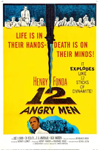
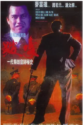
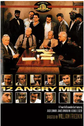
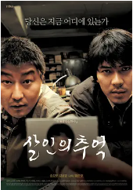
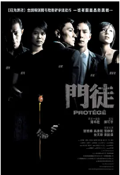
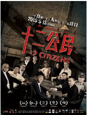

## 

[豆瓣评分: ]()

## 十二怒汉（1957）

[豆瓣评分: 9.4](https://movie.douban.com/subject/1293182/)

导演: [西德尼·吕美特](https://www.douban.com/personage/27216318/)

编剧: [雷金纳德·罗斯](https://www.douban.com/personage/27242884/)

主演: [亨利·方达](https://www.douban.com/personage/27253911/) / [马丁·鲍尔萨姆](https://www.douban.com/personage/27246943/) / [约翰·菲德勒](https://www.douban.com/personage/27212767/) / [李·科布](https://www.douban.com/personage/27242300/) / [E.G.马绍尔](https://www.douban.com/personage/27323504/) / [杰克·克卢格曼](https://www.douban.com/personage/27253965/) / [爱德华·宾斯](https://www.douban.com/personage/27272420/) / [杰克·沃登](https://www.douban.com/personage/27255514/) / [约瑟夫·史威尼](https://www.douban.com/personage/27362810/) / [埃德·贝格利](https://www.douban.com/personage/27208477/) / [乔治·沃斯科维奇](https://www.douban.com/personage/27224049/) / [罗伯特·韦伯](https://www.douban.com/personage/27370806/)

上映日期: 1957-04-10(美国)

片长: 96分钟

## 跛豪

[豆瓣评分: 8.3](https://movie.douban.com/subject/1296272/)

导演: [潘文杰](https://www.douban.com/personage/27523003/)

编剧: [麦当雄](https://www.douban.com/personage/27519053/) / [萧若元](https://www.douban.com/personage/27525999/) / [丁卉霖](https://movie.douban.com/subject_search?search_text=丁卉霖) / [陈慎芝](https://www.douban.com/personage/27563756/) / [李英杰](https://www.douban.com/personage/30480765/)

主演: [吕良伟](https://www.douban.com/personage/27243457/) / [郑则仕](https://www.douban.com/personage/27225002/) / [叶童](https://www.douban.com/personage/27239225/) / [叶子楣](https://www.douban.com/personage/27224103/) / [李子雄](https://www.douban.com/personage/27243413/) / [吴启华](https://www.douban.com/personage/27495071/) / [黄光亮](https://www.douban.com/personage/27529473/) / [徐锦江](https://www.douban.com/personage/27234566/) / [曾江](https://www.douban.com/personage/27497456/) / [罗烈](https://www.douban.com/personage/27218306/) / [吴孟达](https://www.douban.com/personage/27222494/) / [刘洵](https://www.douban.com/personage/27480508/) / [刘江](https://www.douban.com/personage/27495112/) / [江欣燕](https://www.douban.com/personage/27309949/) / [陈荣宗](https://www.douban.com/personage/27480620/) / [钟发](https://www.douban.com/personage/27488614/) / [韩坤](https://www.douban.com/personage/27565248/) / [陈治良](https://www.douban.com/personage/27484293/) / [吴廷烨](https://www.douban.com/personage/27491614/) / [吴丽珠](https://www.douban.com/personage/27483767/) / [钱似莺](https://www.douban.com/personage/27417030/) / [黄智强](https://www.douban.com/personage/34968574/) / [古慧珍](https://www.douban.com/personage/27483239/) / [骆达华](https://www.douban.com/personage/27487477/) / [林迪安](https://www.douban.com/personage/27517568/) / [雷达](https://www.douban.com/personage/27559272/) / [卫青](https://www.douban.com/personage/35022246/) / [林华勋](https://www.douban.com/personage/27561518/) / [李英杰](https://www.douban.com/personage/30480765/) / [黄树棠](https://www.douban.com/personage/27500926/) / [黄金棠](https://www.douban.com/personage/30449177/) / [麦鹤顿](https://www.douban.com/personage/27561279/) / [谭伟民](https://www.douban.com/personage/35022242/) / [梁心](https://www.douban.com/personage/34902129/) / [黄仲渠](https://www.douban.com/personage/33646187/) / [吴国佳](https://movie.douban.com/subject_search?search_text=吴国佳) / [何永祥](https://www.douban.com/personage/27559265/) / [曾醒光](https://www.douban.com/personage/27564580/) / [蔡宪章](https://www.douban.com/personage/35028027/) / [陈汉文](https://www.douban.com/personage/27486713/)

上映日期: 1991-04-15(中国香港)

片长: 143分钟

## 牯岭街少年杀人事件

[豆瓣评分: 8.9](https://movie.douban.com/subject/1292329/)

导演: [杨德昌](https://www.douban.com/personage/27259353/)

编剧: [杨德昌](https://www.douban.com/personage/27259353/) / [赖铭堂](https://www.douban.com/personage/27561187/) / [杨顺清](https://www.douban.com/personage/27503843/) / [鸿鸿](https://www.douban.com/personage/27515146/)

主演: [张震](https://www.douban.com/personage/27283748/) / [杨静怡](https://www.douban.com/personage/27482287/) / [张国柱](https://www.douban.com/personage/27497366/) / [王启赞](https://www.douban.com/personage/27528665/) / [林鸿铭](https://www.douban.com/personage/27504098/) / [金燕玲](https://www.douban.com/personage/27508952/) / [王琄](https://www.douban.com/personage/27584816/) / [张翰](https://www.douban.com/personage/27212045/) / [姜秀琼](https://www.douban.com/personage/27482657/) / [赖梵耘](https://www.douban.com/personage/27482375/) / [柯宇纶](https://www.douban.com/personage/27480935/) / [谭志刚](https://www.douban.com/personage/27569160/) / [冯国强](https://www.douban.com/personage/27483936/) / [陈湘琪](https://www.douban.com/personage/27508858/) / [金士杰](https://www.douban.com/personage/27492252/)

上映日期: 1991-07-27(中国台湾)

片长: 237分钟(导演剪辑版)

## 十二怒汉（1997）

[豆瓣评分: 9.3](https://movie.douban.com/subject/1293989/)

导演: [威廉·弗莱德金](https://www.douban.com/personage/27255585/)

编剧: [雷金纳德·罗斯](https://www.douban.com/personage/27242884/)

主演: [考特尼·万斯](https://www.douban.com/personage/27237719/) / [奥西·戴维斯](https://www.douban.com/personage/27242351/) / [乔治·C·斯科特](https://www.douban.com/personage/27233588/) / [阿明·缪勒-斯塔尔](https://www.douban.com/personage/27261513/) / [道林·海伍德](https://www.douban.com/personage/27260413/) / [詹姆斯·甘多菲尼](https://www.douban.com/personage/27255306/) / [托尼·丹扎](https://www.douban.com/personage/27253915/) / [杰克·莱蒙](https://www.douban.com/personage/27212697/) / [休姆·克罗宁](https://www.douban.com/personage/27216345/) / [麦凯尔泰·威廉逊](https://www.douban.com/personage/27237653/) / [爱德华·詹姆斯·奥莫斯](https://www.douban.com/personage/27237658/) / [威廉·彼德森](https://www.douban.com/personage/27335972/) / [玛丽·麦克唐纳](https://www.douban.com/personage/27250645/) / [道格拉斯·斯派恩](https://www.douban.com/personage/27208527/)

上映日期: 1997-08-17

片长: 117分钟

## 暗战

[豆瓣评分: 8.6](https://movie.douban.com/subject/1298898/)

导演: [杜琪峰](https://www.douban.com/personage/27366073/)

编剧: [游乃海](https://www.douban.com/personage/27367198/) / [劳伦特·考蒂奥德](https://www.douban.com/personage/27254928/) / [朱连·卡邦](https://www.douban.com/personage/27508341/)

主演: [刘德华](https://www.douban.com/personage/27260192/) / [刘青云](https://www.douban.com/personage/27212942/) / [蒙嘉慧](https://www.douban.com/personage/27229611/) / [李子雄](https://www.douban.com/personage/27243413/) / [许绍雄](https://www.douban.com/personage/27495048/) / [林雪](https://www.douban.com/personage/27480239/) / [黄卓玲](https://www.douban.com/personage/27529482/) / [艾威](https://www.douban.com/personage/27480901/) / [林伟健](https://www.douban.com/personage/27494370/) / [Robert Sparks](https://movie.douban.com/subject_search?search_text=Robert Sparks) / [洪伟良](https://www.douban.com/personage/27560211/) / [罗靖庭](https://www.douban.com/personage/27559992/) / [邱万城](https://www.douban.com/personage/27495977/) / [Paco Yick](https://movie.douban.com/subject_search?search_text=Paco Yick) / [South Kei Lee](https://movie.douban.com/subject_search?search_text=South Kei Lee) / [张浚鸿](https://www.douban.com/personage/27485943/) / [李子明](https://www.douban.com/personage/34840134/) / [李寿祺](https://www.douban.com/personage/27231645/)

上映日期: 1999-09-23(中国香港)

片长: 93 分钟

## 暗战 2

[豆瓣评分: 6.6](https://movie.douban.com/subject/1308120/)

导演: [杜琪峰](https://www.douban.com/personage/27366073/) / [罗永昌](https://www.douban.com/personage/27482308/)

编剧: [欧健儿](https://www.douban.com/personage/27531801/) / [游乃海](https://www.douban.com/personage/27367198/)

主演: [郑伊健](https://www.douban.com/personage/27237534/) / [刘青云](https://www.douban.com/personage/27212942/) / [林熙蕾](https://www.douban.com/personage/27247123/) / [许绍雄](https://www.douban.com/personage/27495048/) / [林雪](https://www.douban.com/personage/27480239/) / [黄卓玲](https://www.douban.com/personage/27529482/) / [罗永昌](https://www.douban.com/personage/27482308/)

上映日期: 2001-12-27(中国香港)

片长: 95分钟

## 上帝之城

[豆瓣评分: 9.0](https://movie.douban.com/subject/1292208/)

导演: [费尔南多·梅里尔斯](https://www.douban.com/personage/27246426/) / [卡迪亚·兰德](https://www.douban.com/personage/27518743/)

编剧: [保罗·林斯](https://www.douban.com/personage/27518381/) / [布罗里欧·曼托伐尼](https://www.douban.com/personage/27532043/)

主演: [亚历桑德雷·罗德里格斯](https://www.douban.com/personage/27391349/) / [莱安德鲁·菲尔米诺](https://www.douban.com/personage/27398425/) / [菲利佩·哈根森](https://www.douban.com/personage/27533365/) / [道格拉斯·席尔瓦](https://www.douban.com/personage/27532636/) / [乔纳森·哈根森](https://www.douban.com/personage/27430028/) / [马修斯·纳克加勒](https://www.douban.com/personage/27220118/) / [塞乌·乔奇](https://www.douban.com/personage/27224054/) / [艾莉丝·布拉加](https://www.douban.com/personage/27205747/)

上映日期: 2002-05-18(戛纳电影节) / 2002-08-30(巴西)

片长: 130分钟

## 猫鼠游戏

[豆瓣评分: 9.1](https://movie.douban.com/subject/1305487/)

导演: [史蒂文·斯皮尔伯格](https://www.douban.com/personage/27260208/)

编剧: [杰夫·内桑森](https://www.douban.com/personage/27521210/)

主演: [莱昂纳多·迪卡普里奥](https://www.douban.com/personage/27246784/) / [汤姆·汉克斯](https://www.douban.com/personage/27260218/) / [克里斯托弗·沃肯](https://www.douban.com/personage/27259342/) / [马丁·辛](https://www.douban.com/personage/27260042/) / [艾米·亚当斯](https://www.douban.com/personage/27228290/) / [詹妮弗·加纳](https://www.douban.com/personage/27260279/) / [伊丽莎白·班克斯](https://www.douban.com/personage/27210261/) / [纳塔莉·贝伊](https://www.douban.com/personage/27216399/) / [詹姆斯·布洛林](https://www.douban.com/personage/27216268/) / [艾伦·旁派](https://www.douban.com/personage/27246859/) / [南希·利内翰](https://www.douban.com/personage/27329766/) / [布莱恩·豪威 ](https://www.douban.com/personage/27489111/)/ [弗兰克·约翰·休斯](https://www.douban.com/personage/27246438/) / [克里斯·埃里斯](https://www.douban.com/personage/27294244/)

上映日期: 2003-04-11(中国大陆) / 2002-12-16(洛杉矶首映) / 2002-12-25(美国)

片长: 141 分钟

## 杀人回忆

[豆瓣评分: 8.9](https://movie.douban.com/subject/1300299/)

导演: [奉俊昊](https://www.douban.com/personage/27268658/)

编剧: [奉俊昊](https://www.douban.com/personage/27268658/) / [沈成宝](https://www.douban.com/personage/27481315/) / [金光林](https://www.douban.com/personage/27571120/)

主演: [宋康昊](https://www.douban.com/personage/27236979/) / [金相庆](https://www.douban.com/personage/27225150/) / [金雷夏](https://www.douban.com/personage/27419395/) / [宋在浩](https://www.douban.com/personage/27239498/) / [边希峰](https://www.douban.com/personage/27386652/) / [高瑞熙](https://www.douban.com/personage/27419377/) / [柳泰浩](https://www.douban.com/personage/27486699/) / [朴努植](https://www.douban.com/personage/27551236/) / [朴海日](https://www.douban.com/personage/27425036/) / [全美善](https://www.douban.com/personage/27244534/) / [徐永嬅](https://www.douban.com/personage/27482137/) / [崔钟律](https://www.douban.com/personage/30245465/) / [刘承睦](https://www.douban.com/personage/27570984/) / [申贤宗](https://www.douban.com/personage/34907809/) / [李在应](https://www.douban.com/personage/27252813/) / [郑仁仙](https://www.douban.com/personage/27399376/) / [吴龙](https://www.douban.com/personage/27544020/) / [朴真宇](https://www.douban.com/personage/27500389/) / [朴泰京](https://www.douban.com/personage/34951338/) / [沈成宝](https://www.douban.com/personage/27481315/)

上映日期: 2003-05-02(韩国)

片长: 132分钟

## 大事件

[豆瓣评分: 6.9](https://movie.douban.com/subject/1308855/)

导演: [杜琪峰](https://www.douban.com/personage/27366073/)

编剧: [陈庆嘉](https://www.douban.com/personage/27480348/) / [叶天成](https://www.douban.com/personage/27534998/)

主演: [陈慧琳](https://www.douban.com/personage/27256098/) / [张家辉](https://www.douban.com/personage/27243024/) / [任贤齐](https://www.douban.com/personage/27215579/) / [林雪](https://www.douban.com/personage/27480239/) / [任达华](https://www.douban.com/personage/27236935/) / [许绍雄](https://www.douban.com/personage/27495048/) / [邵美琪](https://www.douban.com/personage/27358878/) / [张兆辉](https://www.douban.com/personage/27211534/) / [尤勇智](https://www.douban.com/personage/27529798/) / [丁海峰](https://www.douban.com/personage/27488380/)

上映日期: 2004-06-10(中国香港)

片长: 90 分钟

## 门徒

[豆瓣评分: 8.1](https://movie.douban.com/subject/1890784/)

导演: [尔冬升](https://www.douban.com/personage/27481240/)

编剧: [尔冬升](https://www.douban.com/personage/27481240/) / [龙文康](https://www.douban.com/personage/27576365/) / [高新](https://www.douban.com/personage/27584401/) / [秦天南](https://www.douban.com/personage/27509052/)

主演: [刘德华](https://www.douban.com/personage/27260192/) / [吴彦祖](https://www.douban.com/personage/27233238/) / [古天乐](https://www.douban.com/personage/27233313/) / [张静初](https://www.douban.com/personage/27222391/) / [袁咏仪](https://www.douban.com/personage/27256456/) / [廖启智](https://www.douban.com/personage/27481227/) / [何美钿](https://www.douban.com/personage/27447824/) / [尔冬升](https://www.douban.com/personage/27481240/)

上映日期: 2007-02-13(中国大陆/中国香港)

片长: 108分钟

## 寒战

[豆瓣评分: 7.6](https://movie.douban.com/subject/6890730/)

导演: [梁乐民](https://www.douban.com/personage/27549697/) / [陆剑青](https://www.douban.com/personage/27549696/)

编剧: [梁乐民](https://www.douban.com/personage/27549697/) / [陆剑青](https://www.douban.com/personage/27549696/)

主演: [郭富城](https://www.douban.com/personage/27247145/) / [梁家辉](https://www.douban.com/personage/27324010/) / [李治廷](https://www.douban.com/personage/27480241/) / [彭于晏](https://www.douban.com/personage/27219486/) / [杨采妮](https://www.douban.com/personage/27224097/) / [马伊琍](https://www.douban.com/personage/27217627/) / [林家栋](https://www.douban.com/personage/27256092/) / [安志杰](https://www.douban.com/personage/27251120/) / [钱嘉乐](https://www.douban.com/personage/27231209/) / [尹子维](https://www.douban.com/personage/27251328/) / [王敏德](https://www.douban.com/personage/27368029/) / [黄芝琪](https://www.douban.com/personage/27567582/) / [郑欣宜](https://www.douban.com/personage/27213203/) / [文峰](https://www.douban.com/personage/27495552/) / [贾晓晨](https://www.douban.com/personage/27495257/) / [刘德华](https://www.douban.com/personage/27260192/) / [何华超](https://www.douban.com/personage/27515001/)

上映日期: 2012-11-08(中国大陆/中国香港)

片长: 102分钟

## 毒战

[豆瓣评分: 7.6](https://movie.douban.com/subject/10344754/)

导演: [杜琪峰](https://www.douban.com/personage/27366073/)

编剧: [韦家辉](https://www.douban.com/personage/27223567/) / [游乃海](https://www.douban.com/personage/27367198/) / [陈伟斌](https://www.douban.com/personage/27570009/) / [余曦](https://www.douban.com/personage/27570217/)

主演: [孙红雷](https://www.douban.com/personage/27259349/) / [古天乐](https://www.douban.com/personage/27233313/) / [黄奕](https://www.douban.com/personage/27256815/) / [钟汉良](https://www.douban.com/personage/27497220/) / [高晟晖](https://www.douban.com/personage/27488300/) / [李光洁](https://www.douban.com/personage/27504226/) / [叶璇](https://www.douban.com/personage/27211228/) / [甘婷婷](https://www.douban.com/personage/27547135/) / [王思雅](https://www.douban.com/personage/27547781/) / [林雪](https://www.douban.com/personage/27480239/) / [林家栋](https://www.douban.com/personage/27256092/) / [肖聪](https://www.douban.com/personage/27551374/) / [王紫逸](https://www.douban.com/personage/27502195/) / [成泰燊](https://www.douban.com/personage/27402318/) / [卢海鹏](https://www.douban.com/personage/27244523/) / [张兆辉](https://www.douban.com/personage/27211534/) / [吴廷烨](https://www.douban.com/personage/27491614/) / [姜皓文](https://www.douban.com/personage/27482274/) / [李菁](https://www.douban.com/personage/27481095/) / [郭涛](https://www.douban.com/personage/27481231/) / [谭凯](https://www.douban.com/personage/27547196/) / [郝平](https://www.douban.com/personage/27481063/)

上映日期: 2013-04-02(中国大陆) / 2013-04-18(中国香港) / 2012-11-15(罗马电影节)

片长: 106分钟

## 扫毒

[豆瓣评分: 7.6](https://movie.douban.com/subject/10763164/)

导演: [陈木胜](https://www.douban.com/personage/27480658/)

编剧: [陈木胜](https://www.douban.com/personage/27480658/) / [文隽](https://www.douban.com/personage/27480667/) / [凌志民](https://www.douban.com/personage/27552624/) / [黄进](https://www.douban.com/personage/27556750/) / [谭惠贞](https://www.douban.com/personage/27552625/)

主演: [古天乐](https://www.douban.com/personage/27233313/) / [张家辉](https://www.douban.com/personage/27243024/) / [刘青云](https://www.douban.com/personage/27212942/) / [袁泉](https://www.douban.com/personage/27216195/) / [卢海鹏](https://www.douban.com/personage/27244523/) / [吴廷烨](https://www.douban.com/personage/27491614/) / [林国斌](https://www.douban.com/personage/27517572/) / [卢惠光](https://www.douban.com/personage/27238373/) / [吴岱融](https://www.douban.com/personage/27481201/) / [宝儿](https://www.douban.com/personage/27552592/) / [马浴柯](https://www.douban.com/personage/27484209/) / [释彦能](https://www.douban.com/personage/27408888/) / [罗兰](https://www.douban.com/personage/27260108/) / [李兆基](https://www.douban.com/personage/27497451/) / [维他亚·潘斯林加姆](https://www.douban.com/personage/27570580/) / [罗钧满](https://www.douban.com/personage/27566530/)

上映日期: 2013-11-29(中国大陆) / 2013-12-05(中国香港)

片长: 134分钟

## 十二公民

[豆瓣评分: 8.4](https://movie.douban.com/subject/24875534/)

导演: [徐昂](https://www.douban.com/personage/27546297/)

编剧: [李玉娇](https://www.douban.com/personage/27546298/) / [韩景龙](https://www.douban.com/personage/27551915/) / [徐昂](https://www.douban.com/personage/27546297/)

主演: [何冰](https://www.douban.com/personage/27495307/) / [韩童生](https://www.douban.com/personage/27495229/) / [钱波](https://www.douban.com/personage/27484239/) / [赵龙豪](https://www.douban.com/personage/27503309/) / [米铁增](https://www.douban.com/personage/27487534/) / [高冬平](https://www.douban.com/personage/27556235/) / [张永强](https://www.douban.com/personage/27487588/) / [李光复](https://www.douban.com/personage/27481058/) / [王刚](https://www.douban.com/personage/27554281/) / [班赞](https://www.douban.com/personage/27484404/) / [刘一辉](https://www.douban.com/personage/27554279/) / [雷佳](https://www.douban.com/personage/27554280/)

上映日期: 2015-05-15(中国大陆) / 2018-04-16(中国大陆重映) / 2014-10-19(罗马电影节)

片长: 106分钟

## 烈日灼心

[豆瓣评分: 8.3](https://movie.douban.com/subject/24719063/)

导演: [曹保平](https://www.douban.com/personage/27480364/)

编剧: [曹保平](https://www.douban.com/personage/27480364/) / [焦华静](https://www.douban.com/personage/27564928/)

主演: [邓超](https://www.douban.com/personage/27480235/) / [段奕宏](https://www.douban.com/personage/27480240/) / [郭涛](https://www.douban.com/personage/27481231/) / [王珞丹](https://www.douban.com/personage/27480365/) / [吕颂贤](https://www.douban.com/personage/27324112/) / [高虎](https://www.douban.com/personage/27495240/) / [白柳汐](https://www.douban.com/personage/27484070/) / [杜志国](https://www.douban.com/personage/27212629/)

上映日期: 2015-08-27(中国大陆) / 2015-06-15(上海电影节)

片长: 139分钟

## 解救吾先生

[豆瓣评分: 7.7](https://movie.douban.com/subject/25798448/)

导演: [丁晟](https://www.douban.com/personage/27481242/)

编剧: [丁晟](https://www.douban.com/personage/27481242/)

主演: [刘德华](https://www.douban.com/personage/27260192/) / [刘烨](https://www.douban.com/personage/27206262/) / [王千源](https://www.douban.com/personage/27481119/) / [吴若甫](https://www.douban.com/personage/27227568/) / [林雪](https://www.douban.com/personage/27480239/) / [赵小锐](https://www.douban.com/personage/27495267/) / [李梦](https://www.douban.com/personage/27547819/) / [蔡鹭](https://www.douban.com/personage/27553799/) / [陆彭](https://www.douban.com/personage/27548238/) / [余皑磊](https://www.douban.com/personage/27494225/) / [郭洺宇](https://www.douban.com/personage/27581614/)

上映日期: 2015-09-30(中国大陆) / 2015-09-26(丝绸之路电影节)

片长: 106分钟

## 树大招风

[豆瓣评分: 8.1](https://movie.douban.com/subject/26265170/)

导演: [许学文](https://www.douban.com/personage/27576363/) / [欧文杰](https://www.douban.com/personage/27570008/) / [黄伟杰](https://www.douban.com/personage/27576364/)

编剧: [龙文康](https://www.douban.com/personage/27576365/) / [伍奇伟](https://www.douban.com/personage/27576366/) / [麦天枢](https://www.douban.com/personage/30121336/)

主演: [林家栋](https://www.douban.com/personage/27256092/) / [任贤齐](https://www.douban.com/personage/27215579/) / [陈小春](https://www.douban.com/personage/27281516/) / [黄光亮](https://www.douban.com/personage/27529473/) / [姜皓文](https://www.douban.com/personage/27482274/) / [尹扬明](https://www.douban.com/personage/27494402/) / [杜燕歌](https://www.douban.com/personage/27568258/) / [岳华](https://www.douban.com/personage/27218480/) / [梁健平](https://www.douban.com/personage/27568327/) / [熊欣欣](https://www.douban.com/personage/27238831/) / [吴志雄](https://www.douban.com/personage/27501606/) / [欧锦棠](https://www.douban.com/personage/27481660/) / [林雪](https://www.douban.com/personage/27480239/) / [张凯](https://www.douban.com/personage/27558907/) / [乐子龙](https://www.douban.com/personage/27558908/) / [廷贾波·查蒂杜](https://www.douban.com/personage/27558909/) / [马幸葵](https://www.douban.com/personage/27558910/) / [刘宗勇](https://www.douban.com/personage/27558911/) / [金来群](https://www.douban.com/personage/27558912/) / [黄凯森](https://www.douban.com/personage/27558913/) / [黄华和](https://www.douban.com/personage/27557995/) / [袁富华](https://www.douban.com/personage/27558914/) / [颜子菲](https://www.douban.com/personage/27558906/) / [罗志星](https://www.douban.com/personage/27558915/) / [何家铧](https://www.douban.com/personage/27558916/) / [许秉珩](https://www.douban.com/personage/27558917/) / [李英涛](https://www.douban.com/personage/27558918/) / [赵志诚](https://www.douban.com/personage/27493435/) / [李文标](https://www.douban.com/personage/27485942/)

上映日期: 2016-03-21(中国香港电影节) / 2016-04-07(中国香港)

片长: 97分钟

## 寒战 2

[豆瓣评分: 7.2](https://movie.douban.com/subject/20505982/)

导演: [梁乐民](https://www.douban.com/personage/27549697/) / [陆剑青](https://www.douban.com/personage/27549696/)

编剧: [梁乐民](https://www.douban.com/personage/27549697/) / [陆剑青](https://www.douban.com/personage/27549696/) / [吴炜伦](https://www.douban.com/personage/27491918/)

主演: [郭富城](https://www.douban.com/personage/27247145/) / [梁家辉](https://www.douban.com/personage/27324010/) / [杨采妮](https://www.douban.com/personage/27224097/) / [彭于晏](https://www.douban.com/personage/27219486/) / [李治廷](https://www.douban.com/personage/27480241/) / [文咏珊](https://www.douban.com/personage/27498375/) / [周润发](https://www.douban.com/personage/27250655/) / [马伊琍](https://www.douban.com/personage/27217627/) / [杨祐宁](https://www.douban.com/personage/27256921/) / [张国柱](https://www.douban.com/personage/27497366/) / [吴樾](https://www.douban.com/personage/27492768/) / [周笔畅](https://www.douban.com/personage/27493018/) / [李子雄](https://www.douban.com/personage/27243413/) / [骆应钧](https://www.douban.com/personage/27495116/) / [林文龙](https://www.douban.com/personage/27500322/)

上映日期: 2016-07-08(中国大陆/中国香港)

片长: 110分钟

## 追凶者也

[豆瓣评分: 7.9](https://movie.douban.com/subject/26284621/)

导演: [曹保平](https://www.douban.com/personage/27480364/)

编剧: [张天辉](https://www.douban.com/personage/27498653/) / [阳建军](https://www.douban.com/personage/27576420/) / [曹保平](https://www.douban.com/personage/27480364/)

主演: [刘烨](https://www.douban.com/personage/27206262/) / [张译](https://www.douban.com/personage/27493523/) / [段博文](https://www.douban.com/personage/27541062/) / [王子文](https://www.douban.com/personage/27500192/) / [谭卓](https://www.douban.com/personage/27541042/) / [王砚辉](https://www.douban.com/personage/27547505/) / [颜北](https://www.douban.com/personage/27576416/) / [孙磊](https://www.douban.com/personage/27551372/) / [施宁](https://www.douban.com/personage/27574993/) / [王云辉](https://www.douban.com/personage/30385780/) / [张岳](https://www.douban.com/personage/30385775/) / [岱江](https://www.douban.com/personage/30385774/) / [董明](https://www.douban.com/personage/30385809/) / [邰勇峰](https://www.douban.com/personage/30385806/) / [李诗译](https://www.douban.com/personage/30385812/) / [杨晶](https://www.douban.com/personage/30385807/) / [蒲枭虎](https://www.douban.com/personage/27582045/) / [马东延](https://www.douban.com/personage/27502468/) / [程佳光](https://www.douban.com/personage/30386055/) / [吴暇](https://www.douban.com/personage/30289147/) / [傅小源](https://www.douban.com/personage/30386064/) / [付立加](https://www.douban.com/personage/30386067/) / [岳冰](https://www.douban.com/personage/30386069/) / [林子琛](https://www.douban.com/personage/30386070/) / [贺之怡](https://www.douban.com/personage/30386071/) / [王欣花](https://www.douban.com/personage/30386072/) / [李昌元](https://www.douban.com/personage/27566734/) / [杨佐玖](https://www.douban.com/personage/30386073/) / [李胜荣](https://www.douban.com/personage/27564116/) / [闫晓林](https://www.douban.com/personage/30386074/)

上映日期: 2016-09-14(中国大陆)

片长: 110分钟

## 误杀

[豆瓣评分: 7.5](https://movie.douban.com/subject/30176393/)

导演: [柯汶利](https://www.douban.com/personage/33476643/)

编剧: [杨薇薇](https://www.douban.com/personage/27560409/) / [翟培](https://www.douban.com/personage/34875349/) / [李鹏](https://www.douban.com/personage/34875350/) / [范凯华](https://www.douban.com/personage/34875351/) / [秦语谦](https://www.douban.com/personage/34875352/) / [雷声](https://www.douban.com/personage/34839528/)

主演: [肖央](https://www.douban.com/personage/27480255/) / [谭卓](https://www.douban.com/personage/27541042/) / [陈冲](https://www.douban.com/personage/27250720/) / [姜皓文](https://www.douban.com/personage/27482274/) / [秦沛](https://www.douban.com/personage/27254237/) / [边天扬](https://www.douban.com/personage/30371660/) / [许文姗](https://www.douban.com/personage/30425955/) / [张熙然](https://www.douban.com/personage/34875353/) / [施名帅](https://www.douban.com/personage/27558735/) / [黄健玮](https://www.douban.com/personage/27495199/) / [陈志朋](https://www.douban.com/personage/27488661/) / [叶浏](https://www.douban.com/personage/27576476/) / [谷洋](https://www.douban.com/personage/27565662/) / [张林](https://www.douban.com/personage/27582122/)

上映日期: 2019-12-13(中国大陆) / 2020-07-20(中国大陆重映) / 2019-12-07(大规模点映)

片长: 112分钟
