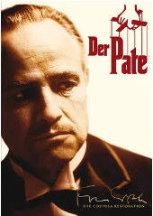
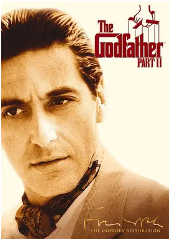
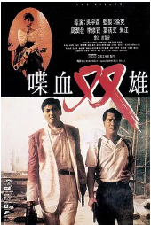
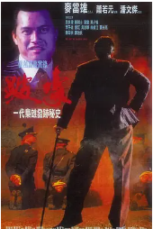
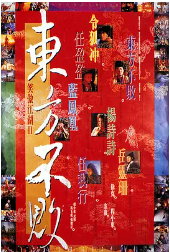
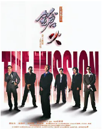
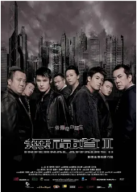
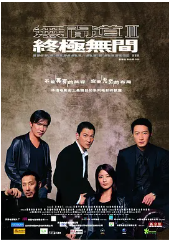
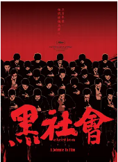

## 

[豆瓣评分: ]()

## 教父

[豆瓣评分: 9.3](https://movie.douban.com/subject/1291841/)

导演: [弗朗西斯·福特·科波拉](https://www.douban.com/personage/27260187/)

编剧: [马里奥·普佐](https://www.douban.com/personage/27233234/) / [弗朗西斯·福特·科波拉](https://www.douban.com/personage/27260187/)

主演: [马龙·白兰度](https://www.douban.com/personage/27246780/) / [阿尔·帕西诺](https://www.douban.com/personage/27260219/) / [詹姆斯·肯恩](https://www.douban.com/personage/27205740/) / [理查德·卡斯特尔诺](https://www.douban.com/personage/27280029/) / [罗伯特·杜瓦尔](https://www.douban.com/personage/27219480/) / [斯特林·海登](https://www.douban.com/personage/27208450/) / [约翰·马利](https://www.douban.com/personage/27233704/) / [理查德·康特](https://www.douban.com/personage/27208505/) / [艾尔·勒提埃里](https://www.douban.com/personage/27237972/) / [黛安·基顿](https://www.douban.com/personage/27259336/) / [阿贝·维高达](https://www.douban.com/personage/27261101/) / [塔莉娅·夏尔](https://www.douban.com/personage/27253903/) / [吉亚尼·罗素](https://www.douban.com/personage/27346622/) / [约翰·凯泽尔](https://www.douban.com/personage/27228339/) / [鲁迪·邦德](https://www.douban.com/personage/27272400/) / [兰尼·蒙大拿](https://www.douban.com/personage/27329307/)

上映日期: 1972-03-15(纽约首映) / 1972-03-24(美国)

片长: 175 分钟

## 教父 2

[豆瓣评分: 9.3](https://movie.douban.com/subject/1299131/)

导演: [弗朗西斯·福特·科波拉](https://www.douban.com/personage/27260187/)

编剧: [弗朗西斯·福特·科波拉](https://www.douban.com/personage/27260187/) / [马里奥·普佐](https://www.douban.com/personage/27233234/)

主演: [阿尔·帕西诺](https://www.douban.com/personage/27260219/) / [罗伯特·杜瓦尔](https://www.douban.com/personage/27219480/) / [黛安·基顿](https://www.douban.com/personage/27259336/) / [罗伯特·德尼罗](https://www.douban.com/personage/27260213/) / [约翰·凯泽尔](https://www.douban.com/personage/27228339/) / [塔莉娅·夏尔](https://www.douban.com/personage/27253903/) / [李·斯特拉斯伯格](https://www.douban.com/personage/27246504/) / [迈克尔·V·格佐](https://www.douban.com/personage/27206111/) / [G•D•斯普拉德林](https://www.douban.com/personage/27363463/) / [理查德·布赖特](https://www.douban.com/personage/27281589/) / [加斯通·莫辛](https://www.douban.com/personage/27342592/) / [汤姆·罗斯奎](https://www.douban.com/personage/27348988/) / [布鲁诺·柯比](https://www.douban.com/personage/27253945/) / [弗兰克·西维罗](https://www.douban.com/personage/27361287/) / [弗朗西丝卡·德·萨维奥](https://www.douban.com/personage/27583504/) / [摩甘娜金](https://www.douban.com/personage/27310803/) / [玛丽亚娜·希尔](https://www.douban.com/personage/27305148/) / [莱奥波多·特里耶斯泰](https://www.douban.com/personage/27254140/) / [多米尼克·查尼斯](https://www.douban.com/personage/27277591/) / [Amerigo Tot](https://www.douban.com/personage/27358701/) / [特洛伊·多纳休](https://www.douban.com/personage/27212750/) / [约翰·阿普雷亚](https://www.douban.com/personage/27238081/) / [乔·斯皮内尔](https://www.douban.com/personage/27246587/) / [阿贝·维高达](https://www.douban.com/personage/27261101/) / [吉亚尼·罗素](https://www.douban.com/personage/27346622/) / [Maria Carta](https://www.douban.com/personage/27278396/) / [菲伊·斯潘](https://www.douban.com/personage/27233804/) / [哈利·戴恩·斯坦通](https://www.douban.com/personage/27216273/) / [卡明·卡里迪](https://www.douban.com/personage/27274231/) / [丹尼·爱罗](https://www.douban.com/personage/27224774/) / [威廉·鲍尔斯](https://www.douban.com/personage/27222669/) / [约瑟夫·德拉·索尔特](https://www.douban.com/personage/27292464/) / [卡门·阿尔根齐亚诺](https://www.douban.com/personage/27263038/) / [乔·罗·格里普](https://www.douban.com/personage/27302382/) / [Ezio Flagello](https://www.douban.com/personage/27288660/) / [凯瑟琳·贝勒](https://www.douban.com/personage/27261132/) / [Saveria Mazzola](https://www.douban.com/personage/27326910/) / [Tito Alba](https://www.douban.com/personage/27266412/) / [彼得·多纳特](https://www.douban.com/personage/27292977/) / [汤姆·达尔格伦](https://www.douban.com/personage/27280221/) / [Phil Feldman](https://www.douban.com/personage/27212285/) / [罗杰·科曼](https://www.douban.com/personage/27208470/) / [伊凡·科尔](https://www.douban.com/personage/27284726/) / [艾丽卡·约恩](https://www.douban.com/personage/30341242/) / [Teresa Tirelli](https://www.douban.com/personage/27355427/) / [詹姆斯·肯恩](https://www.douban.com/personage/27205740/) / [Italia Coppola](https://www.douban.com/personage/27278738/) / [罗曼·科波拉](https://www.douban.com/personage/27250859/) / [索菲亚·科波拉](https://www.douban.com/personage/27260167/) / [朱莉·格雷格](https://www.douban.com/personage/27302709/) / [George Holmes](https://www.douban.com/personage/27303893/) / [Buck Houghton](https://www.douban.com/personage/27251971/) / [Shep Houghton](https://www.douban.com/personage/27303495/) / [小杉正一](https://www.douban.com/personage/27223844/) / [加里·库尔茨](https://www.douban.com/personage/27228929/) / [Laura Lyons](https://www.douban.com/personage/27324864/) / [理查德·麦瑟森](https://www.douban.com/personage/27237989/) / [约翰·梅根纳](https://www.douban.com/personage/27321660/) / [Harrison Ressler](https://www.douban.com/personage/27352853/) / [Al Roberts](https://www.douban.com/personage/27344374/) / [Hank Robinson](https://www.douban.com/personage/27346409/) / [Filomena Spagnuolo](https://www.douban.com/personage/27361397/)

上映日期: 1974-12-12(纽约首映) / 1974-12-20(美国)

片长: 202分钟

## 美国往事

[豆瓣评分: 9.1](https://movie.douban.com/subject/1292262/)

导演: [赛尔乔·莱昂内](https://www.douban.com/personage/27219600/)

编剧: [皮耶罗·德·贝纳迪](https://www.douban.com/personage/27209350/) / [莱奥纳多·本韦努蒂](https://www.douban.com/personage/27256926/) / [弗兰科·奥卡利](https://www.douban.com/personage/27580168/) / [恩里科·梅迪欧力](https://www.douban.com/personage/27239545/) / [弗兰科·费里尼](https://www.douban.com/personage/27222736/) / [赛尔乔·莱昂内](https://www.douban.com/personage/27219600/)

主演: [罗伯特·德尼罗](https://www.douban.com/personage/27260213/) / [詹姆斯·伍兹](https://www.douban.com/personage/27208379/) / [伊丽莎白·麦戈文](https://www.douban.com/personage/27216279/) / [乔·佩西](https://www.douban.com/personage/27210288/) / [伯特·杨](https://www.douban.com/personage/27253941/) / [塔斯黛·韦尔德](https://www.douban.com/personage/27255444/) / [特里特·威廉斯](https://www.douban.com/personage/27242183/) / [丹尼·爱罗](https://www.douban.com/personage/27224774/) / [理查德·布赖特](https://www.douban.com/personage/27281589/) / [詹姆斯·海登](https://www.douban.com/personage/27300935/) / [威廉·弗西斯](https://www.douban.com/personage/27224787/) / [达兰妮·弗鲁格](https://www.douban.com/personage/27242458/) / [拉里·拉普](https://www.douban.com/personage/27344391/) / [理查德·弗让吉](https://www.douban.com/personage/27293190/) / [罗伯特·哈珀](https://www.douban.com/personage/27254122/) / [詹妮弗·康纳利](https://www.douban.com/personage/27222396/)

上映日期: 1984-02-17(波士顿首映) / 1984-09-28(意大利)

片长: 229分钟(导演剪辑版) / 251分钟(导演剪辑加长版)

## 省港骑兵

[豆瓣评分: 7.9](https://movie.douban.com/subject/1292846/)

导演: [麦当雄](https://www.douban.com/personage/27519053/)

编剧: [陈欣健](https://www.douban.com/personage/27212936/)

主演: [陈敬](https://www.douban.com/personage/27480731/) / [江龙](https://www.douban.com/personage/27551438/) / [林国斌](https://www.douban.com/personage/27517572/) / [林威](https://www.douban.com/personage/27517585/) / [沈威](https://www.douban.com/personage/27525815/) / [黄光亮](https://www.douban.com/personage/27529473/) / [方烈](https://movie.douban.com/subject_search?search_text=方烈) / [蓝湘森](https://movie.douban.com/subject_search?search_text=蓝湘森)

上映日期: 1984-07-11

片长: 100分钟(DVD版) / 106分钟(BD版)

## 英雄本色

[豆瓣评分: 8.6](https://movie.douban.com/subject/1297574/)

导演: [吴宇森](https://movie.douban.com/celebrity/1027853/)

编剧: [陈庆嘉](https://movie.douban.com/celebrity/1274234/) / [吴宇森](https://movie.douban.com/celebrity/1027853/) / [梁淑华](https://movie.douban.com/celebrity/1322098/)

主演: [周润发](https://movie.douban.com/celebrity/1044899/) / [狄龙](https://movie.douban.com/celebrity/1025426/) / [张国荣](https://movie.douban.com/celebrity/1003494/) / [朱宝意](https://movie.douban.com/celebrity/1042434/) / [李子雄](https://movie.douban.com/celebrity/1037662/) / [田丰](https://movie.douban.com/celebrity/1019621/) / [吴宇森](https://movie.douban.com/celebrity/1027853/) / [曾江](https://movie.douban.com/celebrity/1275451/) / [成奎安](https://movie.douban.com/celebrity/1141665/) / [徐克](https://movie.douban.com/celebrity/1007152/) / [陈志辉](https://movie.douban.com/celebrity/1312869/)

上映日期: 2017-11-17(中国大陆) / 1986-08-02(中国香港)

片长: 95分钟

## 省港旗兵 2：兵分两路

[豆瓣评分: 7.8](https://movie.douban.com/subject/1780428/)

导演: [麦当杰](https://www.douban.com/personage/27567926/)

编剧: [陈欣健](https://www.douban.com/personage/27212936/)

主演: [万梓良](https://www.douban.com/personage/27229679/) / [徐锦江](https://www.douban.com/personage/27234566/) / [林国斌](https://www.douban.com/personage/27517572/) / [袁日初](https://www.douban.com/personage/27502759/) / [王小凤](https://www.douban.com/personage/27504175/) / [成奎安](https://www.douban.com/personage/27347528/) / [陈敬](https://www.douban.com/personage/27480731/)

上映日期: 1987-11-05(中国香港)

片长: 88分钟

## 英雄本色 2

[豆瓣评分: 8.4](https://movie.douban.com/subject/1297862/)

导演: [吴宇森](https://movie.douban.com/celebrity/1027853/)

编剧: [徐克](https://movie.douban.com/celebrity/1007152/) / [吴宇森](https://movie.douban.com/celebrity/1027853/)

主演: [狄龙](https://movie.douban.com/celebrity/1025426/) / [张国荣](https://movie.douban.com/celebrity/1003494/) / [周润发](https://movie.douban.com/celebrity/1044899/) / [石天](https://movie.douban.com/celebrity/1146001/) / [关山](https://movie.douban.com/celebrity/1103354/) / [朱宝意](https://movie.douban.com/celebrity/1042434/) / [曾江](https://movie.douban.com/celebrity/1275451/) / [成奎安](https://movie.douban.com/celebrity/1141665/) / [吴孟达](https://movie.douban.com/celebrity/1016771/) / [王正方](https://movie.douban.com/celebrity/1300399/)

上映日期: 1987-12-17(中国香港)

片长: 105分钟

## 旺角卡门

[豆瓣评分: 7.8](https://movie.douban.com/subject/1304624/)

导演: [王家卫](https://movie.douban.com/celebrity/1041024/)

编剧: [王家卫](https://movie.douban.com/celebrity/1041024/)

主演: [刘德华](https://movie.douban.com/celebrity/1054424/) / [张学友](https://movie.douban.com/celebrity/1012563/) / [张曼玉](https://movie.douban.com/celebrity/1274231/) / [万梓良](https://movie.douban.com/celebrity/1023948/) / [林蛟](https://movie.douban.com/celebrity/1342431/) / [黄斌](https://movie.douban.com/celebrity/1301199/) / [陈志辉](https://movie.douban.com/celebrity/1312869/) / [王剑风](https://movie.douban.com/subject_search?search_text=王剑风) / [江道海](https://movie.douban.com/celebrity/1327763/) / [张叔平](https://movie.douban.com/celebrity/1274369/)

上映日期: 1988-06-09(中国香港)

片长: 102分钟

## 省港旗兵 3：逃出香港

[豆瓣评分: 6.3](https://movie.douban.com/subject/1786413/)

导演: [麦当杰](https://www.douban.com/personage/27567926/)

编剧: [麦当雄](https://www.douban.com/personage/27519053/) / [萧若元](https://www.douban.com/personage/27525999/)

主演: [刘德华](https://www.douban.com/personage/27260192/) / [徐锦江](https://www.douban.com/personage/27234566/) / [李美凤](https://www.douban.com/personage/27257068/) / [莫少聪](https://www.douban.com/personage/27243597/)

上映日期: 1989-01-12(中国香港) / 1989-01-28(中国台湾) / 1989-12-02(韩国)

片长: 107分钟

## 喋血双雄

[豆瓣评分: 8.5](https://movie.douban.com/subject/1296519/)

导演: [吴宇森](https://www.douban.com/personage/27233590/)

编剧: [吴宇森](https://www.douban.com/personage/27233590/)

主演: [周润发](https://www.douban.com/personage/27250655/) / [李修贤](https://www.douban.com/personage/27231185/) / [叶倩文](https://www.douban.com/personage/27234352/) / [曾江](https://www.douban.com/personage/27497456/) / [朱江](https://www.douban.com/personage/27509041/) / [成奎安](https://www.douban.com/personage/27347528/) / [黄光亮](https://www.douban.com/personage/27529473/) / [林聪](https://www.douban.com/personage/27557997/)

上映日期: 1989-07-06

片长: 111分钟 / 124分钟(加长版)

## 英雄本色 3：夕阳之歌

[豆瓣评分: 7.5](https://movie.douban.com/subject/1293759/)

导演: [徐克](https://movie.douban.com/celebrity/1007152/)

编剧: [戴富浩](https://movie.douban.com/celebrity/1377231/) / [梁耀明](https://movie.douban.com/celebrity/1377232/) / [徐克](https://movie.douban.com/celebrity/1007152/)

主演: [周润发](https://movie.douban.com/celebrity/1044899/) / [梅艳芳](https://movie.douban.com/celebrity/1047976/) / [梁家辉](https://movie.douban.com/celebrity/1118167/) / [张可颐](https://movie.douban.com/celebrity/1073994/) / [时任三郎](https://movie.douban.com/celebrity/1007548/) / [石坚](https://movie.douban.com/celebrity/1140701/) / [郑伟伦](https://movie.douban.com/celebrity/1416033/)

上映日期: 1989-10-20(中国香港)

片长: 120分钟

## 笑傲江湖

[豆瓣评分: 8.0](https://movie.douban.com/subject/1297304/)

导演: [胡金铨](https://movie.douban.com/celebrity/1048426/) / [徐克](https://movie.douban.com/celebrity/1007152/) / [李惠民](https://movie.douban.com/celebrity/1319466/) / [程小东](https://movie.douban.com/celebrity/1280664/)

编剧: [黄鹰](https://movie.douban.com/celebrity/1316778/) / [梁耀明](https://movie.douban.com/celebrity/1377232/) / [戴富浩](https://movie.douban.com/celebrity/1377231/) / [林纪陶](https://movie.douban.com/celebrity/1289291/) / [刘大木](https://movie.douban.com/celebrity/1354545/) / [更多...](javascript:;)

主演: [许冠杰](https://movie.douban.com/celebrity/1102963/) / [叶童](https://movie.douban.com/celebrity/1033481/) / [张学友](https://movie.douban.com/celebrity/1012563/) / [张敏](https://movie.douban.com/celebrity/1005297/) / [袁洁莹](https://movie.douban.com/celebrity/1051082/) / [刘兆铭](https://movie.douban.com/celebrity/1313719/) / [元华](https://movie.douban.com/celebrity/1050240/) / [刘洵](https://movie.douban.com/celebrity/1274304/) / [林正英](https://movie.douban.com/celebrity/1016823/) / [午马](https://movie.douban.com/celebrity/1054282/)

上映日期: 1990-01-27(中国台湾) / 1990-04-05(中国香港)

片长: 118分钟

## 天若有情

[豆瓣评分: 8.4](https://movie.douban.com/subject/1297710/)

导演: [陈木胜](https://movie.douban.com/celebrity/1274293/)

编剧: [阮世生](https://movie.douban.com/celebrity/1023957/)

主演: [刘德华](https://movie.douban.com/celebrity/1054424/) / [吴倩莲](https://movie.douban.com/celebrity/1166703/) / [吴孟达](https://movie.douban.com/celebrity/1016771/) / [朱铁和](https://movie.douban.com/celebrity/1331124/) / [刘江](https://movie.douban.com/celebrity/1274572/) / [黄光亮](https://movie.douban.com/celebrity/1301194/) / [林聪](https://movie.douban.com/subject_search?search_text=林聪)

上映日期: 1990-06-14(中国香港)

片长: 92分钟

## 喋血街头

[豆瓣评分: 8.2](https://movie.douban.com/subject/1295344/)

导演: [吴宇森](https://www.douban.com/personage/27233590/)

编剧: [梁柏坚](https://www.douban.com/personage/27503478/) / [吴宇森](https://www.douban.com/personage/27233590/) / [秦小珍](https://www.douban.com/personage/27480349/)

主演: [梁朝伟](https://www.douban.com/personage/27321759/) / [张学友](https://www.douban.com/personage/27218255/) / [李子雄](https://www.douban.com/personage/27243413/) / [任达华](https://www.douban.com/personage/27236935/) / [甄楚倩](https://www.douban.com/personage/27547856/) / [袁洁莹](https://www.douban.com/personage/27256846/) / [鲍起静](https://www.douban.com/personage/27480652/) / [吴宇森](https://www.douban.com/personage/27233590/)

上映日期: 1990-08-17(中国香港)

片长: 136分钟（午夜场版） / 130分钟

## 好家伙

[豆瓣评分: 8.5](https://movie.douban.com/subject/1292268/)

导演: [马丁·斯科塞斯](https://www.douban.com/personage/27260193/)

编剧: [马丁·斯科塞斯](https://www.douban.com/personage/27260193/) / [尼古拉斯·派勒吉](https://www.douban.com/personage/27238195/)

主演: [罗伯特·德尼罗](https://www.douban.com/personage/27260213/) / [雷·利奥塔](https://www.douban.com/personage/27242075/) / [乔·佩西](https://www.douban.com/personage/27210288/) / [洛兰·布拉科](https://www.douban.com/personage/27232933/) / [保罗·索维诺](https://www.douban.com/personage/27205886/) / [弗兰克·西维罗](https://www.douban.com/personage/27361287/) / [托尼·戴劳](https://www.douban.com/personage/27291949/) / [迈克·斯塔尔](https://www.douban.com/personage/27231013/) / [弗兰克·文森特](https://www.douban.com/personage/27356173/) / [查克·洛](https://www.douban.com/personage/27327621/) / [弗兰克·迪莱奥](https://www.douban.com/personage/27233884/) / [亨利·扬曼](https://www.douban.com/personage/27371059/) / [吉娜·马斯特罗吉科莫](https://www.douban.com/personage/27328017/) / [凯瑟琳·斯科塞斯](https://www.douban.com/personage/27206297/) / [查尔斯·斯科西斯](https://www.douban.com/personage/27251090/) / [苏珊妮·谢泼德](https://www.douban.com/personage/27489697/) / [黛比·玛扎](https://www.douban.com/personage/27230954/) / [塞缪尔·杰克逊](https://www.douban.com/personage/27260176/)

上映日期: 1990-09-09(威尼斯电影节) / 1990-09-21(美国)

片长: 146分钟

## 教父 3

[豆瓣评分: 9.0](https://movie.douban.com/subject/1294240/)

导演: [弗朗西斯·福特·科波拉](https://www.douban.com/personage/27260187/)

编剧: [马里奥·普佐](https://www.douban.com/personage/27233234/) / [弗朗西斯·福特·科波拉](https://www.douban.com/personage/27260187/)

主演: [阿尔·帕西诺](https://www.douban.com/personage/27260219/) / [黛安·基顿](https://www.douban.com/personage/27259336/) / [塔莉娅·夏尔](https://www.douban.com/personage/27253903/) / [安迪·加西亚](https://www.douban.com/personage/27208385/) / [伊莱·瓦拉赫](https://www.douban.com/personage/27242134/) / [乔·曼特纳](https://www.douban.com/personage/27246898/) / [乔治·汉密尔顿](https://www.douban.com/personage/27261064/) / [布里吉特·方达](https://www.douban.com/personage/27212678/) / [索菲亚·科波拉](https://www.douban.com/personage/27260167/) / [雷夫·瓦朗](https://www.douban.com/personage/27212864/) / [弗兰克·德安布罗西奥](https://www.douban.com/personage/27278851/) / [敦尔·当纳利](https://www.douban.com/personage/27215489/) / [理查德·布赖特](https://www.douban.com/personage/27281589/) / [赫尔穆特·贝格](https://www.douban.com/personage/27224849/) / [唐·诺韦洛](https://www.douban.com/personage/27219966/)

上映日期: 1990-12-25(美国)

片长: 162分钟 / 170分钟 / 157分钟(导演剪辑版)

## 跛豪

[豆瓣评分: 8.3](https://movie.douban.com/subject/1296272/)

导演: [潘文杰](https://www.douban.com/personage/27523003/)

编剧: [麦当雄](https://www.douban.com/personage/27519053/) / [萧若元](https://www.douban.com/personage/27525999/) / [丁卉霖](https://movie.douban.com/subject_search?search_text=丁卉霖) / [陈慎芝](https://www.douban.com/personage/27563756/) / [李英杰](https://www.douban.com/personage/30480765/)

主演: [吕良伟](https://www.douban.com/personage/27243457/) / [郑则仕](https://www.douban.com/personage/27225002/) / [叶童](https://www.douban.com/personage/27239225/) / [叶子楣](https://www.douban.com/personage/27224103/) / [李子雄](https://www.douban.com/personage/27243413/) / [吴启华](https://www.douban.com/personage/27495071/) / [黄光亮](https://www.douban.com/personage/27529473/) / [徐锦江](https://www.douban.com/personage/27234566/) / [曾江](https://www.douban.com/personage/27497456/) / [罗烈](https://www.douban.com/personage/27218306/) / [吴孟达](https://www.douban.com/personage/27222494/) / [刘洵](https://www.douban.com/personage/27480508/) / [刘江](https://www.douban.com/personage/27495112/) / [江欣燕](https://www.douban.com/personage/27309949/) / [陈荣宗](https://www.douban.com/personage/27480620/) / [钟发](https://www.douban.com/personage/27488614/) / [韩坤](https://www.douban.com/personage/27565248/) / [陈治良](https://www.douban.com/personage/27484293/) / [吴廷烨](https://www.douban.com/personage/27491614/) / [吴丽珠](https://www.douban.com/personage/27483767/) / [钱似莺](https://www.douban.com/personage/27417030/) / [黄智强](https://www.douban.com/personage/34968574/) / [古慧珍](https://www.douban.com/personage/27483239/) / [骆达华](https://www.douban.com/personage/27487477/) / [林迪安](https://www.douban.com/personage/27517568/) / [雷达](https://www.douban.com/personage/27559272/) / [卫青](https://www.douban.com/personage/35022246/) / [林华勋](https://www.douban.com/personage/27561518/) / [李英杰](https://www.douban.com/personage/30480765/) / [黄树棠](https://www.douban.com/personage/27500926/) / [黄金棠](https://www.douban.com/personage/30449177/) / [麦鹤顿](https://www.douban.com/personage/27561279/) / [谭伟民](https://www.douban.com/personage/35022242/) / [梁心](https://www.douban.com/personage/34902129/) / [黄仲渠](https://www.douban.com/personage/33646187/) / [吴国佳](https://movie.douban.com/subject_search?search_text=吴国佳) / [何永祥](https://www.douban.com/personage/27559265/) / [曾醒光](https://www.douban.com/personage/27564580/) / [蔡宪章](https://www.douban.com/personage/35028027/) / [陈汉文](https://www.douban.com/personage/27486713/)

上映日期: 1991-04-15(中国香港)

片长: 143分钟

## 辣手神探

[豆瓣评分: 7.9](https://movie.douban.com/subject/1293147/)

导演: [吴宇森](https://www.douban.com/personage/27233590/)

编剧: [黄炳耀](https://www.douban.com/personage/27220679/)

主演: [周润发](https://www.douban.com/personage/27250655/) / [梁朝伟](https://www.douban.com/personage/27321759/) / [毛舜筠](https://www.douban.com/personage/27495043/) / [陈欣健](https://www.douban.com/personage/27212936/) / [黄秋生](https://www.douban.com/personage/27255839/) / [郭追](https://www.douban.com/personage/27234163/) / [关海山](https://www.douban.com/personage/27517446/) / [林保怡](https://www.douban.com/personage/27492024/) / [欧阳震华](https://www.douban.com/personage/27266654/) / [国村隼](https://www.douban.com/personage/27247546/)

上映日期: 1992-04-16

片长: 128分钟

## 笑傲江湖 2：东方不败

[豆瓣评分: 8.5](https://movie.douban.com/subject/1294417/)

导演: [程小东](https://movie.douban.com/celebrity/1280664/)

编剧: [徐克](https://movie.douban.com/celebrity/1007152/) / [邓碧燕](https://movie.douban.com/celebrity/1321260/) / [陈天璇](https://movie.douban.com/celebrity/1322467/)

主演: [李连杰](https://movie.douban.com/celebrity/1025146/) / [林青霞](https://movie.douban.com/celebrity/1044746/) / [关之琳](https://movie.douban.com/celebrity/1028064/) / [李嘉欣](https://movie.douban.com/celebrity/1139540/) / [李子雄](https://movie.douban.com/celebrity/1037662/) / [余安安](https://movie.douban.com/celebrity/1301560/) / [袁洁莹](https://movie.douban.com/celebrity/1051082/) / [刘洵](https://movie.douban.com/celebrity/1274304/) / [任世官](https://movie.douban.com/celebrity/1165667/) / [钱嘉乐](https://movie.douban.com/celebrity/1025476/)

上映日期: 1992-06-26(中国香港)

片长: 107分钟

## 笑傲江湖 3：东方不败之风云再起

[豆瓣评分: 7.4](https://movie.douban.com/subject/1394324/)

导演: [李惠民](https://movie.douban.com/celebrity/1319466/) / [程小东](https://movie.douban.com/celebrity/1280664/)

编剧: [司徒慧焯](https://movie.douban.com/celebrity/1298762/) / [张炭](https://movie.douban.com/celebrity/1313457/) / [徐克](https://movie.douban.com/celebrity/1007152/)

主演: [林青霞](https://movie.douban.com/celebrity/1044746/) / [王祖贤](https://movie.douban.com/celebrity/1166896/) / [王静莹](https://movie.douban.com/celebrity/1274668/) / [于荣光](https://movie.douban.com/celebrity/1274556/) / [刘洵](https://movie.douban.com/celebrity/1274304/) / [高雄](https://movie.douban.com/celebrity/1313798/) / [李家鼎](https://movie.douban.com/celebrity/1328058/) / [苑琼丹](https://movie.douban.com/celebrity/1274445/) / [任世官](https://movie.douban.com/celebrity/1165667/)

上映日期: 1993-01-21(中国香港)

片长: 98分钟

## 白莲邪神

[豆瓣评分: 6.3](https://movie.douban.com/subject/1304701/)

导演: [郑兆强](https://movie.douban.com/celebrity/1280597/)

编剧: [冯瑞熊](https://movie.douban.com/celebrity/1378957/)

主演: [杜少津](https://movie.douban.com/celebrity/1343825/) / [叶全真](https://movie.douban.com/celebrity/1051995/) / [袁洁莹](https://movie.douban.com/celebrity/1051082/)

上映日期: 1993-12-02(中国香港)

片长: 96分钟

## 六指琴魔

[豆瓣评分: 7.3](https://movie.douban.com/subject/1300265/)

导演: [吴勉勤](https://movie.douban.com/celebrity/1326358/)

编剧: [李敏才](https://movie.douban.com/celebrity/1326368/) / [李炯楷](https://movie.douban.com/celebrity/1326359/)

主演: [林青霞](https://movie.douban.com/celebrity/1044746/) / [元彪](https://movie.douban.com/celebrity/1163752/) / [刘嘉玲](https://movie.douban.com/celebrity/1036905/) / [林威](https://movie.douban.com/celebrity/1289306/) / [午马](https://movie.douban.com/celebrity/1054282/) / [徐锦江](https://movie.douban.com/celebrity/1028828/) / [郑爽](https://movie.douban.com/celebrity/1275766/)

上映日期: 1994-01-08(中国香港)

片长: 91分钟

## 刀

[豆瓣评分: 8.1](https://movie.douban.com/subject/1401962/)

导演: [徐克](https://movie.douban.com/celebrity/1007152/)

编剧: [许安](https://movie.douban.com/celebrity/1287130/) / [苏文星](https://movie.douban.com/celebrity/1360361/) / [徐克](https://movie.douban.com/celebrity/1007152/)

主演: [赵文卓](https://movie.douban.com/celebrity/1000526/) / [熊欣欣](https://movie.douban.com/celebrity/1033090/) / [桑妮](https://movie.douban.com/celebrity/1312866/) / [惠天赐](https://movie.douban.com/celebrity/1312867/) / [陈豪](https://movie.douban.com/celebrity/1003593/) / [钟碧霞](https://movie.douban.com/celebrity/1359144/) / [朱永棠](https://movie.douban.com/celebrity/1312868/) / [周嘉玲](https://movie.douban.com/celebrity/1037015/) / [谢天华](https://movie.douban.com/celebrity/1010833/) / [邹兆龙](https://movie.douban.com/celebrity/1022821/) / [元彬](https://movie.douban.com/celebrity/1278657/) / [陈志辉](https://movie.douban.com/celebrity/1312869/) / [雪妮](https://movie.douban.com/celebrity/1321088/)

上映日期: 1995-12-21(中国香港)

片长: 105分钟

## 古惑仔之人在江湖

[豆瓣评分: 7.9](https://movie.douban.com/subject/1433736/)

导演: [刘伟强](https://movie.douban.com/celebrity/1106979/)

编剧: [文隽](https://movie.douban.com/celebrity/1274823/)

主演: [郑伊健](https://movie.douban.com/celebrity/1031793/) / [陈小春](https://movie.douban.com/celebrity/1075760/) / [吴镇宇](https://movie.douban.com/celebrity/1037098/) / [黎姿](https://movie.douban.com/celebrity/1028208/) / [林晓峰](https://movie.douban.com/celebrity/1029805/) / [谢天华](https://movie.douban.com/celebrity/1010833/) / [林尚义](https://movie.douban.com/celebrity/1042889/) / [朱永棠](https://movie.douban.com/celebrity/1312868/) / [吴志雄](https://movie.douban.com/celebrity/1316796/) / [任达华](https://movie.douban.com/celebrity/1031194/) / [夏萍](https://movie.douban.com/celebrity/1029271/) / [罗兰](https://movie.douban.com/celebrity/1054340/) / [王龙威](https://movie.douban.com/celebrity/1012747/) / [陈秀茹](https://movie.douban.com/celebrity/1352862/)

上映日期: 1996-01-25(中国香港)

片长: 97分钟

## 古惑仔 2 之猛龙过江

[豆瓣评分: 7.7](https://movie.douban.com/subject/1473074/)

导演: [刘伟强](https://movie.douban.com/celebrity/1106979/)

编剧: [许莎朗](https://movie.douban.com/celebrity/1335187/) / [文隽](https://movie.douban.com/celebrity/1274823/)

主演: [郑伊健](https://movie.douban.com/celebrity/1031793/) / [陈小春](https://movie.douban.com/celebrity/1075760/) / [黎姿](https://movie.douban.com/celebrity/1028208/) / [邱淑贞](https://movie.douban.com/celebrity/1048296/) / [林晓峰](https://movie.douban.com/celebrity/1029805/) / [谢天华](https://movie.douban.com/celebrity/1010833/) / [朱永棠](https://movie.douban.com/celebrity/1312868/) / [黄秋生](https://movie.douban.com/celebrity/1050076/) / [任达华](https://movie.douban.com/celebrity/1031194/) / [雷震](https://movie.douban.com/celebrity/1052072/) / [柯受良](https://movie.douban.com/celebrity/1315099/) / [谭小环](https://movie.douban.com/celebrity/1052846/) / [陈豪](https://movie.douban.com/celebrity/1003593/)

上映日期: 1996-03-30(中国香港)

片长: 101分钟

## 古惑仔 3 之只手遮天

[豆瓣评分: 7.8](https://movie.douban.com/subject/1301283/)

导演: [刘伟强](https://movie.douban.com/celebrity/1106979/)

编剧: [许莎朗](https://movie.douban.com/celebrity/1335187/) / [文隽](https://movie.douban.com/celebrity/1274823/)

主演: [郑伊健](https://movie.douban.com/celebrity/1031793/) / [陈小春](https://movie.douban.com/celebrity/1075760/) / [黎姿](https://movie.douban.com/celebrity/1028208/) / [邱淑贞](https://movie.douban.com/celebrity/1048296/) / [林晓峰](https://movie.douban.com/celebrity/1029805/) / [谢天华](https://movie.douban.com/celebrity/1010833/) / [朱永棠](https://movie.douban.com/celebrity/1312868/) / [黄秋生](https://movie.douban.com/celebrity/1050076/) / [任达华](https://movie.douban.com/celebrity/1031194/) / [雷震](https://movie.douban.com/celebrity/1052072/) / [柯受良](https://movie.douban.com/celebrity/1315099/) / [谭小环](https://movie.douban.com/celebrity/1052846/) / [陈豪](https://movie.douban.com/celebrity/1003593/)

上映日期: 1996-03-30(中国香港)

片长: 98分钟

## 马永贞

[豆瓣评分: 6.9](https://movie.douban.com/subject/1304694/)

导演: [元奎](https://movie.douban.com/celebrity/1289150/)

编剧: [刘镇伟](https://movie.douban.com/celebrity/1274431/)

主演: [金城武](https://movie.douban.com/celebrity/1027883/) / [元彪](https://movie.douban.com/celebrity/1163752/) / [宣萱](https://movie.douban.com/celebrity/1023521/) / [周嘉玲](https://movie.douban.com/celebrity/1037015/) / [元华](https://movie.douban.com/celebrity/1050240/)

上映日期: 1997-06-17(中国香港)

片长: 97分钟

## 黑金

[豆瓣评分: 7.8](https://movie.douban.com/subject/1292962/)

导演: [麦当杰](https://www.douban.com/personage/27567926/)

编剧: [麦当雄](https://www.douban.com/personage/27519053/)

主演: [刘德华](https://www.douban.com/personage/27260192/) / [梁家辉](https://www.douban.com/personage/27324010/) / [孙佳君](https://www.douban.com/personage/27256427/) / [吴辰君](https://www.douban.com/personage/27229279/) / [郭静纯](https://www.douban.com/personage/27493403/) / [钮承泽](https://www.douban.com/personage/27491504/) / [赵文瑄](https://www.douban.com/personage/27224483/) / [李立群](https://www.douban.com/personage/27481580/) / [金士杰](https://www.douban.com/personage/27492252/) / [郎雄](https://www.douban.com/personage/27493360/)

上映日期: 1997-12-23(中国香港)

片长: 125分钟

## 暗花

[豆瓣评分: 8.4](https://movie.douban.com/subject/1292450/)

导演: [游达志](https://www.douban.com/personage/27480588/)

编剧: [司徒锦源](https://www.douban.com/personage/27527045/) / [游乃海](https://www.douban.com/personage/27367198/)

主演: [刘青云](https://www.douban.com/personage/27212942/) / [梁朝伟](https://www.douban.com/personage/27321759/) / [邵美琪](https://www.douban.com/personage/27358878/) / [王天林](https://www.douban.com/personage/27246829/) / [卢海鹏](https://www.douban.com/personage/27244523/) / [郑浩南](https://www.douban.com/personage/27234343/) / [林雪](https://www.douban.com/personage/27480239/) / [龙方](https://www.douban.com/personage/27518748/)

上映日期: 1998-01-01

片长: 81分钟

## 枪火

[豆瓣评分: 8.8](https://movie.douban.com/subject/1300741/)

导演: [杜琪峰](https://www.douban.com/personage/27366073/)

编剧: [游乃海](https://www.douban.com/personage/27367198/) / [银河创作组](https://movie.douban.com/subject_search?search_text=银河创作组)

主演: [吴镇宇](https://www.douban.com/personage/27242847/) / [任达华](https://www.douban.com/personage/27236935/) / [黄秋生](https://www.douban.com/personage/27255839/) / [吕颂贤](https://www.douban.com/personage/27324112/) / [张耀扬](https://www.douban.com/personage/27218443/) / [林雪](https://www.douban.com/personage/27480239/) / [王天林](https://www.douban.com/personage/27246829/) / [施绮莲](https://www.douban.com/personage/27504027/) / [高雄](https://www.douban.com/personage/27541374/)

上映日期: 1999-11-19(中国香港)

片长: 84分钟(香港)

## 无间道

[豆瓣评分: 9.3](https://movie.douban.com/subject/1307914/)

导演: [刘伟强](https://www.douban.com/personage/27312797/) / [麦兆辉](https://www.douban.com/personage/27332004/)

编剧: [麦兆辉](https://www.douban.com/personage/27332004/) / [庄文强](https://www.douban.com/personage/27220431/)

主演: [刘德华](https://www.douban.com/personage/27260192/) / [梁朝伟](https://www.douban.com/personage/27321759/) / [黄秋生](https://www.douban.com/personage/27255839/) / [曾志伟](https://www.douban.com/personage/27208552/) / [陈慧琳](https://www.douban.com/personage/27256098/) / [郑秀文](https://www.douban.com/personage/27229013/) / [陈冠希](https://www.douban.com/personage/27282422/) / [余文乐](https://www.douban.com/personage/27247265/) / [萧亚轩](https://www.douban.com/personage/27256900/) / [林家栋](https://www.douban.com/personage/27256092/) / [吴廷烨](https://www.douban.com/personage/27491614/) / [林迪安](https://www.douban.com/personage/27517568/) / [尹志强](https://www.douban.com/personage/27501608/) / [许金峰](https://www.douban.com/personage/35908105/) / [何华超](https://www.douban.com/personage/27515001/) / [利沙华](https://www.douban.com/personage/27239795/) / [区轩玮](https://www.douban.com/personage/27546087/) / [李天翔](https://www.douban.com/personage/27489122/) / [黄燕强](https://www.douban.com/personage/35896336/) / [姚文基](https://www.douban.com/personage/35021661/) / [余世腾](https://www.douban.com/personage/27496066/) / [苏伟南](https://www.douban.com/personage/34986287/) / [黎志伟](https://www.douban.com/personage/36146433/) / [梁皓楷](https://www.douban.com/personage/33427316/) / [张旭燊](https://www.douban.com/personage/35975338/) / [袁伟豪](https://www.douban.com/personage/27249492/) / [杜汶泽](https://movie.douban.com/subject_search?search_text=杜汶泽)

上映日期: 2003-09-05(中国大陆) / 2002-12-12(中国香港)

片长: 101分钟 / 97分钟(导演剪辑版)

## 无间道 2

[豆瓣评分: 8.8](https://movie.douban.com/subject/1307106/)

导演: [刘伟强](https://www.douban.com/personage/27312797/) / [麦兆辉](https://www.douban.com/personage/27332004/)

编剧: [麦兆辉](https://www.douban.com/personage/27332004/) / [庄文强](https://www.douban.com/personage/27220431/)

主演: [陈冠希](https://www.douban.com/personage/27282422/) / [余文乐](https://www.douban.com/personage/27247265/) / [曾志伟](https://www.douban.com/personage/27208552/) / [黄秋生](https://www.douban.com/personage/27255839/) / [吴镇宇](https://www.douban.com/personage/27242847/) / [刘嘉玲](https://www.douban.com/personage/27242654/) / [胡军](https://www.douban.com/personage/27238280/) / [张耀扬](https://www.douban.com/personage/27218443/) / [连凯](https://www.douban.com/personage/27328682/) / [惠英红](https://www.douban.com/personage/27222570/) / [廖启智](https://www.douban.com/personage/27481227/) / [张同祖](https://www.douban.com/personage/27482313/) / [方平](https://www.douban.com/personage/27541007/) / [敖志君](https://www.douban.com/personage/27521402/) / [黄岳泰](https://www.douban.com/personage/27529464/) / [陈德森](https://www.douban.com/personage/27480266/) / [赵颂茹](https://www.douban.com/personage/27564952/) / [叶世品](https://www.douban.com/personage/27563956/) / [郑斌辉](https://www.douban.com/personage/27495475/) / [许金峰](https://www.douban.com/personage/35908105/) / [陈望华](https://www.douban.com/personage/27508697/) / [尹志强](https://www.douban.com/personage/27501608/) / [傅嘉莉](https://www.douban.com/personage/27492159/) / [段伟伦](https://www.douban.com/personage/34468133/) / [林仲岐](https://www.douban.com/personage/30180780/) / [金来群](https://www.douban.com/personage/27558912/) / [黄锐生](https://www.douban.com/personage/36012309/) / [张碧珊](https://www.douban.com/personage/27558848/) / [刘宗基](https://www.douban.com/personage/27546934/) / [王文成](https://www.douban.com/personage/34451310/) / [张旭燊](https://www.douban.com/personage/35975338/) / [林国杰](https://www.douban.com/personage/27559264/) / [雷小明](https://www.douban.com/personage/27559273/) / [里卡多·马姆多](https://www.douban.com/personage/27224293/) / [布兰登·雷亚](https://www.douban.com/personage/27210926/) / [李霆锋](https://www.douban.com/personage/27574998/) / [阎青妤](https://www.douban.com/personage/27547763/) / [龙比意](https://www.douban.com/personage/27561557/) / [Phorjeat Keanpetch](https://movie.douban.com/subject_search?search_text=Phorjeat Keanpetch) / [杜汶泽](https://movie.douban.com/subject_search?search_text=杜汶泽)

上映日期: 2003-10-17(中国大陆) / 2003-10-01(中国香港)

片长: 119分钟 / 110 分钟(德国电视版)

## 无间道 3：终极无间

[豆瓣评分: 8.2](https://movie.douban.com/subject/1307694/)

导演: [刘伟强](https://www.douban.com/personage/27312797/) / [麦兆辉](https://www.douban.com/personage/27332004/)

编剧: [麦兆辉](https://www.douban.com/personage/27332004/) / [庄文强](https://www.douban.com/personage/27220431/)

主演: [梁朝伟](https://www.douban.com/personage/27321759/) / [刘德华](https://www.douban.com/personage/27260192/) / [黎明](https://www.douban.com/personage/27242727/) / [陈道明](https://www.douban.com/personage/27251322/) / [陈慧琳](https://www.douban.com/personage/27256098/) / [黄秋生](https://www.douban.com/personage/27255839/) / [曾志伟](https://www.douban.com/personage/27208552/) / [郑秀文](https://www.douban.com/personage/27229013/) / [刘嘉玲](https://www.douban.com/personage/27242654/) / [陈冠希](https://www.douban.com/personage/27282422/) / [余文乐](https://www.douban.com/personage/27247265/) / [杜汶泽](https://movie.douban.com/subject_search?search_text=杜汶泽) / [李子雄](https://www.douban.com/personage/27243413/) / [林家栋](https://www.douban.com/personage/27256092/) / [吴廷烨](https://www.douban.com/personage/27491614/) / [黄志忠](https://www.douban.com/personage/27461854/) / [尹志强](https://www.douban.com/personage/27501608/) / [尹扬明](https://www.douban.com/personage/27494402/) / [李冈龙](https://www.douban.com/personage/27568265/) / [高皓正](https://www.douban.com/personage/27487541/) / [吴慧冰](https://www.douban.com/personage/27558418/) / [林志泰](https://www.douban.com/personage/34992858/) / [黎伟明](https://www.douban.com/personage/34429078/) / [余世腾](https://www.douban.com/personage/27496066/) / [梁皓楷](https://www.douban.com/personage/33427316/) / [黎志伟](https://www.douban.com/personage/36146433/) / [刘玉基](https://www.douban.com/personage/34825642/) / [冯康宁](https://www.douban.com/personage/34451301/) / [陈国荣](https://www.douban.com/personage/30409651/) / [利沙华](https://www.douban.com/personage/27239795/) / [区轩玮](https://www.douban.com/personage/27546087/) / [李天翔](https://www.douban.com/personage/27489122/) / [黄燕强](https://www.douban.com/personage/35896336/) / [姚文基](https://www.douban.com/personage/35021661/) / [袁伟豪](https://www.douban.com/personage/27249492/) / [何家驹](https://www.douban.com/personage/27514989/)

上映日期: 2003-12-12(中国大陆/中国香港/中国台湾)

片长: 107分钟(公映版) / 118分钟

## 黑社会

[豆瓣评分: 8.4](https://movie.douban.com/subject/1309220/)

导演: [杜琪峰](https://movie.douban.com/celebrity/1160186/)

编剧: [游乃海](https://movie.douban.com/celebrity/1161310/) / [叶天成](https://movie.douban.com/celebrity/1306719/)

主演: [任达华](https://movie.douban.com/celebrity/1031194/) / [梁家辉](https://movie.douban.com/celebrity/1118167/) / [古天乐](https://movie.douban.com/celebrity/1027577/) / [林雪](https://movie.douban.com/celebrity/1274279/) / [张家辉](https://movie.douban.com/celebrity/1037273/) / [张兆辉](https://movie.douban.com/celebrity/1005843/) / [林家栋](https://movie.douban.com/celebrity/1050329/) / [王天林](https://movie.douban.com/celebrity/1041074/) / [谭炳文](https://movie.douban.com/celebrity/1317676/) / [邵美琪](https://movie.douban.com/celebrity/1152997/) / [姜大卫](https://movie.douban.com/celebrity/1013705/) / [尤勇智](https://movie.douban.com/celebrity/1301518/) / [黄浩然](https://movie.douban.com/celebrity/1051740/) / [车保罗](https://movie.douban.com/celebrity/1315269/) / [吴廷烨](https://movie.douban.com/celebrity/1275607/) / [郭锋](https://movie.douban.com/celebrity/1314508/) / [王钟](https://movie.douban.com/celebrity/1003807/) / [陈少鹏](https://movie.douban.com/celebrity/1326667/) / [元彬](https://movie.douban.com/celebrity/1278657/) / [甄懋强](https://movie.douban.com/celebrity/1364264/) / [洪罗拔](https://movie.douban.com/celebrity/1364265/) / [余袁稳](https://movie.douban.com/celebrity/1364266/) / [黄志伟](https://movie.douban.com/celebrity/1308890/) / [赵志诚](https://movie.douban.com/celebrity/1326360/) / [黄思恩](https://movie.douban.com/celebrity/1364267/) / [林文伟](https://movie.douban.com/celebrity/1364268/) / [何汉州](https://movie.douban.com/celebrity/1364269/) / [唐培中](https://movie.douban.com/celebrity/1364270/) / [何柱](https://movie.douban.com/celebrity/1364271/) / [元宝](https://movie.douban.com/celebrity/1346065/) / [李日升](https://movie.douban.com/celebrity/1364272/)

上映日期: 2005-10-20(中国香港)

片长: 100分钟 / 85分钟(删减版)

>解析：https://www.bilibili.com/video/BV14u411h72B

## 黑社会 2：以和为贵

[豆瓣评分: 8.3](https://movie.douban.com/subject/1484760/)

导演: [杜琪峰](https://movie.douban.com/celebrity/1160186/)

编剧: [游乃海](https://movie.douban.com/celebrity/1161310/) / [叶天成](https://movie.douban.com/celebrity/1306719/)

主演: [古天乐](https://movie.douban.com/celebrity/1027577/) / [任达华](https://movie.douban.com/celebrity/1031194/) / [张家辉](https://movie.douban.com/celebrity/1037273/) / [林家栋](https://movie.douban.com/celebrity/1050329/) / [王天林](https://movie.douban.com/celebrity/1041074/) / [林雪](https://movie.douban.com/celebrity/1274279/) / [安志杰](https://movie.douban.com/celebrity/1045364/) / [郑浩南](https://movie.douban.com/celebrity/1028605/) / [张兆辉](https://movie.douban.com/celebrity/1005843/) / [谭炳文](https://movie.douban.com/celebrity/1317676/) / [尤勇智](https://movie.douban.com/celebrity/1301518/) / [潘月彤](https://movie.douban.com/celebrity/1364273/) / [张武孝](https://movie.douban.com/celebrity/1364458/) / [元彬](https://movie.douban.com/celebrity/1278657/) / [莫醒麟](https://movie.douban.com/celebrity/1364459/) / [李日升](https://movie.douban.com/celebrity/1364272/) / [黄思恩](https://movie.douban.com/celebrity/1364267/) / [徐忠信](https://movie.douban.com/celebrity/1327646/) / [罗强](https://movie.douban.com/celebrity/1364460/) / [赵志诚](https://movie.douban.com/celebrity/1326360/) / [罗靖庭](https://movie.douban.com/celebrity/1364461/) / [唐培中](https://movie.douban.com/celebrity/1364270/) / [张荣祥](https://movie.douban.com/celebrity/1326361/) / [张志平](https://movie.douban.com/celebrity/1364462/) / [陈绍佳](https://movie.douban.com/celebrity/1364463/) / [周建军](https://movie.douban.com/celebrity/1364464/) / [李发源](https://movie.douban.com/celebrity/1360501/) / [陈桂芬](https://movie.douban.com/celebrity/1364465/) / [樊文杰](https://movie.douban.com/celebrity/1364466/) / [凌振帮](https://movie.douban.com/celebrity/1311447/) / [余袁稳](https://movie.douban.com/celebrity/1364266/)

上映日期: 2006-04-27(中国香港)

片长: 92分钟

>解析：https://www.bilibili.com/video/BV1qX4y1v7GN

## 放·逐

[豆瓣评分: 8.3](https://movie.douban.com/subject/1790577/)

导演: [杜琪峰](https://www.douban.com/personage/27366073/)

编剧: [司徒锦源](https://www.douban.com/personage/27527045/) / [叶天成](https://www.douban.com/personage/27534998/) / [杜琪峰](https://www.douban.com/personage/27366073/)

主演: [黄秋生](https://www.douban.com/personage/27255839/) / [吴镇宇](https://www.douban.com/personage/27242847/) / [张家辉](https://www.douban.com/personage/27243024/) / [任贤齐](https://www.douban.com/personage/27215579/) / [何超仪](https://www.douban.com/personage/27219924/) / [张耀扬](https://www.douban.com/personage/27218443/) / [林雪](https://www.douban.com/personage/27480239/) / [任达华](https://www.douban.com/personage/27236935/) / [林家栋](https://www.douban.com/personage/27256092/) / [张兆辉](https://www.douban.com/personage/27211534/) / [陈雅伦](https://www.douban.com/personage/27211314/) / [谭炳文](https://www.douban.com/personage/27480724/) / [许绍雄](https://www.douban.com/personage/27495048/)

上映日期: 2006-10-19(中国香港) / 2006-09-06(威尼斯电影节)

片长: 108分钟

## 复仇

[豆瓣评分: 7.0](https://movie.douban.com/subject/3302627/)

导演: [杜琪峰](https://www.douban.com/personage/27366073/)

编剧: [韦家辉](https://www.douban.com/personage/27223567/)

主演: [约翰尼·哈里戴](https://www.douban.com/personage/27223990/) / [黄秋生](https://www.douban.com/personage/27255839/) / [林家栋](https://www.douban.com/personage/27256092/) / [林雪](https://www.douban.com/personage/27480239/) / [叶璇](https://www.douban.com/personage/27211228/) / [任达华](https://www.douban.com/personage/27236935/) / [黄日华](https://www.douban.com/personage/27256498/) / [张兆辉](https://www.douban.com/personage/27211534/) / [吴廷烨](https://www.douban.com/personage/27491614/) / [邵美琪](https://www.douban.com/personage/27358878/) / [西尔维·泰斯蒂](https://www.douban.com/personage/27219930/) / [谷祖琳](https://www.douban.com/personage/27251583/) / [冯淬帆](https://www.douban.com/personage/27481706/)

上映日期: 2009-08-20(中国香港) / 2009-05-20(法国)

片长: 108分钟

## 新世界

[豆瓣评分: 8.9](https://movie.douban.com/subject/10437779/)

导演: [朴勋政](https://www.douban.com/personage/27565712/)

编剧: [朴勋政](https://www.douban.com/personage/27565712/)

主演: [李政宰](https://www.douban.com/personage/27315729/) / [崔岷植](https://www.douban.com/personage/27250898/) / [黄政民](https://www.douban.com/personage/27256810/) / [宋智孝](https://www.douban.com/personage/27229147/) / [朴成雄](https://www.douban.com/personage/27541500/) / [金秉玉](https://www.douban.com/personage/27487326/) / [金胤成](https://www.douban.com/personage/27496856/)

上映日期: 2013-02-21(韩国)

片长: 134分钟

## 一个人的武林

[豆瓣评分: 6.7](https://movie.douban.com/subject/24695277/)

导演: [陈德森](https://movie.douban.com/celebrity/1313007/)

编剧: [刘浩良](https://movie.douban.com/celebrity/1317346/) / [麦天枢](https://movie.douban.com/celebrity/1343080/) / [陈德森](https://movie.douban.com/celebrity/1313007/)

主演: [甄子丹](https://movie.douban.com/celebrity/1025194/) / [王宝强](https://movie.douban.com/celebrity/1274388/) / [杨采妮](https://movie.douban.com/celebrity/1018373/) / [白冰](https://movie.douban.com/celebrity/1275547/) / [方中信](https://movie.douban.com/celebrity/1033102/) / [樊少皇](https://movie.douban.com/celebrity/1018257/) / [释彦能](https://movie.douban.com/celebrity/1202926/) / [姜大卫](https://movie.douban.com/celebrity/1013705/) / [喻亢](https://movie.douban.com/celebrity/1339113/) / [思漩](https://movie.douban.com/celebrity/1317102/) / [吴浩康](https://movie.douban.com/celebrity/1313361/) / [纪焕博](https://movie.douban.com/celebrity/1321846/) / [王嘉慧](https://movie.douban.com/celebrity/1343836/) / [张文杰](https://movie.douban.com/celebrity/1336383/) / [刘伟强](https://movie.douban.com/celebrity/1106979/) / [郭子健](https://movie.douban.com/celebrity/1274244/) / [孟海](https://movie.douban.com/celebrity/1286778/) / [邹文怀](https://movie.douban.com/celebrity/1016883/) / [袁祥仁](https://movie.douban.com/celebrity/1301574/) / [张蓝心](https://movie.douban.com/celebrity/1324267/) / [元彬](https://movie.douban.com/celebrity/1278657/)

上映日期: 2014-10-31(中国大陆)

片长: 100分钟

- 古惑仔
- 无人区
- 机动部队
- 暗战
- 喋血街头
- 无间道
- 卑劣的街头
- 教父
- 监狱风云
- 杀破狼
- 导火线
- 狼牙
- 阿飞与阿基
- 咖喱和辣椒
- 喋血双雄
- 纵横四海
- 新仙鹤神针
- 赌神
- 监狱风云
- 