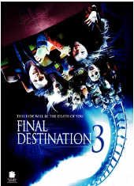
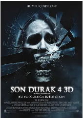

##

[豆瓣评分: ]()

## 回魂夜

[豆瓣评分: 8.1](https://movie.douban.com/subject/1299765/)

导演: [刘镇伟](https://movie.douban.com/celebrity/1274431/)

编剧: [刘镇伟](https://movie.douban.com/celebrity/1274431/)

主演: [周星驰](https://movie.douban.com/celebrity/1048026/) / [莫文蔚](https://movie.douban.com/celebrity/1018248/) / [梁家仁](https://movie.douban.com/celebrity/1008125/) / [黄一飞](https://movie.douban.com/celebrity/1301215/) / [李力持](https://movie.douban.com/celebrity/1274246/) / [卢雄](https://movie.douban.com/celebrity/1377025/) / [张莽](https://movie.douban.com/celebrity/1305232/) / [谭淑梅](https://movie.douban.com/celebrity/1337283/) / [黄智贤](https://movie.douban.com/celebrity/1315071/) / [周志辉](https://movie.douban.com/celebrity/1343510/) / [侯焕玲](https://movie.douban.com/celebrity/1275424/)

上映日期: 1995-07-06

片长: 82分钟

## 死神来了

[豆瓣评分: 7.9](https://movie.douban.com/subject/1300300/)

导演: [黄毅瑜](https://www.douban.com/personage/27529469/)

编剧: [格伦·摩根](https://www.douban.com/personage/27520768/) / [黄毅瑜](https://www.douban.com/personage/27529469/) / [杰弗里·雷迪克](https://www.douban.com/personage/35039472/)

主演: [戴文·萨瓦](https://www.douban.com/personage/27253722/) / [艾丽·拉特](https://www.douban.com/personage/27224702/) / [科尔·史密斯](https://www.douban.com/personage/27237685/) / [克里斯汀·克洛克](https://www.douban.com/personage/27255633/) / [丹尼尔·洛巴克](https://www.douban.com/personage/27237859/) / [罗杰·格午埃文·史密斯](https://www.douban.com/personage/27365485/) / [查德·多纳拉](https://www.douban.com/personage/27295415/) / [西恩·威廉·斯科特](https://www.douban.com/personage/27232888/) / [托尼·托德](https://www.douban.com/personage/27242247/) / [阿曼达·达特曼](https://www.douban.com/personage/27233073/) / [布兰登·费尔](https://www.douban.com/personage/27246317/) / [Forbes Angus](https://movie.douban.com/subject_search?search_text=Forbes Angus) / [Lisa Marie Caruk](https://movie.douban.com/subject_search?search_text=Lisa Marie Caruk) / [克里斯汀·查特莱恩](https://www.douban.com/personage/27480684/) / [芭芭拉·泰森](https://www.douban.com/personage/27358823/)

上映日期: 2000-03-17(美国)

片长: 98 分钟

## 双瞳

[豆瓣评分: 7.7](https://movie.douban.com/subject/1305046/)

导演: [陈国富](https://movie.douban.com/celebrity/1075862/)

编剧: [苏照彬](https://movie.douban.com/celebrity/1274731/) / [陈国富](https://movie.douban.com/celebrity/1075862/)

主演: [梁家辉](https://movie.douban.com/celebrity/1118167/) / [刘若英](https://movie.douban.com/celebrity/1041007/) / [戴立忍](https://movie.douban.com/celebrity/1023718/) / [大卫·摩斯](https://movie.douban.com/celebrity/1027810/) / [杨贵媚](https://movie.douban.com/celebrity/1165442/) / [林涵](https://movie.douban.com/celebrity/1331802/) / [郎雄](https://movie.douban.com/celebrity/1274507/)

上映日期: 2002-10-25(中国台湾)

片长: 113分钟

## 死神来了 2

[豆瓣评分: 7.5](https://movie.douban.com/subject/1307956/)

导演: [大卫·R·艾里斯](https://www.douban.com/personage/27255845/)

编剧: [J·麦基·格鲁伯](https://www.douban.com/personage/27513833/) / [埃里克·布雷斯](https://www.douban.com/personage/27507544/) / [杰弗里·雷迪克](https://www.douban.com/personage/35039472/)

主演: [艾丽·拉特](https://www.douban.com/personage/27224702/) / [A·J·库克](https://www.douban.com/personage/27282804/) / [迈克尔·兰德斯](https://www.douban.com/personage/27255487/) / [大卫·佩特考](https://www.douban.com/personage/27341420/) / [詹姆斯·柯克](https://www.douban.com/personage/27315013/) / [琳达·博伊德](https://www.douban.com/personage/27261699/) / [基冈·康纳·特雷西](https://www.douban.com/personage/27358800/) / [乔纳森·切里](https://www.douban.com/personage/30306373/) / [特伦斯·卡森](https://www.douban.com/personage/27276760/) / [贾斯蒂娜·马查多](https://www.douban.com/personage/27328511/) / [托尼·托德](https://www.douban.com/personage/27242247/) / [莎拉·卡特](https://www.douban.com/personage/27246339/) / [亚利桑德罗·雷](https://www.douban.com/personage/27428648/) / [肖恩·西珀斯](https://www.douban.com/personage/27246404/) / [安德鲁·爱尔莱](https://www.douban.com/personage/27264304/) / [克里斯蒂娜·杰斯特泽姆布斯卡](https://www.douban.com/personage/34451829/) / [艾琳·佩德](https://www.douban.com/personage/27614556/) / [诺尔·费舍](https://www.douban.com/personage/27289941/) / [贝妮塔·夏](https://www.douban.com/personage/30487727/) / [阿伦·道格拉斯](https://www.douban.com/personage/27291525/) / [埃里克·李塞德](https://www.douban.com/personage/27312372/) / [伊妮德·雷伊·亚当斯](https://www.douban.com/personage/27263948/) / [薇娜·苏德](https://www.douban.com/personage/27500516/) / [达西·劳瑞](https://www.douban.com/personage/27316041/) / [John R. Taylor](https://www.douban.com/personage/27527282/) / [奇尔顿·克兰](https://www.douban.com/personage/33398417/) / [Klodyne Rodney](https://www.douban.com/personage/27354362/) / [凯姆·科罗宁](https://www.douban.com/personage/27260592/)

上映日期: 2003-01-31(美国)

片长: 90 分钟

## 死神来了 3

[豆瓣评分: 7.2](https://movie.douban.com/subject/1436870/)

导演: [黄毅瑜](https://www.douban.com/personage/27529469/)

编剧: [格伦·摩根](https://www.douban.com/personage/27520768/) / [黄毅瑜](https://www.douban.com/personage/27529469/)

主演: [玛丽·伊丽莎白·温斯特德](https://www.douban.com/personage/27246773/) / [瑞恩·莫里曼](https://www.douban.com/personage/27205875/) / [克里斯·勒姆彻](https://www.douban.com/personage/27491515/) / [亚莉克兹·约翰逊](https://www.douban.com/personage/27246447/) / [萨姆·伊斯顿](https://www.douban.com/personage/27400741/) / [杰西·莫斯](https://www.douban.com/personage/27250886/) / [吉娜·赫尔顿](https://www.douban.com/personage/27237688/) / [特夏斯·巴特尔](https://www.douban.com/personage/27418959/) / [切兰·西蒙斯](https://www.douban.com/personage/27246930/) / [克瑞斯塔尔·洛维](https://www.douban.com/personage/27322721/) / [阿曼达·克鲁](https://www.douban.com/personage/27222337/) / [马美琪](https://www.douban.com/personage/27215492/) / [派崔克·盖勒](https://www.douban.com/personage/27237694/)

上映日期: 2006-02-10(美国)

片长: 93 分钟 / 86 分钟(韩国剪辑版)

## 诡丝

[豆瓣评分: 7.2](https://movie.douban.com/subject/1780168/)

导演: [苏照彬](https://movie.douban.com/celebrity/1274731/)

编剧: [苏照彬](https://movie.douban.com/celebrity/1274731/)

主演: [张震](https://movie.douban.com/celebrity/1077991/) / [林嘉欣](https://movie.douban.com/celebrity/1204410/) / [江口洋介](https://movie.douban.com/celebrity/1088015/) / [徐熙媛](https://movie.douban.com/celebrity/1027645/) / [陈柏霖](https://movie.douban.com/celebrity/1211987/) / [张钧甯](https://movie.douban.com/celebrity/1257882/) / [万芳](https://movie.douban.com/celebrity/1325657/) / [陈冠伯](https://movie.douban.com/celebrity/1221966/) / [马之秦](https://movie.douban.com/celebrity/1323221/) / [津嘉山正种](https://movie.douban.com/celebrity/1156488/) / [戴立忍](https://movie.douban.com/celebrity/1023718/)

上映日期: 2006-09-29(中国台湾)

片长: 108分钟

## 死神来了 4

[豆瓣评分: 6.7](https://movie.douban.com/subject/2357708/)

导演: [大卫·R·艾里斯](https://www.douban.com/personage/27255845/)

编剧: [埃里克·布雷斯](https://www.douban.com/personage/27507544/) / [杰弗里·雷迪克](https://www.douban.com/personage/35039472/)

主演: [鲍比·坎波](https://www.douban.com/personage/27237917/) / [珊特尔·范圣滕](https://www.douban.com/personage/27228404/) / [尼克·扎诺](https://www.douban.com/personage/27237681/) / [海雷·韦伯](https://www.douban.com/personage/27242486/) / [麦凯尔泰·威廉逊](https://www.douban.com/personage/27237653/) / [克里丝塔·艾伦](https://www.douban.com/personage/27208402/) / [安德鲁·费斯切拉](https://www.douban.com/personage/27286604/) / [贾斯汀·维尔伯恩](https://www.douban.com/personage/27585661/) / [斯蒂芬妮·奥诺雷](https://www.douban.com/personage/27499732/) / [拉腊·格赖斯](https://www.douban.com/personage/27388030/) / [Jackson Walker](https://movie.douban.com/subject_search?search_text=Jackson Walker) / [菲尔·奥斯汀](https://www.douban.com/personage/27552699/) / [William Aguillard](https://movie.douban.com/subject_search?search_text=William Aguillard) / [Brendan Aguillard](https://movie.douban.com/subject_search?search_text=Brendan Aguillard) / [Juan Kincaid](https://movie.douban.com/subject_search?search_text=Juan Kincaid) / [克里斯·弗赖伊](https://www.douban.com/personage/27421752/) / [蒂娜·帕克](https://www.douban.com/personage/27501853/) / [戴恩·罗兹](https://www.douban.com/personage/27551961/) / [加布丽埃勒·沙潘](https://www.douban.com/personage/27549736/) / [戴恩·布朗](https://www.douban.com/personage/27471865/) / [珍娜·克莱格](https://www.douban.com/personage/27394056/) / [约书亚·戴维斯](https://www.douban.com/personage/27248653/) / [Lauren Denham](https://www.douban.com/personage/27477049/) / [瑞奇·迪亚兹](https://www.douban.com/personage/27215895/) / [Joanna Doherty](https://www.douban.com/personage/27478975/) / [安东尼·迈克尔·弗雷德里克](https://www.douban.com/personage/27393377/) / [Kyrt Gates](https://www.douban.com/personage/27471426/) / [肖恩·吉尔默](https://www.douban.com/personage/27464655/) / [罗德尼·赫伯特](https://www.douban.com/personage/27448531/) / [Alan Wyn Hughes](https://www.douban.com/personage/27474248/) / [艾丽·拉特](https://www.douban.com/personage/27224702/) / [劳丽·李](https://www.douban.com/personage/27466800/) / [Jake Moritt](https://www.douban.com/personage/27376121/) / [杰里米·帕尔科](https://www.douban.com/personage/27432404/) / [克鲁瓦·普罗旺斯](https://www.douban.com/personage/27497626/) / [比利·斯洛特](https://www.douban.com/personage/27411853/) / [查兹·史密斯](https://www.douban.com/personage/27444853/) / [洛根·道格拉斯·史密斯](https://www.douban.com/personage/27477841/) / [特里·李·史密斯](https://www.douban.com/personage/27479070/) / [Louis St. Romain](https://www.douban.com/personage/27454099/) / [Corey Stewart](https://www.douban.com/personage/27462431/) / [Preston Strother](https://www.douban.com/personage/27459096/) / [科琳·特拉斯勒](https://www.douban.com/personage/27497693/)

上映日期: 2009-08-28

片长: 82 分钟

## 死神来了 5

[豆瓣评分: 6.8](https://movie.douban.com/subject/4724373/)

导演: [史蒂文·奎里](https://www.douban.com/personage/27499257/)

编剧: [埃里克·海瑟尔](https://www.douban.com/personage/27544751/) / [杰弗里·雷迪克](https://www.douban.com/personage/35039472/)

主演: [麦尔斯·费舍](https://www.douban.com/personage/27215372/) / [尼克·达歌斯托](https://www.douban.com/personage/27274138/) / [大卫·科恩查内](https://www.douban.com/personage/27255433/) / [艾玛·贝尔](https://www.douban.com/personage/27242389/) / [梅甘·欧瑞](https://www.douban.com/personage/27335329/) / [杰奎琳·玛克林尼丝·伍德](https://www.douban.com/personage/27206031/) / [托尼·托德](https://www.douban.com/personage/27242247/)

上映日期: 2011-08-12

片长: 92分钟

## 

[豆瓣评分: ]()

## 

[豆瓣评分: ]()

## 

[豆瓣评分: ]()

- 小岛惊魂
- 灵异第六感
- 七宗罪
- 沉默的羔羊
- 闪灵
- 见鬼
- 恐怖游轮
- 前目的地
- 异度空间    （枪王）
- 致命ID
- 1408幻影凶间
- 迷雾
- 禁闭岛
- 致命魔术
- 十二猴子
- 误杀