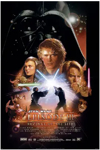

## 

[豆瓣评分: ]()

## 星球大战

[豆瓣评分: 8.5](https://movie.douban.com/subject/1293838/)

导演: [乔治·卢卡斯](https://www.douban.com/personage/27260274/)

编剧: [乔治·卢卡斯](https://www.douban.com/personage/27260274/)

主演: [哈里森·福特](https://www.douban.com/personage/27214929/) / [马克·哈米尔](https://www.douban.com/personage/27233546/) / [凯丽·费雪](https://www.douban.com/personage/27233550/) / [彼得·库欣](https://www.douban.com/personage/27224808/) / [亚历克·吉尼斯](https://www.douban.com/personage/27205799/) / [彼德·梅犹](https://www.douban.com/personage/27250739/) / [大卫·鲍罗斯](https://www.douban.com/personage/27215090/) / [詹姆斯·厄尔·琼斯](https://www.douban.com/personage/27219504/)

上映日期: 1977-05-25(美国)

片长: 121分钟 / 125分钟(特别版)

## 星球大战 2：帝国反击战

[豆瓣评分: 8.4](https://movie.douban.com/subject/1296528/)

导演: [厄文·克什纳](https://www.douban.com/personage/27250845/)

编剧: [乔治·卢卡斯](https://www.douban.com/personage/27260274/) / [劳伦斯·卡斯丹](https://www.douban.com/personage/27219780/) / [利·布拉克特](https://www.douban.com/personage/27242810/)

主演: [马克·哈米尔](https://www.douban.com/personage/27233546/) / [哈里森·福特](https://www.douban.com/personage/27214929/) / [凯丽·费雪](https://www.douban.com/personage/27233550/) / [比利·迪·威廉姆斯](https://www.douban.com/personage/27208447/) / [安东尼·丹尼尔斯](https://www.douban.com/personage/27237890/) / [大卫·鲍罗斯](https://www.douban.com/personage/27215090/) / [彼德·梅犹](https://www.douban.com/personage/27250739/) / [肯尼·贝克](https://www.douban.com/personage/27264464/) / [弗兰克·奥兹](https://www.douban.com/personage/27224778/) / [亚历克·吉尼斯](https://www.douban.com/personage/27205799/)

上映日期: 1980-05-21(美国)

片长: 124分钟 / 127分钟(特别版)

## 星球大战 3：绝地归来

[豆瓣评分: 8.4](https://movie.douban.com/subject/1297151/)

导演: [理查德·马昆德](https://www.douban.com/personage/27250981/)

编剧: [劳伦斯·卡斯丹](https://www.douban.com/personage/27219780/) / [乔治·卢卡斯](https://www.douban.com/personage/27260274/)

主演: [马克·哈米尔](https://www.douban.com/personage/27233546/) / [哈里森·福特](https://www.douban.com/personage/27214929/) / [凯丽·费雪](https://www.douban.com/personage/27233550/) / [比利·迪·威廉姆斯](https://www.douban.com/personage/27208447/) / [安东尼·丹尼尔斯](https://www.douban.com/personage/27237890/) / [彼德·梅犹](https://www.douban.com/personage/27250739/) / [塞巴斯蒂安·肖](https://www.douban.com/personage/27224874/) / [伊恩·麦克迪阿梅德](https://www.douban.com/personage/27228441/) / [弗兰克·奥兹](https://www.douban.com/personage/27224778/) / [詹姆斯·厄尔·琼斯](https://www.douban.com/personage/27219504/) / [大卫·鲍罗斯](https://www.douban.com/personage/27215090/) / [亚历克·吉尼斯](https://www.douban.com/personage/27205799/) / [肯尼·贝克](https://www.douban.com/personage/27264464/) / [Michael Pennington](https://www.douban.com/personage/27340501/) / [肯尼斯·考利](https://www.douban.com/personage/27242696/) / [米迦勒·卡特](https://www.douban.com/personage/27275561/) / [丹尼斯·劳森](https://www.douban.com/personage/27312695/) / [蒂姆·罗斯](https://www.douban.com/personage/27346315/) / [德尔莫特·克劳利](https://www.douban.com/personage/27276671/) / [卡罗琳·布莱奇斯顿](https://www.douban.com/personage/27212897/) / [沃维克·戴维斯](https://www.douban.com/personage/27212685/) / [杰米·布洛奇](https://www.douban.com/personage/27212845/) / [克莱尔·达文波特](https://www.douban.com/personage/27294402/) / [杰克·普韦思](https://www.douban.com/personage/27547212/) / [尼古拉斯·里德](https://www.douban.com/personage/27351012/) / [汤姆·曼尼恩](https://www.douban.com/personage/27486170/) / [迈克尔·亨博瑞·巴尔兰](https://www.douban.com/personage/27269362/) / [莎拉·本内特](https://www.douban.com/personage/27270195/) / [黛比·李·卡林顿](https://www.douban.com/personage/27282352/) / [萨迪·科尔](https://www.douban.com/personage/27284773/) / [托尼·考克斯](https://www.douban.com/personage/27205980/) / [Luis De Jesus](https://www.douban.com/personage/27295470/) / [菲尔·方德卡罗](https://www.douban.com/personage/27292776/) / [Sal Fondacaro](https://www.douban.com/personage/27288065/) / [迈克尔·吉尔顿](https://www.douban.com/personage/27255927/) / [保罗·格兰特](https://www.douban.com/personage/36323896/) / [理查德·琼斯](https://www.douban.com/personage/27309913/) / [基兰·沙阿](https://www.douban.com/personage/27233161/) / [费利克斯·西拉](https://www.douban.com/personage/27346733/) / [凯文·汤普森](https://www.douban.com/personage/27586375/) / [Kendra Wall](https://www.douban.com/personage/27366787/)

上映日期: 1983-05-25(美国)

片长: 131分钟 / 134分钟(特别版)

## 回到未来

[豆瓣评分: 8.8](https://movie.douban.com/subject/1300555/)

导演: [罗伯特·泽米吉斯](https://www.douban.com/personage/27259332/)

编剧: [罗伯特·泽米吉斯](https://www.douban.com/personage/27259332/) / [鲍勃·盖尔](https://www.douban.com/personage/27224021/)

主演: [迈克尔·J·福克斯](https://www.douban.com/personage/27223619/) / [克里斯托弗·洛伊德](https://www.douban.com/personage/27232898/) / [莉·汤普森](https://www.douban.com/personage/27224738/) / [克里斯平·格洛弗](https://www.douban.com/personage/27208356/) / [托马斯·F·威尔森](https://www.douban.com/personage/27208397/) / [克劳迪娅·韦尔斯](https://www.douban.com/personage/27214977/) / [马克·麦克卢尔](https://www.douban.com/personage/27324440/) / [温迪·乔·斯佩博](https://www.douban.com/personage/27360585/) / [乔治·第桑佐](https://www.douban.com/personage/27254016/) / [弗兰西斯·李·麦克凯恩](https://www.douban.com/personage/27228620/) / [詹姆斯·托根](https://www.douban.com/personage/27361233/) / [J·J·科恩](https://www.douban.com/personage/27278035/) / [凯西·希玛兹科](https://www.douban.com/personage/27350614/) / [比利·赞恩](https://www.douban.com/personage/27237605/) / [小哈利·沃特斯](https://www.douban.com/personage/27486051/) / [唐纳德·富利洛夫](https://www.douban.com/personage/27486052/) / [丽萨·弗里曼](https://www.douban.com/personage/27486053/) / [克里斯滕·考夫曼](https://www.douban.com/personage/27486054/)

上映日期: 1985-07-03(美国)

片长: 116分钟

## 回到未来 2

[豆瓣评分: 8.5](https://movie.douban.com/subject/1299092/)

导演: [罗伯特·泽米吉斯](https://www.douban.com/personage/27259332/)

编剧: [鲍勃·盖尔](https://www.douban.com/personage/27224021/) / [罗伯特·泽米吉斯](https://www.douban.com/personage/27259332/)

主演: [迈克尔·J·福克斯](https://www.douban.com/personage/27223619/) / [克里斯托弗·洛伊德](https://www.douban.com/personage/27232898/) / [莉·汤普森](https://www.douban.com/personage/27224738/) / [托马斯·F·威尔森](https://www.douban.com/personage/27208397/) / [伊丽莎白·苏](https://www.douban.com/personage/27232875/) / [詹姆斯·托根](https://www.douban.com/personage/27361233/) / [杰弗里·韦斯曼](https://www.douban.com/personage/27233084/) / [凯西·希玛兹科](https://www.douban.com/personage/27350614/) / [比利·赞恩](https://www.douban.com/personage/27237605/) / [J·J·科恩](https://www.douban.com/personage/27278035/) / [查尔斯·弗莱舍](https://www.douban.com/personage/27295421/) / [卡萨诺瓦·埃文斯](https://www.douban.com/personage/27486055/) / [杰伊·科赫](https://www.douban.com/personage/27313576/) / [查尔斯·格拉迪](https://www.douban.com/personage/27486056/) / [瑞奇·迪恩·洛根](https://www.douban.com/personage/27486057/) / [达琳·沃格尔](https://www.douban.com/personage/27366731/) / [李截](https://www.douban.com/personage/27246340/) / [弗利](https://www.douban.com/personage/27233069/)

上映日期: 1989-11-22(美国)

片长: 108分钟

## 回到未来 3

[豆瓣评分: 8.6](https://movie.douban.com/subject/1296666/)

导演: [罗伯特·泽米吉斯](https://www.douban.com/personage/27259332/)

编剧: [鲍勃·盖尔](https://www.douban.com/personage/27224021/) / [罗伯特·泽米吉斯](https://www.douban.com/personage/27259332/)

主演: [迈克尔·J·福克斯](https://www.douban.com/personage/27223619/) / [克里斯托弗·洛伊德](https://www.douban.com/personage/27232898/) / [玛丽·斯汀伯根](https://www.douban.com/personage/27212679/) / [托马斯·F·威尔森](https://www.douban.com/personage/27208397/) / [莉·汤普森](https://www.douban.com/personage/27224738/) / [伊丽莎白·苏](https://www.douban.com/personage/27232875/) / [马特·克拉克](https://www.douban.com/personage/27242507/) / [理查德·戴萨特](https://www.douban.com/personage/27289421/) / [Pat Buttram](https://www.douban.com/personage/27279031/) / [小哈里·凯瑞](https://www.douban.com/personage/27253974/) / [德博泰勒](https://www.douban.com/personage/27359349/) / [詹姆斯·托根](https://www.douban.com/personage/27361233/) / [马克·麦克卢尔](https://www.douban.com/personage/27324440/) / [温迪·乔·斯佩博](https://www.douban.com/personage/27360585/) / [杰弗里·韦斯曼](https://www.douban.com/personage/27233084/) / [Hugh Gillin](https://www.douban.com/personage/27304977/) / [弗利](https://www.douban.com/personage/27233069/)

上映日期: 1990-05-25(美国)

片长: 118分钟

## 终结者

[豆瓣评分: 8.2](https://movie.douban.com/subject/1300656/)

导演: [詹姆斯·卡梅隆](https://www.douban.com/personage/27228298/)

编剧: [詹姆斯·卡梅隆](https://www.douban.com/personage/27228298/) / [盖尔·安妮·赫德](https://www.douban.com/personage/27246567/) / [小威廉·威谢尔](https://www.douban.com/personage/27529397/)

主演: [阿诺·施瓦辛格](https://www.douban.com/personage/27241391/) / [迈克尔·比恩](https://www.douban.com/personage/27230922/) / [琳达·汉密尔顿](https://www.douban.com/personage/27233558/) / [保罗·温菲尔德](https://www.douban.com/personage/27224852/) / [兰斯·亨利克森](https://www.douban.com/personage/27253901/) / [里克·罗索维奇](https://www.douban.com/personage/27260934/) / [贝丝·莫塔](https://www.douban.com/personage/27342313/) / [阿尔·伯恩](https://www.douban.com/personage/27266973/) / [迪克·米勒](https://www.douban.com/personage/27222433/) / [弗兰科·哥伦布](https://www.douban.com/personage/27228690/) / [比尔·帕克斯顿](https://www.douban.com/personage/27253895/) / [布莱恩·汤普森](https://www.douban.com/personage/27255434/) / [小威廉·威谢尔](https://www.douban.com/personage/27529397/) / [菲利普·戈登](https://www.douban.com/personage/27513506/) / [哈丽特·梅丁](https://www.douban.com/personage/27332030/) / [玛丽安妮·穆勒雷尔](https://www.douban.com/personage/27338080/) / [达雷尔·马普森](https://www.douban.com/personage/27216791/) / [Shawn Schepps](https://movie.douban.com/subject_search?search_text=Shawn Schepps) / [Bruce M. Kerner](https://movie.douban.com/subject_search?search_text=Bruce M. Kerner) / [Brad Rearden](https://movie.douban.com/subject_search?search_text=Brad Rearden) / [斯坦·耶尔](https://www.douban.com/personage/27368726/) / [Norman Friedman](https://www.douban.com/personage/27290637/) / [Barbara Powers](https://www.douban.com/personage/27334193/) / [Chino 'Fats' Williams](https://www.douban.com/personage/27374541/)

上映日期: 1992-06(中国大陆) / 1984-10-26(美国)

片长: 107分钟

## 终结者 2：审判日

[豆瓣评分: 8.8](https://movie.douban.com/subject/1291844/)

导演: [詹姆斯·卡梅隆](https://www.douban.com/personage/27228298/)

编剧: [詹姆斯·卡梅隆](https://www.douban.com/personage/27228298/) / [小威廉·威谢尔](https://www.douban.com/personage/27529397/)

主演: [阿诺·施瓦辛格](https://www.douban.com/personage/27241391/) / [琳达·汉密尔顿](https://www.douban.com/personage/27233558/) / [爱德华·福隆](https://www.douban.com/personage/27228327/) / [罗伯特·帕特里克](https://www.douban.com/personage/27246890/) / [阿尔·伯恩](https://www.douban.com/personage/27266973/) / [乔·莫顿](https://www.douban.com/personage/27233629/) / [埃帕莎·默克森](https://www.douban.com/personage/27242365/) / [卡斯图罗·格雷拉](https://www.douban.com/personage/27297243/) / [丹尼·库克塞](https://www.douban.com/personage/27284752/) / [詹妮特·戈德斯坦恩](https://www.douban.com/personage/27210396/) / [山德·贝克利](https://www.douban.com/personage/27242224/) / [莱思莉·汉密尔顿·格伦](https://www.douban.com/personage/27300112/) / [彼得·舒鲁姆](https://www.douban.com/personage/27346460/) / [唐·雷克](https://www.douban.com/personage/27242628/) / [吉姆·帕尔默](https://www.douban.com/personage/27522132/) / [格温达·迪肯](https://www.douban.com/personage/27499017/) / [科林·帕特里克·林奇](https://www.douban.com/personage/27215785/) / [妮基·考克斯](https://www.douban.com/personage/27223689/) / [德沃恩·尼克森](https://www.douban.com/personage/27494553/) / [阿卜杜勒·萨拉姆·埃尔·拉扎克](https://www.douban.com/personage/27286818/) / [迈克·马斯喀特](https://www.douban.com/personage/27224997/) / [迪恩·诺里斯](https://www.douban.com/personage/27488333/) / [查尔斯·A·坦伯罗](https://www.douban.com/personage/27527159/) / [丹尼·皮尔斯](https://www.douban.com/personage/27522794/) / [马克·克里斯托弗·劳伦斯](https://www.douban.com/personage/27319128/) / [林凡 ](https://www.douban.com/personage/27518392/)/ [乔尔·克莱默](https://www.douban.com/personage/27261666/) / [斯科特·肖](https://www.douban.com/personage/27261188/) / [史文-欧尔·托尔森](https://www.douban.com/personage/27233091/) / [小威廉·威谢尔](https://www.douban.com/personage/27529397/) / [Ken Gibbel](https://movie.douban.com/subject_search?search_text=Ken Gibbel) / [Robert Winley](https://movie.douban.com/subject_search?search_text=Robert Winley) / [Michael Edwards](https://www.douban.com/personage/27291128/) / [Don Stanton](https://www.douban.com/personage/27356331/) / [Dan Stanton](https://www.douban.com/personage/27356499/) / [Lisa Brinegar](https://www.douban.com/personage/27277967/) / [Dalton Abbott](https://www.douban.com/personage/27261058/) / [Bret A. Arnold](https://www.douban.com/personage/27263557/) / [Martin Deluca](https://www.douban.com/personage/27229474/)

上映日期: 1991-07-03(美国) / 2017-02-17(柏林电影节 3D)

片长: 137分钟 / 153分钟(特别版) / 156分钟(终极剪辑版)

## 未来水世界

[豆瓣评分: 7.6](https://movie.douban.com/subject/1294037/)

导演: [凯文·雷诺兹](https://www.douban.com/personage/27219765/)

编剧: [Peter Rader](https://movie.douban.com/subject_search?search_text=Peter Rader) / [大卫·杜西](https://www.douban.com/personage/27233166/)

主演: [凯文·科斯特纳](https://www.douban.com/personage/27222394/) / [珍妮·特里普里霍恩](https://www.douban.com/personage/27223639/) / [蒂娜·米乔里诺](https://www.douban.com/personage/27212664/) / [Chaim Girafi](https://movie.douban.com/subject_search?search_text=Chaim Girafi) / [瑞克·阿维莱斯](https://www.douban.com/personage/27263497/)

上映日期: 1995-07-28

片长: 135 分钟 / 176分钟(美国电视版)

## 星河战队

[豆瓣评分: 7.9](https://movie.douban.com/subject/1295384/)

导演: [保罗·范霍文](https://www.douban.com/personage/27261687/)

编剧: [爱德华·诺麦尔](https://www.douban.com/personage/27521354/) / [罗伯特·A·海因莱因](https://www.douban.com/personage/27215449/)

主演: [卡斯帕·范·迪恩](https://www.douban.com/personage/27242148/) / [迪娜·迈耶](https://www.douban.com/personage/27242106/) / [丹妮丝·理查兹](https://www.douban.com/personage/27210291/) / [杰克·布塞](https://www.douban.com/personage/27223720/) / [尼尔·帕特里克·哈里斯](https://www.douban.com/personage/27223620/) / [克兰西·布朗](https://www.douban.com/personage/27219521/) / [塞斯·吉列姆](https://www.douban.com/personage/27297954/) / [帕特里克·茂顿](https://www.douban.com/personage/27233080/) / [迈克尔·艾恩塞德](https://www.douban.com/personage/27212691/) / [露·麦克拉纳罕](https://www.douban.com/personage/27237543/) / [马绍尔·贝尔](https://www.douban.com/personage/27271229/) / [埃里克·布鲁斯科特尔](https://www.douban.com/personage/27283763/) / [马特·莱文](https://www.douban.com/personage/27206219/) / [布蕾克·林斯利](https://www.douban.com/personage/27327451/) / [安东尼·瑞维瓦](https://www.douban.com/personage/27351074/) / [布兰达·斯特朗](https://www.douban.com/personage/27208432/) / [迪恩·诺里斯](https://www.douban.com/personage/27488333/) / [克里斯托弗·柯里](https://www.douban.com/personage/27274450/) / [莱诺尔·卡斯多夫](https://www.douban.com/personage/27309112/) / [罗伯特·斯莫特](https://www.douban.com/personage/27358566/) / [斯蒂芬·福特](https://www.douban.com/personage/27251003/) / [罗伯特·大卫·豪尔](https://www.douban.com/personage/27246481/) / [艾米·斯马特](https://www.douban.com/personage/27205738/) / [蒂莫西·奥门德森](https://www.douban.com/personage/27338809/) / [代尔·戴](https://www.douban.com/personage/27233627/)

上映日期: 1997-11-07

片长: 129 分钟

## 黑客帝国

[豆瓣评分: 9.1](https://movie.douban.com/subject/1291843/)

导演: [莉莉·沃卓斯基](https://www.douban.com/personage/27219605/) / [拉娜·沃卓斯基](https://www.douban.com/personage/27366900/)

编剧: [莉莉·沃卓斯基](https://www.douban.com/personage/27219605/) / [拉娜·沃卓斯基](https://www.douban.com/personage/27366900/)

主演: [基努·里维斯](https://www.douban.com/personage/27213761/) / [劳伦斯·菲什伯恩](https://www.douban.com/personage/27228323/) / [凯瑞-安·莫斯](https://www.douban.com/personage/27228308/) / [雨果·维文](https://www.douban.com/personage/27246749/) / [格洛丽亚·福斯特](https://www.douban.com/personage/27246580/) / [乔·潘托里亚诺](https://www.douban.com/personage/27255320/) / [马库斯·钟](https://www.douban.com/personage/27276607/) / [朱利安·阿拉汗加](https://www.douban.com/personage/27261933/) / [马特·多兰](https://www.douban.com/personage/27286427/) / [贝琳达·麦克洛里](https://www.douban.com/personage/27519756/) / [安东尼·雷·帕克](https://www.douban.com/personage/27333483/) / [罗伯特·泰勒](https://www.douban.com/personage/27551636/) / [阿达·尼科德莫](https://www.douban.com/personage/27334707/) / [罗温·维特](https://www.douban.com/personage/27367641/) / [塔玛拉·布朗](https://www.douban.com/personage/27274329/) / [纳塔莉·特珍](https://www.douban.com/personage/27363441/) / [比尔·扬](https://www.douban.com/personage/27225028/) / [克里斯·斯科特](https://www.douban.com/personage/27346710/) / [纳许·埃哲顿](https://www.douban.com/personage/27222480/)

上映日期: 2000-01-14(中国大陆) / 1999-03-31(美国)

片长: 136分钟

## 星球大战前传 1：幽灵的威胁

[豆瓣评分: 8.2](https://movie.douban.com/subject/1294362/)

导演: [乔治·卢卡斯](https://www.douban.com/personage/27260274/)

编剧: [乔治·卢卡斯](https://www.douban.com/personage/27260274/)

主演: [连姆·尼森](https://www.douban.com/personage/27236961/) / [伊万·麦克格雷格](https://www.douban.com/personage/27218224/) / [娜塔莉·波特曼](https://www.douban.com/personage/27200509/) / [杰克·洛伊德](https://www.douban.com/personage/27237684/) / [伊恩·麦克迪阿梅德](https://www.douban.com/personage/27228441/) / [潘妮拉·奥古斯特](https://www.douban.com/personage/27212827/) / [奥利弗·福德·戴维斯](https://www.douban.com/personage/27285673/) / [阿梅德·贝斯特](https://www.douban.com/personage/27228561/) / [安东尼·丹尼尔斯](https://www.douban.com/personage/27237890/) / [肯尼·贝克](https://www.douban.com/personage/27264464/) / [弗兰克·奥兹](https://www.douban.com/personage/27224778/) / [特伦斯·斯坦普](https://www.douban.com/personage/27216261/) / [布耐恩·布莱塞得](https://www.douban.com/personage/27233637/) / [安德鲁·斯考姆比](https://www.douban.com/personage/27347946/) / [休·夸希](https://www.douban.com/personage/27345374/)

上映日期: 1999-11-05(中国大陆) / 1999-05-19(美国) / 2012-02-10(美国)

片长: 136分钟

## 异次元骇客

[豆瓣评分: 8.4](https://movie.douban.com/subject/1300282/)

导演: [约瑟夫·鲁斯纳克](https://www.douban.com/personage/27556643/)

编剧: [约瑟夫·鲁斯纳克](https://www.douban.com/personage/27556643/) / [拉威尔·森特諾-罗德里格斯](https://www.douban.com/personage/36594777/)

主演: [克雷格·比尔克](https://www.douban.com/personage/27228453/) / [阿明·缪勒-斯塔尔](https://www.douban.com/personage/27261513/) / [格瑞辰·摩尔](https://www.douban.com/personage/27246908/) / [文森特·多诺费奥](https://www.douban.com/personage/27216237/) / [丹尼斯·海斯伯特](https://www.douban.com/personage/27224780/) / [斯蒂文·沙博](https://www.douban.com/personage/27260712/) / [Jeremy Roberts](https://movie.douban.com/subject_search?search_text=Jeremy Roberts) / [里夫·霍顿](https://www.douban.com/personage/27311650/) / [莱昂·里皮](https://www.douban.com/personage/27350623/) / [珍妮特·麦克拉克伦](https://www.douban.com/personage/27321558/) / [布拉德·威廉姆·亨克](https://www.douban.com/personage/27208491/) / [伯特·布洛斯](https://www.douban.com/personage/27555960/) / [Venessia Valentino](https://movie.douban.com/subject_search?search_text=Venessia Valentino) / [霍华德·S·米勒](https://www.douban.com/personage/27556116/) / [蒂娅·德克萨达](https://www.douban.com/personage/27242348/) / [施瑞·阿普莱碧](https://www.douban.com/personage/27242108/) / [鲍勃·克莱德宁](https://www.douban.com/personage/27261915/) / [艾莉森·洛曼](https://www.douban.com/personage/27246746/) / [Hadda Brooks](https://www.douban.com/personage/27280684/) / [厄尼·里夫利](https://www.douban.com/personage/27212792/) / [托妮·索耶](https://www.douban.com/personage/27352003/) / [Brooks Almy](https://www.douban.com/personage/27265204/) / [李韦弗](https://www.douban.com/personage/27370911/) / [杰弗里·里瓦斯](https://www.douban.com/personage/27492337/) / [Travis Tedford](https://www.douban.com/personage/27360543/) / [杰夫·布鲁门克兰茨](https://www.douban.com/personage/27270691/) / [约翰尼·克劳福德](https://www.douban.com/personage/27283259/) / [Tracy Perry](https://www.douban.com/personage/27334699/) / [威尔·华莱士](https://www.douban.com/personage/27504692/)

上映日期: 1999-05-28(美国)

片长: 100分钟

## 星球大战前传 2：克隆人的进攻

[豆瓣评分: 8.1](https://movie.douban.com/subject/1297785/)

导演: [乔治·卢卡斯](https://www.douban.com/personage/27260274/)

编剧: [乔治·卢卡斯](https://www.douban.com/personage/27260274/) / [乔纳森·黑尔斯](https://www.douban.com/personage/27255232/)

主演: [伊万·麦克格雷格](https://www.douban.com/personage/27218224/) / [娜塔莉·波特曼](https://www.douban.com/personage/27200509/) / [海登·克里斯滕森](https://www.douban.com/personage/27246778/) / [克里斯托弗·李](https://www.douban.com/personage/27260234/) / [塞缪尔·杰克逊](https://www.douban.com/personage/27260176/) / [弗兰克·奥兹](https://www.douban.com/personage/27224778/) / [伊恩·麦克迪阿梅德](https://www.douban.com/personage/27228441/) / [潘妮拉·奥古斯特](https://www.douban.com/personage/27212827/) / [特穆拉·莫里森](https://www.douban.com/personage/27219604/) / [吉米·斯密茨](https://www.douban.com/personage/27216289/) / [杰克·汤普森](https://www.douban.com/personage/27358133/) / [阿梅德·贝斯特](https://www.douban.com/personage/27228561/) / [罗丝·伯恩](https://www.douban.com/personage/27228289/) / [奥利弗·福德·戴维斯](https://www.douban.com/personage/27285673/) / [利安娜·瓦尔斯曼](https://www.douban.com/personage/27370062/)

上映日期: 2002-07-12(中国大陆) / 2002-05-16(美国)

片长: 142分钟 / 120分钟(IMAX版)

## 黑客帝国 2：重装上阵

[豆瓣评分: 8.7](https://movie.douban.com/subject/1304141/)

导演: [拉娜·沃卓斯基](https://www.douban.com/personage/27366900/) / [莉莉·沃卓斯基](https://www.douban.com/personage/27219605/)

编剧: [莉莉·沃卓斯基](https://www.douban.com/personage/27219605/) / [拉娜·沃卓斯基](https://www.douban.com/personage/27366900/)

主演: [基努·里维斯](https://www.douban.com/personage/27213761/) / [劳伦斯·菲什伯恩](https://www.douban.com/personage/27228323/) / [凯瑞-安·莫斯](https://www.douban.com/personage/27228308/) / [雨果·维文](https://www.douban.com/personage/27246749/) / [莫妮卡·贝鲁奇](https://www.douban.com/personage/27230888/) / [赫尔穆特·巴凯蒂斯](https://www.douban.com/personage/27264642/) / [斯蒂夫·巴什托尼](https://www.douban.com/personage/27238124/) / [克里斯汀·阿努](https://www.douban.com/personage/27584853/) / [丹尼尔·伯哈特](https://www.douban.com/personage/27255652/) / [约瑟芬·白内斯](https://www.douban.com/personage/27220313/) / [安迪·阿尼斯](https://www.douban.com/personage/27220340/) / [贾达·萍克特·史密斯](https://www.douban.com/personage/27259922/) / [邹兆龙](https://www.douban.com/personage/27228548/) / [埃茜·戴维斯](https://www.douban.com/personage/27510181/) / [纳许·埃哲顿](https://www.douban.com/personage/27222480/) / [格洛丽亚·福斯特](https://www.douban.com/personage/27246580/) / [大卫·富兰克林](https://www.douban.com/personage/27251053/) / [诺娜·加耶](https://www.douban.com/personage/27300408/) / [小罗伊·琼斯](https://www.douban.com/personage/27397691/) / [大卫·基尔德](https://www.douban.com/personage/27516803/) / [兰德尔·杜克·金](https://www.douban.com/personage/27233019/) / [克里斯托弗·卡比](https://www.douban.com/personage/27565708/) / [纳撒尼尔·利斯](https://www.douban.com/personage/30241294/) / [哈里·列尼斯](https://www.douban.com/personage/27330967/) / [罗伯特·马莫内](https://www.douban.com/personage/27570319/) / [马特·麦科姆](https://www.douban.com/personage/27547248/) / [罗宾·奈文](https://www.douban.com/personage/27340378/) / [大卫·诺](https://www.douban.com/personage/27243178/) / [吉娜薇·欧瑞丽](https://www.douban.com/personage/27503139/) / [苏格拉底·奥图](https://www.douban.com/personage/27552642/) / [哈罗德·佩里诺](https://www.douban.com/personage/27335947/) / [阿德里安·雷梅特](https://www.douban.com/personage/27405174/) / [尼尔·雷梅特](https://www.douban.com/personage/27382118/) / [鲁伯特·雷德](https://www.douban.com/personage/27556053/) / [大卫·罗伯茨](https://www.douban.com/personage/27524038/) / [凯文·斯科特](https://www.douban.com/personage/27525363/) / [尼坎德罗·托马斯](https://www.douban.com/personage/27403890/) / [吉娜·托瑞斯](https://www.douban.com/personage/27253896/) / [史蒂夫·维拉](https://www.douban.com/personage/27403475/) / [克莱顿·华生](https://www.douban.com/personage/27206328/) / [康奈尔·韦斯特](https://www.douban.com/personage/27373125/) / [雷·沃纳尔](https://www.douban.com/personage/27219737/) / [伯纳德·怀特](https://www.douban.com/personage/27370702/) / [朗贝尔·维尔森](https://www.douban.com/personage/27230996/) / [安东尼·布兰登·黄](https://www.douban.com/personage/27372119/) / [安东尼·泽比](https://www.douban.com/personage/27253964/)

上映日期: 2003-07-18(中国大陆) / 2003-05-07(韦斯特伍德首映) / 2003-05-15(美国)

片长: 138分钟

## 终结者 3：机器的觉醒

[豆瓣评分: 7.4](https://movie.douban.com/subject/1305333/)

导演: [乔纳森·莫斯托](https://www.douban.com/personage/27242488/)

编剧: [约翰·布兰卡托](https://www.douban.com/personage/27276218/) / [迈克尔·费里斯](https://www.douban.com/personage/27210915/) / [詹姆斯·卡梅隆](https://www.douban.com/personage/27228298/) / [盖尔·安妮·赫德](https://www.douban.com/personage/27246567/) / [Tedi Sarafian](https://movie.douban.com/subject_search?search_text=Tedi Sarafian)

主演: [阿诺·施瓦辛格](https://www.douban.com/personage/27241391/) / [尼克·斯塔尔](https://www.douban.com/personage/27242152/) / [克莱尔·丹尼斯](https://www.douban.com/personage/27259350/) / [克里斯塔娜·洛肯](https://www.douban.com/personage/27232920/) / [大卫·安德鲁](https://www.douban.com/personage/27574582/) / [马克·法姆吉列蒂](https://www.douban.com/personage/27295393/) / [阿尔·伯恩](https://www.douban.com/personage/27266973/) / [茉拉哈瑞斯](https://www.douban.com/personage/27307183/) / [克里斯多福·劳福德](https://www.douban.com/personage/27206182/) / [卡罗琳·赫尼塞](https://www.douban.com/personage/27306107/) / [杰·阿克沃内](https://www.douban.com/personage/27262106/) / [迈克·康纳·盖尼](https://www.douban.com/personage/27306393/) / [布莱恩·斯特斯](https://www.douban.com/personage/27358024/) / [阿兰娜·库瑞](https://www.douban.com/personage/27251152/) / [罗伯特·阿隆佐](https://www.douban.com/personage/27265057/) / [迈克尔·帕帕约翰](https://www.douban.com/personage/27246611/) / [蒂莫斯·道灵](https://www.douban.com/personage/27247154/) / [乔恩·福斯特](https://www.douban.com/personage/27228381/) / [马克·希克斯](https://www.douban.com/personage/27514857/) / [马特·杰拉德](https://www.douban.com/personage/27492421/) / [威廉姆·奥利莱里](https://www.douban.com/personage/27332969/) / [丽贝卡·蒂尔尼](https://www.douban.com/personage/27357905/) / [克里斯·哈德维克](https://www.douban.com/personage/27306760/) / [埃里克·里特尔](https://www.douban.com/personage/27256828/) / [Chopper Bernet](https://movie.douban.com/subject_search?search_text=Chopper Bernet) / [Susan Merson](https://www.douban.com/personage/27321775/) / [Elizabeth Morehead](https://movie.douban.com/subject_search?search_text=Elizabeth Morehead) / [比利·D·卢卡斯](https://www.douban.com/personage/27518690/) / [Larry McCormick](https://www.douban.com/personage/27327884/) / [George A. Sack Jr.](https://www.douban.com/personage/27353128/)

上映日期: 2003-08-29(中国大陆) / 2003-07-02(美国)

片长: 109 分钟

## 黑客帝国 3：矩阵革命

[豆瓣评分: 8.8](https://movie.douban.com/subject/1302467/)

导演: [拉娜·沃卓斯基](https://www.douban.com/personage/27366900/) / [莉莉·沃卓斯基](https://www.douban.com/personage/27219605/)

编剧: [莉莉·沃卓斯基](https://www.douban.com/personage/27219605/) / [拉娜·沃卓斯基](https://www.douban.com/personage/27366900/)

主演: [基努·里维斯](https://www.douban.com/personage/27213761/) / [劳伦斯·菲什伯恩](https://www.douban.com/personage/27228323/) / [凯瑞-安·莫斯](https://www.douban.com/personage/27228308/) / [雨果·维文](https://www.douban.com/personage/27246749/) / [贾达·萍克特·史密斯](https://www.douban.com/personage/27259922/) / [凯特·宾汉](https://www.douban.com/personage/27233190/) / [玛丽·爱丽丝](https://www.douban.com/personage/27242631/) / [莫妮卡·贝鲁奇](https://www.douban.com/personage/27230888/) / [埃茜·戴维斯](https://www.douban.com/personage/27510181/) / [克里斯托弗·卡比](https://www.douban.com/personage/27565708/) / [罗伯特·马莫内](https://www.douban.com/personage/27570319/) / [罗宾·奈文](https://www.douban.com/personage/27340378/) / [吉娜薇·欧瑞丽](https://www.douban.com/personage/27503139/) / [诺娜·加耶](https://www.douban.com/personage/27300408/) / [纳撒尼尔·利斯](https://www.douban.com/personage/30241294/) / [哈里·列尼斯](https://www.douban.com/personage/27330967/) / [哈罗德·佩里诺](https://www.douban.com/personage/27335947/) / [鲁伯特·雷德](https://www.douban.com/personage/27556053/) / [凯文·迈克尔·理查德森](https://www.douban.com/personage/27348581/) / [大卫·罗伯茨](https://www.douban.com/personage/27524038/) / [布鲁斯·斯宾斯](https://www.douban.com/personage/27255445/) / [吉娜·托瑞斯](https://www.douban.com/personage/27253896/) / [克莱顿·华生](https://www.douban.com/personage/27206328/) / [赫尔穆特·巴凯蒂斯](https://www.douban.com/personage/27264642/) / [邹兆龙](https://www.douban.com/personage/27228548/) / [乔·曼宁](https://www.douban.com/personage/27328342/) / [Tanveer K. Atwal](https://www.douban.com/personage/27393484/) / [拉黑·休姆](https://www.douban.com/personage/27319745/) / [康奈尔·韦斯特](https://www.douban.com/personage/27373125/) / [伯纳德·怀特](https://www.douban.com/personage/27370702/) / [朗贝尔·维尔森](https://www.douban.com/personage/27230996/) / [安东尼·布兰登·黄](https://www.douban.com/personage/27372119/) / [安东尼·泽比](https://www.douban.com/personage/27253964/) / [克雷格·沃克](https://www.douban.com/personage/27369702/)

上映日期: 2003-11-05(美国/中国大陆)

片长: 129 分钟

## 星河战队 2：联邦英雄

[豆瓣评分: 5.5](https://movie.douban.com/subject/1422938/)

导演: [菲尔·蒂贝特](https://www.douban.com/personage/27527628/)

编剧: [爱德华·诺麦尔](https://www.douban.com/personage/27521354/)

主演: [比利·布朗](https://www.douban.com/personage/27546758/) / [理查德·布基](https://www.douban.com/personage/27228479/) / [凯莉·卡尔森](https://www.douban.com/personage/27210343/) / [何家蓓](https://www.douban.com/personage/27246459/) / [埃德·劳特尔](https://www.douban.com/personage/27317392/) / [J·P·马诺克斯](https://www.douban.com/personage/27260616/) / [劳伦斯·莫努森](https://www.douban.com/personage/27322260/) / [柯琳·波奇](https://www.douban.com/personage/30241628/) / [德鲁·鲍威尔](https://www.douban.com/personage/27335901/) / [爱德·奎恩](https://www.douban.com/personage/27237784/) / [杰森-沙恩·斯科特](https://www.douban.com/personage/27220092/) / [布兰达·斯特朗](https://www.douban.com/personage/27208432/) / [布莱恩·泰](https://www.douban.com/personage/27237887/) / [斯蒂芬·斯坦顿](https://www.douban.com/personage/27552683/) / [乔恩·戴维森](https://www.douban.com/personage/27215666/) / [Jesse Grce](https://www.douban.com/personage/27418426/) / [Oliver Keller](https://www.douban.com/personage/27382350/) / [乔纳森·帕索](https://www.douban.com/personage/27408763/) / [Ty Williams](https://www.douban.com/personage/27374598/)

上映日期: 2004-04-24

片长: 92分钟

## 后天

[豆瓣评分: 8.3](https://movie.douban.com/subject/1308779/)

导演: [罗兰·艾默里奇](https://www.douban.com/personage/27246348/)

编剧: [罗兰·艾默里奇](https://www.douban.com/personage/27246348/) / [杰弗利·纳赫马诺夫](https://www.douban.com/personage/27521138/)

主演: [丹尼斯·奎德](https://www.douban.com/personage/27208369/) / [杰克·吉伦哈尔](https://www.douban.com/personage/27253763/) / [埃米·罗森](https://www.douban.com/personage/27227725/) / [达什·米霍克](https://www.douban.com/personage/27223799/) / [杰伊·桑德斯](https://www.douban.com/personage/27208459/) / [雪拉·渥德](https://www.douban.com/personage/27216274/) / [奥斯汀·尼可斯](https://www.douban.com/personage/27250654/) / [阿尔杰·史密斯](https://www.douban.com/personage/27366200/) / [富田谭玲](https://www.douban.com/personage/27261090/) / [萨沙·罗伊茨](https://www.douban.com/personage/27399156/) / [伊安·霍姆](https://www.douban.com/personage/27255357/) / [肯尼斯·威尔什](https://www.douban.com/personage/27206072/) / [罗宾·威尔科克](https://www.douban.com/personage/27486238/) / [贾森·布利克](https://www.douban.com/personage/27554245/) / [肯尼思·莫斯科](https://www.douban.com/personage/27486239/) / [蒂姆·滨口](https://www.douban.com/personage/27486240/) / [格伦·普拉默](https://www.douban.com/personage/27231007/) / [艾德里安·莱斯特](https://www.douban.com/personage/27327325/) / [理查德·麦克米伦](https://www.douban.com/personage/27486241/) / [内斯特·塞拉诺](https://www.douban.com/personage/27351397/) / [克里斯·布里顿](https://www.douban.com/personage/27486243/) / [瓦拉斯塔·瓦拉纳](https://www.douban.com/personage/27528487/) / [保利娜·利特尔](https://www.douban.com/personage/27486244/) / [艾伦·福西特](https://www.douban.com/personage/27486245/) / [霍华德·比莱尔曼](https://www.douban.com/personage/27486246/) / [约翰·麦克拉伦](https://www.douban.com/personage/27327943/) / [理查德·泽曼](https://www.douban.com/personage/27553439/) / [佩里·金](https://www.douban.com/personage/27250824/) / [弗兰克·方丹](https://www.douban.com/personage/27289091/) / [米米·库兹克](https://www.douban.com/personage/27486250/) / [维塔利·马卡罗夫](https://www.douban.com/personage/27552898/) / [阮朴生](https://www.douban.com/personage/27260549/) / [蒂姆·巴格来](https://www.douban.com/personage/27266684/) / [查克·沙曼塔](https://www.douban.com/personage/27485967/) / [菲利普·贾勒特](https://www.douban.com/personage/27486254/) / [艾安娜·奥申](https://www.douban.com/personage/27486255/) / [托尼·卡拉布雷塔](https://www.douban.com/personage/27281871/) / [薇安·温特](https://www.douban.com/personage/27573851/) / [希拉·麦卡锡](https://www.douban.com/personage/27222448/) / [汤姆·鲁尼](https://www.douban.com/personage/27486256/) / [艾米·斯洛安](https://www.douban.com/personage/27253992/) / [玛丽洛·贝吕古](https://www.douban.com/personage/27486257/) / [凯伦·格莱夫](https://www.douban.com/personage/27486258/) / [克里斯蒂安·特西尔](https://www.douban.com/personage/27486259/) / [乔·柯布登 ](https://www.douban.com/personage/27283995/)/ [卡罗琳·基南](https://www.douban.com/personage/27308695/) / [阿隆·鲁斯汀](https://www.douban.com/personage/27322380/) / [萨姆·伍兹](https://www.douban.com/personage/27486260/) / [杰克·劳弗](https://www.douban.com/personage/27486261/) / [吕克·莱图尔诺](https://www.douban.com/personage/27486262/) / [安妮·戴-琼斯](https://www.douban.com/personage/27486263/) / [埃马纽埃尔·奥斯-德马雷](https://www.douban.com/personage/27545652/) / [特里·辛普森](https://www.douban.com/personage/27486264/) / [何塞·拉蒙·罗萨里奥](https://www.douban.com/personage/27486265/)

上映日期: 2004-05-28(中国大陆/美国) / 2004-05-17(墨西哥城首映)

片长: 124分钟

## 我，机器人

[豆瓣评分: 8.2](https://movie.douban.com/subject/1308843/)

导演: [亚历克斯·普罗亚斯](https://www.douban.com/personage/27233082/)

编剧: [杰夫·温塔](https://www.douban.com/personage/27567327/) / [阿齐瓦·高斯曼](https://www.douban.com/personage/27215198/) / [艾萨克·阿西莫夫](https://www.douban.com/personage/27219962/)

主演: [威尔·史密斯](https://www.douban.com/personage/27232873/) / [布里吉特·莫伊纳汉](https://www.douban.com/personage/27250624/) / [艾伦·图代克](https://www.douban.com/personage/27237596/) / [詹姆斯·克伦威尔](https://www.douban.com/personage/27212683/) / [布鲁斯·格林伍德](https://www.douban.com/personage/27230938/) / [Adrian Ricard](https://movie.douban.com/subject_search?search_text=Adrian Ricard) / [齐·麦克布赖德](https://www.douban.com/personage/27322353/) / [杰瑞·瓦塞尔曼](https://www.douban.com/personage/27370217/) / [Fiona Hogan](https://movie.douban.com/subject_search?search_text=Fiona Hogan) / [彼得·新田](https://www.douban.com/personage/34893000/) / [特瑞·陈](https://www.douban.com/personage/27210375/) / [戴维·哈索姆](https://www.douban.com/personage/27307980/) / [Scott Heindl](https://movie.douban.com/subject_search?search_text=Scott Heindl) / [Sharon Wilkins](https://movie.douban.com/subject_search?search_text=Sharon Wilkins) / [Craig March](https://movie.douban.com/subject_search?search_text=Craig March) / [阿伦·道格拉斯](https://www.douban.com/personage/27291525/) / [艾米丽·坦南特](https://www.douban.com/personage/27569416/) / [希亚·拉博夫](https://www.douban.com/personage/27227727/) / [Tiffany Lyndall-Knight](https://www.douban.com/personage/27319181/) / [安吉拉·穆尔](https://www.douban.com/personage/30168648/) / [Aaron Joseph](https://www.douban.com/personage/27319481/) / [西蒙·本克](https://www.douban.com/personage/27263513/) / [菲利普·米切尔](https://www.douban.com/personage/27520517/) / [琳娜·泽格](https://www.douban.com/personage/27585240/)

上映日期: 2004-07-16(美国)

片长: 115 分钟

## 星球大战前传 3：西斯的复仇

[豆瓣评分: 8.5](https://movie.douban.com/subject/1309078/)

导演: [乔治·卢卡斯](https://www.douban.com/personage/27260274/)

编剧: [乔治·卢卡斯](https://www.douban.com/personage/27260274/)

主演: [伊万·麦克格雷格](https://www.douban.com/personage/27218224/) / [娜塔莉·波特曼](https://www.douban.com/personage/27200509/) / [海登·克里斯滕森](https://www.douban.com/personage/27246778/) / [伊恩·麦克迪阿梅德](https://www.douban.com/personage/27228441/) / [塞缪尔·杰克逊](https://www.douban.com/personage/27260176/) / [吉米·斯密茨](https://www.douban.com/personage/27216289/) / [弗兰克·奥兹](https://www.douban.com/personage/27224778/) / [安东尼·丹尼尔斯](https://www.douban.com/personage/27237890/) / [克里斯托弗·李](https://www.douban.com/personage/27260234/) / [凯莎·卡斯特-休伊斯](https://www.douban.com/personage/27429478/) / [西拉斯·卡森](https://www.douban.com/personage/27481190/) / [Jay Laga'aia](https://www.douban.com/personage/27315405/) / [布鲁斯·斯宾斯](https://www.douban.com/personage/27255445/) / [韦恩·佩格拉姆](https://www.douban.com/personage/27233174/) / [特穆拉·莫里森](https://www.douban.com/personage/27219604/) / [奥利弗·福德·戴维斯](https://www.douban.com/personage/27285673/) / [阿梅德·贝斯特](https://www.douban.com/personage/27228561/) / [杰米·布洛奇](https://www.douban.com/personage/27212845/) / [肯尼·贝克](https://www.douban.com/personage/27264464/) / [彼德·梅犹](https://www.douban.com/personage/27250739/) / [乔尔·埃哲顿](https://www.douban.com/personage/27216322/) / [邦妮·皮耶斯](https://www.douban.com/personage/35417198/) / [艾米·爱伦](https://www.douban.com/personage/27247101/) / [Graeme Blundell](https://www.douban.com/personage/27272499/) / [特丽莎·诺贝尔](https://www.douban.com/personage/27342249/) / [克劳迪娅·卡万](https://www.douban.com/personage/27250680/) / [Keira Wingate](https://www.douban.com/personage/27367337/) / [吉娜薇·欧瑞丽](https://www.douban.com/personage/27503139/) / [奇·陈](https://www.douban.com/personage/30241292/) / [丽纳·欧文](https://www.douban.com/personage/27215301/) / [克里斯托弗·卡比](https://www.douban.com/personage/27565708/) / [马修·伍德](https://www.douban.com/personage/27228767/) / [克里斯蒂·莱特](https://www.douban.com/personage/27373377/) / [Mousy McCallum](https://www.douban.com/personage/27414270/) / [Michael Kingma](https://www.douban.com/personage/27412557/) / [大卫·阿克德](https://www.douban.com/personage/27546875/) / [Jill Brooks](https://www.douban.com/personage/27507666/) / [罗布·科尔曼](https://www.douban.com/personage/27284271/) / [本·库克](https://www.douban.com/personage/27284222/) / [卡罗琳·德索扎](https://www.douban.com/personage/27392145/) / [纳许·埃哲顿](https://www.douban.com/personage/27222480/) / [尼克·吉拉德](https://www.douban.com/personage/27504746/) / [罗杰·盖耶特](https://www.douban.com/personage/27504772/) / [尼克·詹姆森](https://www.douban.com/personage/27492323/) / [詹姆斯·厄尔·琼斯](https://www.douban.com/personage/27219504/) / [Ali Keshavji](https://www.douban.com/personage/27310387/) / [戈兰·D·克鲁特](https://www.douban.com/personage/27552643/) / [约翰·诺尔](https://www.douban.com/personage/27517053/) / [Nalini Krishan](https://www.douban.com/personage/27380737/) / [约翰·莱文](https://www.douban.com/personage/27324460/) / [白灵](https://www.douban.com/personage/27232928/) / [乔治·卢卡斯](https://www.douban.com/personage/27260274/)

上映日期: 2005-05-20(中国大陆) / 2005-05-19(美国)

片长: 140分钟

## 超人归来

[豆瓣评分: 6.7](https://movie.douban.com/subject/1418191/)

导演: [布莱恩·辛格](https://movie.douban.com/celebrity/1049586/)

编剧: [迈克尔·道赫蒂](https://movie.douban.com/celebrity/1041313/) / [丹·哈里斯](https://movie.douban.com/celebrity/1050369/) / [布莱恩·辛格](https://movie.douban.com/celebrity/1049586/) / [杰里·西格尔](https://movie.douban.com/celebrity/1028138/) / [乔·舒斯特](https://movie.douban.com/celebrity/1010444/)

主演: [布兰登·罗斯](https://movie.douban.com/celebrity/1053551/) / [凯特·波茨沃斯](https://movie.douban.com/celebrity/1004855/) / [凯文·史派西](https://movie.douban.com/celebrity/1054432/) / [詹姆斯·麦斯登](https://movie.douban.com/celebrity/1048023/) / [爱娃·玛丽·森特](https://movie.douban.com/celebrity/1010652/) / [马龙·白兰度](https://movie.douban.com/celebrity/1041025/) / [卡尔·潘](https://movie.douban.com/celebrity/1048127/)

上映日期: 2006-07-11(中国大陆) / 2006-06-28(美国)

片长: 154分钟

## 星河战队 3：掠夺者 

[豆瓣评分: 5.4](https://movie.douban.com/subject/3006123/)

导演: [爱德华·诺麦尔](https://www.douban.com/personage/27521354/)

编剧: [爱德华·诺麦尔](https://www.douban.com/personage/27521354/)

主演: [卡斯帕·范·迪恩](https://www.douban.com/personage/27242148/) / [乔琳纳·布拉洛克](https://www.douban.com/personage/27237630/) / [斯蒂芬·霍根](https://www.douban.com/personage/27502429/) / [波瑞斯·科乔](https://www.douban.com/personage/27237699/) / [阿曼达·多诺休](https://www.douban.com/personage/27261189/) / [玛内特·帕特森](https://www.douban.com/personage/27260464/) / [斯特里奥·萨万特](https://www.douban.com/personage/27348621/) / [坦娅·范·格拉恩](https://www.douban.com/personage/27452856/) / [Antonio Summerton](https://www.douban.com/personage/27413106/) / [Nicole Salandra](https://www.douban.com/personage/27565325/) / [柯基·法尔考](https://www.douban.com/personage/27555994/) / [史蒂芬·詹宁斯](https://www.douban.com/personage/35157945/) / [Rob Vega](https://www.douban.com/personage/27419779/) / [格兰特·斯旺比](https://www.douban.com/personage/27358675/) / [Damon Berry](https://www.douban.com/personage/27486901/) / [乔·瓦兹](https://www.douban.com/personage/27380698/) / [卡尔·桑宁](https://www.douban.com/personage/27445024/) / [蒂龙·基奥](https://www.douban.com/personage/27593303/) / [凯文·奥托](https://www.douban.com/personage/27554630/) / [劳伦·麦格雷](https://www.douban.com/personage/27469162/) / [Tarryn Page](https://www.douban.com/personage/27486899/) / [邦戈·姆布图马](https://www.douban.com/personage/27486573/) / [科里·伯顿](https://www.douban.com/personage/27275348/) / [凯瑟琳·奥克森伯格](https://www.douban.com/personage/27261496/)

上映日期: 2008-08-05(美国)

片长: 105分钟

## 第九区

[豆瓣评分: 8.3](https://movie.douban.com/subject/3006772/)

导演: [尼尔·布洛姆坎普](https://movie.douban.com/celebrity/1049576/)

编剧: [尼尔·布洛姆坎普](https://movie.douban.com/celebrity/1049576/) / [特丽·塔歇尔](https://movie.douban.com/celebrity/1311893/)

主演: [沙尔托·科普雷](https://movie.douban.com/celebrity/1036300/) / [詹森·库伯](https://movie.douban.com/celebrity/1319331/) / [娜塔莉·博尔特](https://movie.douban.com/celebrity/1319332/) / [茜尔雯·斯特赖克](https://movie.douban.com/celebrity/1326584/) / [约翰·萨莫尔](https://movie.douban.com/celebrity/1152796/) / [威廉·艾伦·扬](https://movie.douban.com/celebrity/1319333/) / [尼克·布雷克](https://movie.douban.com/celebrity/1342796/) / [杰德·布罗菲](https://movie.douban.com/celebrity/1325970/) / [路易斯·米纳尔](https://movie.douban.com/celebrity/1342712/) / [瓦妮莎·海伍德](https://movie.douban.com/celebrity/1337167/) / [玛丽安·胡曼](https://movie.douban.com/celebrity/1375628/) / [维多利奥·莱奥纳迪](https://movie.douban.com/celebrity/1375626/) / [曼德拉·加杜卡](https://movie.douban.com/celebrity/1375624/) / [约翰·范·肖尔](https://movie.douban.com/celebrity/1375627/) / [斯特拉·斯廷坎普](https://movie.douban.com/celebrity/1375629/) / [戴维·詹姆斯](https://movie.douban.com/celebrity/1341922/) / [肯尼思·恩科西](https://movie.douban.com/celebrity/1375625/) / [蒂姆·戈登](https://movie.douban.com/celebrity/1375630/) / [莫尔内·埃拉斯姆斯](https://movie.douban.com/celebrity/1375631/) / [尤金·孔巴尼瓦](https://movie.douban.com/celebrity/1342713/) / [赫棱基维·马德拉拉](https://movie.douban.com/celebrity/1375632/) / [西雅邦加·拉德贝](https://movie.douban.com/celebrity/1375633/) / [梅尔特·西贝尔哈亨](https://movie.douban.com/celebrity/1375634/) / [安德勒·奥登达尔](https://movie.douban.com/celebrity/1375635/) / [尼克·伯莱尼](https://movie.douban.com/celebrity/1348974/) / [罗伯特·霍布斯](https://movie.douban.com/celebrity/1331344/)

上映日期: 2009-11-27(中国大陆) / 2009-08-14(美国)

片长: 112分钟

## 源代码

[豆瓣评分: 8.5](https://movie.douban.com/subject/3075287/)

导演: [邓肯·琼斯](https://www.douban.com/personage/27223754/)

编剧: [本·雷普利](https://www.douban.com/personage/27488194/)

主演: [杰克·吉伦哈尔](https://www.douban.com/personage/27253763/) / [维拉·法米加](https://www.douban.com/personage/27259352/) / [米歇尔·莫纳汉](https://www.douban.com/personage/27205705/) / [杰弗里·怀特](https://www.douban.com/personage/27242233/) / [拉塞尔·皮特斯](https://www.douban.com/personage/27233224/) / [詹姆斯·A·伍兹](https://www.douban.com/personage/27420579/) / [迈克尔·阿登](https://www.douban.com/personage/27233368/) / [乔·柯布登 ](https://www.douban.com/personage/27283995/)/ [卡斯·安瓦尔](https://www.douban.com/personage/27567613/)

上映日期: 2011-08-30(中国大陆) / 2011-03-11(西南偏南电影节) / 2011-04-01(美国)

片长: 93分钟

## 星河战队：入侵

[豆瓣评分: 6.7](https://movie.douban.com/subject/7162552/)

导演: [荒牧伸志](https://www.douban.com/personage/27265956/)

编剧: [罗伯特·A·海因莱因](https://www.douban.com/personage/27215449/) / [Flint Dille](https://movie.douban.com/subject_search?search_text=Flint Dille)

主演: [Leraldo Anzaldua](https://movie.douban.com/subject_search?search_text=Leraldo Anzaldua) / [Luci Christian](https://movie.douban.com/subject_search?search_text=Luci Christian) / [Melissa Davis](https://movie.douban.com/subject_search?search_text=Melissa Davis)

上映日期: 2012-07-21

片长: 89分钟

## 星河战队：火星叛国者

[豆瓣评分: 6.1](https://movie.douban.com/subject/27064923/)

导演: [荒牧伸志](https://www.douban.com/personage/27265956/) / [松本松子](https://www.douban.com/personage/27586066/)

编剧: [爱德华·诺麦尔](https://www.douban.com/personage/27521354/)

主演: [卡斯帕·范·迪恩](https://www.douban.com/personage/27242148/) / [迪娜·迈耶](https://www.douban.com/personage/27242106/) / [德雷·戴维斯](https://www.douban.com/personage/27565690/) / [露西·克里斯蒂安](https://www.douban.com/personage/27275490/)

上映日期: 2017-08-21(美国)

片长: 88分钟

## 流浪地球

[豆瓣评分: 7.9](https://movie.douban.com/subject/26266893/)

导演: [郭帆](https://movie.douban.com/celebrity/1276086/)

编剧: [龚格尔](https://movie.douban.com/celebrity/1331536/) / [严东旭](https://movie.douban.com/celebrity/1395285/) / [郭帆](https://movie.douban.com/celebrity/1276086/) / [叶俊策](https://movie.douban.com/celebrity/1395286/) / [杨治学](https://movie.douban.com/celebrity/1395287/) / [更多...](javascript:;)

主演: [吴京](https://movie.douban.com/celebrity/1000525/) / [屈楚萧](https://movie.douban.com/celebrity/1359081/) / [李光洁](https://movie.douban.com/celebrity/1275178/) / [吴孟达](https://movie.douban.com/celebrity/1016771/) / [赵今麦](https://movie.douban.com/celebrity/1337036/) / [隋凯](https://movie.douban.com/celebrity/1319315/) / [屈菁菁](https://movie.douban.com/celebrity/1316540/) / [张亦驰](https://movie.douban.com/celebrity/1356221/) / [杨皓宇](https://movie.douban.com/celebrity/1318482/) / [阿尔卡基·沙罗格拉茨基](https://movie.douban.com/celebrity/1403359/) / [李虹辰](https://movie.douban.com/celebrity/1357084/) / [杨轶](https://movie.douban.com/celebrity/1342478/) / [姜志刚](https://movie.douban.com/celebrity/1340171/) / [张欢](https://movie.douban.com/celebrity/1403358/) / [雷佳音](https://movie.douban.com/celebrity/1312940/) / [宁浩](https://movie.douban.com/celebrity/1274265/) / [刘慈欣](https://movie.douban.com/celebrity/1326565/) / [郭京飞](https://movie.douban.com/celebrity/1274663/) / [王智](https://movie.douban.com/celebrity/1321587/) / [张子贤](https://movie.douban.com/celebrity/1374201/) / [路阳](https://movie.douban.com/celebrity/1321200/) / [张宁](https://movie.douban.com/celebrity/1410503/) / [张小北](https://movie.douban.com/celebrity/1317950/) / [饶晓志](https://movie.douban.com/celebrity/1326752/) / [陶珞依](https://movie.douban.com/celebrity/1313739/) / [吴晓亮](https://movie.douban.com/celebrity/1315721/) / [龚格尔](https://movie.douban.com/celebrity/1331536/) / [郭帆](https://movie.douban.com/celebrity/1276086/)

上映日期: 2019-02-05(中国大陆) / 2020-11-26(中国大陆重映)

片长: 125分钟 / 137分钟(重映版)

## 流浪地球 2

[豆瓣评分: 8.3](https://movie.douban.com/subject/35267208/)

导演: [郭帆](https://movie.douban.com/celebrity/1276086/)

编剧: [杨治学](https://movie.douban.com/celebrity/1395287/) / [龚格尔](https://movie.douban.com/celebrity/1331536/) / [郭帆](https://movie.douban.com/celebrity/1276086/) / [叶濡畅](https://movie.douban.com/celebrity/1395289/)

主演: [吴京](https://movie.douban.com/celebrity/1000525/) / [刘德华](https://movie.douban.com/celebrity/1054424/) / [李雪健](https://movie.douban.com/celebrity/1274233/) / [沙溢](https://movie.douban.com/celebrity/1274648/) / [宁理](https://movie.douban.com/celebrity/1327193/) / [王智](https://movie.douban.com/celebrity/1321587/) / [朱颜曼滋](https://movie.douban.com/celebrity/1341795/) / [安地](https://movie.douban.com/celebrity/1397205/) / [王若熹 ](https://movie.douban.com/celebrity/1484093/)/ [佟丽娅](https://movie.douban.com/celebrity/1275756/) / [伟大力](https://movie.douban.com/celebrity/1484094/) / [张衣](https://movie.douban.com/celebrity/1325751/) / [天使](https://movie.douban.com/celebrity/1484095/) / [克拉拉](https://movie.douban.com/celebrity/1336802/) / [叶展飞](https://movie.douban.com/celebrity/1478831/) / [倪腾](https://movie.douban.com/celebrity/1484096/) / [胡先煦](https://movie.douban.com/celebrity/1329632/) / [霍青](https://movie.douban.com/celebrity/1316349/) / [刘寅](https://movie.douban.com/celebrity/1411333/) / [国义骞](https://movie.douban.com/celebrity/1413852/) / [吴恩璇](https://movie.douban.com/celebrity/1452488/) / [王红卫](https://movie.douban.com/celebrity/1331159/) / [孔大山](https://movie.douban.com/celebrity/1425482/) / [徐建](https://movie.douban.com/celebrity/1382406/) / [刘佳沄](https://movie.douban.com/celebrity/1484273/) / [丁燕来](https://movie.douban.com/celebrity/1408965/) / [郜昂](https://movie.douban.com/celebrity/1411334/) / [严华](https://movie.douban.com/celebrity/1378390/) / [李仁](https://movie.douban.com/celebrity/1484274/) / [洪真](https://movie.douban.com/celebrity/1484275/) / [王磊](https://movie.douban.com/celebrity/1397173/) / [王一通](https://movie.douban.com/celebrity/1373031/) / [杨洪涛](https://movie.douban.com/celebrity/1412635/) / [赵叶索](https://movie.douban.com/celebrity/1329160/) / [李路琦](https://movie.douban.com/celebrity/1431845/) / [黄纪渊](https://movie.douban.com/celebrity/1484277/) / [郑楚一](https://movie.douban.com/celebrity/1358994/) / [吴静一](https://movie.douban.com/celebrity/1315529/) / [付嘉灏](https://movie.douban.com/celebrity/1466786/) / [瓦伦廷·沃罗布耶夫](https://movie.douban.com/celebrity/1484280/) / [李一冉](https://movie.douban.com/celebrity/1414954/) / [周强](https://movie.douban.com/celebrity/1484731/) / [朱超艺](https://movie.douban.com/celebrity/1425785/) / [何金和龙](https://movie.douban.com/celebrity/1484278/) / [何金和金](https://movie.douban.com/celebrity/1484279/) / [张涛](https://movie.douban.com/celebrity/1401246/) / [向进](https://movie.douban.com/celebrity/1405082/) / [李沛东](https://movie.douban.com/celebrity/1484276/)

上映日期: 2023-01-22(中国大陆)

片长: 173分钟

- 星际迷航
- 2012
- 猩球觉醒
- 人猿星球
- 未来水世界
- 2001太空漫游
- 湮灭
- 盗梦空间