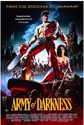
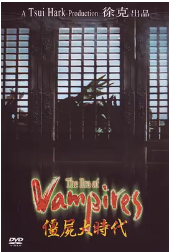
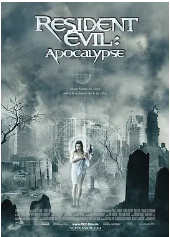
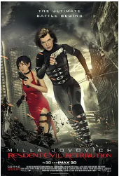
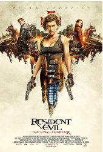

## 

[豆瓣评分: ]()

## 鬼玩人

[豆瓣评分: 7.1](https://movie.douban.com/subject/1292501/)

导演: [山姆·雷米](https://www.douban.com/personage/27232894/)

编剧: [山姆·雷米](https://www.douban.com/personage/27232894/)

主演: [布鲁斯·坎贝尔](https://www.douban.com/personage/27275563/) / [艾伦·桑德维斯](https://www.douban.com/personage/27352175/) / [贝琪·贝克](https://www.douban.com/personage/27266356/) / [特丽莎缇莉](https://www.douban.com/personage/27355976/)

片长: 85 分钟 / Germany: 70 分钟(FSK 16 version)

又名: 尸变 / 死亡魔鬼

## 鬼玩人 2

[豆瓣评分: 7.3](https://movie.douban.com/subject/1293448/)

导演: [山姆·雷米](https://www.douban.com/personage/27232894/)

编剧: [山姆·雷米](https://www.douban.com/personage/27232894/) / [斯科特·斯皮格尔](https://www.douban.com/personage/27219976/)

主演: [布鲁斯·坎贝尔](https://www.douban.com/personage/27275563/) / [Sarah Berry](https://movie.douban.com/subject_search?search_text=Sarah Berry) / [丹·希克斯](https://www.douban.com/personage/27301951/) / [凯茜·韦斯利·德帕瓦](https://www.douban.com/personage/27287551/)

上映日期: 1987-03-13(美国)

片长: 84分钟

## 鬼玩人 3：魔界英豪

[豆瓣评分: 7.0](https://movie.douban.com/subject/1299111/)

导演: [山姆·雷米](https://www.douban.com/personage/27232894/)

编剧: [山姆·雷米](https://www.douban.com/personage/27232894/) / [伊万·莱米](https://www.douban.com/personage/27578712/)

主演: [布鲁斯·坎贝尔](https://www.douban.com/personage/27275563/) / [艾伯丝·戴维兹](https://www.douban.com/personage/27228353/) / [马库斯·吉尔伯特](https://www.douban.com/personage/27480439/) / [伊安·艾伯克龙比](https://www.douban.com/personage/27253724/) / [泰德·雷米](https://www.douban.com/personage/27242284/) / [布里吉特·方达](https://www.douban.com/personage/27212678/) / [布鲁斯·托马斯](https://www.douban.com/personage/27250846/) / [Richard Grove](https://movie.douban.com/subject_search?search_text=Richard Grove) / [Timothy Patrick Quill](https://movie.douban.com/subject_search?search_text=Timothy Patrick Quill) / [Michael Earl Reid](https://movie.douban.com/subject_search?search_text=Michael Earl Reid) / [帕特里夏·塔尔曼](https://www.douban.com/personage/27365810/) / [德克-安德森](https://www.douban.com/personage/27263635/) / [Sara Shearer](https://movie.douban.com/subject_search?search_text=Sara Shearer) / [Shiva Gordon](https://www.douban.com/personage/27308124/) / [Billy Bryan](https://movie.douban.com/subject_search?search_text=Billy Bryan)

上映日期: 1993-02-11

片长: 81 分钟 / 96 分钟(director's cut)

## 生化危机

[豆瓣评分: 8.3](https://movie.douban.com/subject/1306809/)

导演: [保罗·安德森](https://www.douban.com/personage/27237662/)

编剧: [保罗·安德森](https://www.douban.com/personage/27237662/)

主演: [米拉·乔沃维奇](https://www.douban.com/personage/27230886/) / [米歇尔·罗德里格兹](https://www.douban.com/personage/27230906/) / [科林·萨蒙](https://www.douban.com/personage/27549086/) / [埃里克·马比斯](https://www.douban.com/personage/27250670/) / [詹姆斯·鲍弗](https://www.douban.com/personage/27223644/)

上映日期: 2002-03-15(美国)

片长: 100 分钟

## 僵尸大时代

[豆瓣评分: 6.8](https://movie.douban.com/subject/1307864/)

导演: [钱升玮](https://www.douban.com/personage/27220863/)

编剧: [徐克](https://www.douban.com/personage/27212843/)

主演: [陈国坤](https://www.douban.com/personage/27435760/) / [文健](https://movie.douban.com/subject_search?search_text=文健) / [于荣光](https://www.douban.com/personage/27495096/) / [张智尧](https://www.douban.com/personage/27481516/) / [林雪](https://www.douban.com/personage/27480239/) / [周文健](https://www.douban.com/personage/27547749/) / [计春华](https://www.douban.com/personage/27491954/) / [安雅](https://www.douban.com/personage/27210876/)

上映日期: 2003-05-30

片长: 108分钟

## 活死人黎明

[豆瓣评分: 7.5](https://movie.douban.com/subject/1309088/)

导演: [扎克·施奈德](https://movie.douban.com/celebrity/1031904/)

编剧: [乔治·A·罗梅罗](https://movie.douban.com/celebrity/1007001/) / [詹姆斯·古恩](https://movie.douban.com/celebrity/1092322/)

主演: [莎拉·波利](https://movie.douban.com/celebrity/1013756/) / [文·瑞姆斯](https://movie.douban.com/celebrity/1048129/) / [杰克·韦伯](https://movie.douban.com/celebrity/1031971/) / [梅奇·费法](https://movie.douban.com/celebrity/1013836/) / [泰·布利尔](https://movie.douban.com/celebrity/1025048/) / [迈克尔·凯利](https://movie.douban.com/celebrity/1104615/) / [凯文·席格斯](https://movie.douban.com/celebrity/1040993/) / [林蒂·布丝](https://movie.douban.com/celebrity/1000180/) / [杰恩·伊斯特伍德](https://movie.douban.com/celebrity/1086375/) / [博伊德·班克斯](https://movie.douban.com/celebrity/1000548/) / [因纳·克洛姬娜](https://movie.douban.com/celebrity/1103346/) / [金·波伊里尔](https://movie.douban.com/celebrity/1126479/) / [马特·弗里沃](https://movie.douban.com/celebrity/1013864/) / [路易斯·费雷拉](https://movie.douban.com/celebrity/1328428/) / [汉娜·洛克纳](https://movie.douban.com/celebrity/1118140/) / [Bruce Bohne](https://movie.douban.com/celebrity/1395756/) / [金·罗伯特](https://movie.douban.com/celebrity/1347745/) / [提姆·波斯特](https://movie.douban.com/celebrity/1364684/) / [马特·萨多斯基](https://movie.douban.com/celebrity/1059888/) / [路易吉娅·祖卡罗](https://movie.douban.com/celebrity/1197294/) / [迈克·瑞巴](https://movie.douban.com/celebrity/1215730/) / [劳拉·德卡特莱特](https://movie.douban.com/celebrity/1335201/) / [乔治娅·克雷格](https://movie.douban.com/celebrity/1198324/) / [桑迪·乔宾-贝文斯](https://movie.douban.com/celebrity/1105462/) / [娜塔莉·布朗](https://movie.douban.com/celebrity/1343252/) / [斯科特·H·雷宁格](https://movie.douban.com/celebrity/1145074/) / [汤姆·萨维尼](https://movie.douban.com/celebrity/1041207/) / [肯·佛瑞](https://movie.douban.com/celebrity/1032138/) / [扎克·施奈德](https://movie.douban.com/celebrity/1031904/)

上映日期: 2004-03-19(美国)

片长: 101 分钟 / 110 分钟(未分级导演剪辑版)

## 生化危机 2：启示录

[豆瓣评分: 8.0](https://movie.douban.com/subject/1308752/)

导演: [亚历山大·维特](https://www.douban.com/personage/27556657/)

编剧: [保罗·安德森](https://www.douban.com/personage/27237662/)

主演: [米拉·乔沃维奇](https://www.douban.com/personage/27230886/) / [西耶娜·盖尔利](https://www.douban.com/personage/27237551/) / [奥德·菲尔](https://www.douban.com/personage/27242136/) / [托马斯·克莱舒曼](https://www.douban.com/personage/27255358/) / [索菲·瓦瓦塞尔](https://www.douban.com/personage/27531378/) / [何家蓓](https://www.douban.com/personage/27246459/)

上映日期: 2004-09-10(加拿大/美国)

片长: 94分钟 / 98分钟

## 生化危机 3：灭绝

[豆瓣评分: 7.5](https://movie.douban.com/subject/1482911/)

导演: [拉塞尔·穆卡希](https://www.douban.com/personage/27218142/)

编剧: [保罗·安德森](https://www.douban.com/personage/27237662/)

主演: [米拉·乔沃维奇](https://www.douban.com/personage/27230886/) / [奥德·菲尔](https://www.douban.com/personage/27242136/) / [伊恩·格雷](https://www.douban.com/personage/27215058/) / [艾丽·拉特](https://www.douban.com/personage/27224702/) / [亚香缇](https://www.douban.com/personage/27233048/)

上映日期: 2007-09-21(美国)

片长: 94分钟

## 生化危机 4：战神再生

[豆瓣评分: 6.8](https://movie.douban.com/subject/3041294/)

导演: [保罗·安德森](https://www.douban.com/personage/27237662/)

]编剧: [保罗·安德森](https://www.douban.com/personage/27237662/)

主演: [米拉·乔沃维奇](https://www.douban.com/personage/27230886/) / [艾丽·拉特](https://www.douban.com/personage/27224702/) / [温特沃斯·米勒](https://www.douban.com/personage/27246783/) / [西耶娜·盖尔利](https://www.douban.com/personage/27237551/) / [波瑞斯·科乔](https://www.douban.com/personage/27237699/) / [肖恩·罗伯茨](https://www.douban.com/personage/27350731/) / [金·寇兹](https://www.douban.com/personage/27219522/) / [史宾塞·洛克](https://www.douban.com/personage/27255341/) / [凯茜·克拉克](https://www.douban.com/personage/27269946/)

上映日期: 2010-11-16(中国大陆) / 2010-09-10(美国)

片长: 97分钟

## 生化危机 5：惩罚

[豆瓣评分: 6.4](https://movie.douban.com/subject/6532822/)

导演: [保罗·安德森](https://www.douban.com/personage/27237662/)

编剧: [保罗·安德森](https://www.douban.com/personage/27237662/)

主演: [米拉·乔沃维奇](https://www.douban.com/personage/27230886/) / [米歇尔·罗德里格兹](https://www.douban.com/personage/27230906/) / [西耶娜·盖尔利](https://www.douban.com/personage/27237551/) / [李冰冰](https://www.douban.com/personage/27246745/) / [凯文·杜兰](https://www.douban.com/personage/27219494/) / [奥德·菲尔](https://www.douban.com/personage/27242136/) / [肖恩·罗伯茨](https://www.douban.com/personage/27350731/) / [科林·萨蒙](https://www.douban.com/personage/27549086/) / [中岛美嘉](https://www.douban.com/personage/27253749/) / [波瑞斯·科乔](https://www.douban.com/personage/27237699/) / [阿娅娜·恩吉妮尔](https://www.douban.com/personage/27237665/)

上映日期: 2013-03-17(中国大陆) / 2012-09-14(美国)

片长: 96分钟

## 生化危机 6：终章 

[豆瓣评分: 6.5](https://movie.douban.com/subject/20471852/)

导演: [保罗·安德森](https://www.douban.com/personage/27237662/)

编剧: [保罗·安德森](https://www.douban.com/personage/27237662/)

主演: [米拉·乔沃维奇](https://www.douban.com/personage/27230886/) / [伊恩·格雷](https://www.douban.com/personage/27215058/) / [艾丽·拉特](https://www.douban.com/personage/27224702/) / [鲁比·罗丝](https://www.douban.com/personage/27568531/) / [李准基](https://www.douban.com/personage/27411287/) / [肖恩·罗伯茨](https://www.douban.com/personage/27350731/) / [威廉·莱维](https://www.douban.com/personage/27461120/) / [欧文·马肯](https://www.douban.com/personage/27495516/) / [萝拉](https://www.douban.com/personage/27583958/) / [艾尔·安德森](https://www.douban.com/personage/27583959/) / [密尔顿·施尔](https://www.douban.com/personage/27583960/) / [西沃恩·霍奇森](https://www.douban.com/personage/27583961/) / [凯文·奥托](https://www.douban.com/personage/27554630/) / [保罗·汉普赛尔](https://www.douban.com/personage/27554433/)

上映日期: 2017-02-24(中国大陆) / 2016-12-23(日本) / 2017-01-27(美国)

片长: 106分钟(美国) / 99分钟(中国大陆)

## 生化危机：死亡岛

[豆瓣评分: 5.3](https://movie.douban.com/subject/36240739/)

导演: [羽住英一郎](https://www.douban.com/personage/27207825/)

编剧: [深见真](https://www.douban.com/personage/27578723/)

主演: [艾琳·卡希尔](https://www.douban.com/personage/27279153/) / [凯文·多曼](https://www.douban.com/personage/27503350/) / [马修·默瑟](https://www.douban.com/personage/27448216/) / [斯蒂芬妮·潘尼斯洛](https://www.douban.com/personage/35422729/) / [妮科尔·汤普金斯](https://www.douban.com/personage/35021682/)

上映日期: 2023-06-21(菲律宾) / 2023-07-07(日本)

片长: 87分钟

- 异形
- 铁血战士
- 怪形
- 寂静岭
- 林中小屋
- 一眉道人
- 僵尸先生
- 僵尸叔叔
- 灵幻先生
- 新僵尸先生
- 大白鲨
- 极度深寒
- 黑洞表面
- 黑暗侵袭
- 僵尸
- 鬼影
- 咒怨
- 活跳尸

