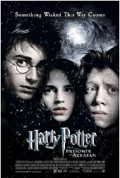

## 

[豆瓣评分: ]()

## 倩女幽魂

[豆瓣评分: 8.8](https://movie.douban.com/subject/1297447/)

导演: [程小东](https://www.douban.com/personage/27508943/)

编剧: [阮继志](https://www.douban.com/personage/27566979/)

主演: [张国荣](https://www.douban.com/personage/27209184/) / [王祖贤](https://www.douban.com/personage/27372793/) / [午马](https://www.douban.com/personage/27260050/) / [刘兆铭](https://www.douban.com/personage/27482716/) / [林威](https://www.douban.com/personage/27517585/) / [薛芷伦](https://www.douban.com/personage/27494621/) / [胡大为](https://www.douban.com/personage/27529611/) / [王晶](https://www.douban.com/personage/27503085/)

上映日期: 2011-04-30(中国大陆) / 1987-07-18(中国香港)

片长: 96分钟

## 倩女幽魂 2：人间道

[豆瓣评分: 8.1](https://movie.douban.com/subject/1296629/)

导演: [程小东](https://www.douban.com/personage/27508943/)

编剧: [梁耀明](https://www.douban.com/personage/27588794/) / [林纪陶](https://www.douban.com/personage/27517570/) / [刘大木](https://www.douban.com/personage/27485197/)

主演: [张国荣](https://www.douban.com/personage/27209184/) / [王祖贤](https://www.douban.com/personage/27372793/) / [张学友](https://www.douban.com/personage/27218255/) / [午马](https://www.douban.com/personage/27260050/) / [李子雄](https://www.douban.com/personage/27243413/) / [李嘉欣](https://www.douban.com/personage/27345399/) / [刘洵](https://www.douban.com/personage/27480508/) / [刘兆铭](https://www.douban.com/personage/27482716/) / [谷峰](https://www.douban.com/personage/27260007/)

上映日期: 1990-07-13(中国香港)

片长: 104 分钟

## 倩女幽魂 3：道道道

[豆瓣评分: 7.7](https://movie.douban.com/subject/1298040/)

导演: [程小东](https://www.douban.com/personage/27508943/)

编剧: [徐克](https://www.douban.com/personage/27212843/) / [司徒慧焯](https://www.douban.com/personage/27527041/)

主演: [梁朝伟](https://www.douban.com/personage/27321759/) / [张学友](https://www.douban.com/personage/27218255/) / [王祖贤](https://www.douban.com/personage/27372793/) / [利智](https://www.douban.com/personage/27330206/) / [刘兆铭](https://www.douban.com/personage/27482716/) / [刘洵](https://www.douban.com/personage/27480508/) / [刘玉婷](https://www.douban.com/personage/27315589/) / [黄光亮](https://www.douban.com/personage/27529473/) / [李子雄](https://www.douban.com/personage/27243413/)

上映日期: 1991-07-18

片长: 109分钟

## 青蛇

[豆瓣评分: 8.6](https://movie.douban.com/subject/1303394/)

导演: [徐克](https://movie.douban.com/celebrity/1007152/)

编剧: [李碧华](https://movie.douban.com/celebrity/1275229/) / [徐克](https://movie.douban.com/celebrity/1007152/)

主演: [张曼玉](https://movie.douban.com/celebrity/1274231/) / [王祖贤](https://movie.douban.com/celebrity/1166896/) / [赵文卓](https://movie.douban.com/celebrity/1000526/) / [吴兴国](https://movie.douban.com/celebrity/1301324/) / [马精武](https://movie.douban.com/celebrity/1313092/) / [田丰](https://movie.douban.com/celebrity/1019621/) / [刘洵](https://movie.douban.com/celebrity/1274304/)

上映日期: 1993-11-04(中国香港)

片长: 99分钟

## 蜀山传

[豆瓣评分: 6.9](https://movie.douban.com/subject/1308338/)

导演: [徐克](https://www.douban.com/personage/27212843/)

编剧: [徐克](https://www.douban.com/personage/27212843/) / [李敏才](https://www.douban.com/personage/27569852/)

主演: [郑伊健](https://www.douban.com/personage/27237534/) / [张柏芝](https://www.douban.com/personage/27209185/) / [古天乐](https://www.douban.com/personage/27233313/) / [谭耀文](https://www.douban.com/personage/27239024/) / [林熙蕾](https://www.douban.com/personage/27247123/) / [洪金宝](https://www.douban.com/personage/27261621/) / [章子怡](https://www.douban.com/personage/27246769/) / [吴京](https://www.douban.com/personage/27206215/) / [刘洵](https://www.douban.com/personage/27480508/) / [吴樾](https://www.douban.com/personage/27492768/)

上映日期: 2001-08-09(中国香港)

片长: 104分钟 / 78分钟(德国)

## 哈利·波特与魔法石

[豆瓣评分: 9.2](https://movie.douban.com/subject/1295038/)

导演: [克里斯·哥伦布](https://www.douban.com/personage/27255479/)

编剧: [史蒂夫·克洛夫斯](https://www.douban.com/personage/27313556/) / [J·K·罗琳](https://www.douban.com/personage/27228499/)

主演: [丹尼尔·雷德克里夫](https://www.douban.com/personage/27209174/) / [艾玛·沃森](https://www.douban.com/personage/27259392/) / [鲁伯特·格林特](https://www.douban.com/personage/27218209/) / [艾伦·瑞克曼](https://www.douban.com/personage/27230885/) / [玛吉·史密斯](https://www.douban.com/personage/27219502/) / [汤姆·费尔顿](https://www.douban.com/personage/27255251/) / [伊恩·哈特](https://www.douban.com/personage/27233083/) / [理查德·哈里斯](https://www.douban.com/personage/27232907/) / [约翰·赫特](https://www.douban.com/personage/27210277/) / [罗彼·考特拉尼](https://www.douban.com/personage/27208400/) / [朱丽·沃特斯](https://www.douban.com/personage/27237643/) / [邦妮·怀特](https://www.douban.com/personage/27210271/) / [约翰·克里斯](https://www.douban.com/personage/27246892/) / [肖恩·比格斯代夫](https://www.douban.com/personage/27237765/)

上映日期: 2002-01-26(中国大陆) / 2020-08-14(中国大陆重映) / 2001-11-04(英国首映) / 2001-11-16(美国)

片长: 152分钟 / 159分钟(加长版)

## 指环王 1：护戒使者

[豆瓣评分: 9.1](https://movie.douban.com/subject/1291571/)

导演: [彼得·杰克逊](https://movie.douban.com/celebrity/1040524/)

编剧: [弗兰·威尔士](https://movie.douban.com/celebrity/1013998/) / [菲利帕·鲍恩斯](https://movie.douban.com/celebrity/1279114/) / [彼得·杰克逊](https://movie.douban.com/celebrity/1040524/) / [J.R.R.托尔金](https://movie.douban.com/celebrity/1152849/)

主演: [伊利亚·伍德](https://movie.douban.com/celebrity/1054395/) / [西恩·奥斯汀](https://movie.douban.com/celebrity/1031818/) / [伊恩·麦克莱恩](https://movie.douban.com/celebrity/1054410/) / [维果·莫腾森](https://movie.douban.com/celebrity/1054520/) / [奥兰多·布鲁姆](https://movie.douban.com/celebrity/1008069/) / [多米尼克·莫纳汉](https://movie.douban.com/celebrity/1036320/) / [比利·博伊德](https://movie.douban.com/celebrity/1049629/) / [克里斯托弗·李](https://movie.douban.com/celebrity/1054467/) / [马尔顿·索克斯](https://movie.douban.com/celebrity/1009284/) / [梅根·爱德华兹](https://movie.douban.com/celebrity/1192159/) / [伊安·霍姆](https://movie.douban.com/celebrity/1049594/) / [凯特·布兰切特](https://movie.douban.com/celebrity/1054441/) / [阿兰·霍华德](https://movie.douban.com/celebrity/1090960/) / [马克·弗格森](https://movie.douban.com/celebrity/1090417/) / [肖恩·宾](https://movie.douban.com/celebrity/1002683/) / [萨拉·贝克](https://movie.douban.com/celebrity/1049790/) / [劳伦斯·马克奥雷](https://movie.douban.com/celebrity/1125247/) / [安迪·瑟金斯](https://movie.douban.com/celebrity/1002708/) / [彼得·麦肯齐](https://movie.douban.com/celebrity/1397428/) / [伊恩·穆内](https://movie.douban.com/celebrity/1292702/) / [克雷格·帕克](https://movie.douban.com/celebrity/1040564/) / [卡梅隆·罗德](https://movie.douban.com/celebrity/1138759/) / [约翰·瑞斯-戴维斯](https://movie.douban.com/celebrity/1147054/) / [丽芙·泰勒](https://movie.douban.com/celebrity/1041027/) / [大卫·韦瑟莱](https://movie.douban.com/celebrity/1162853/) / [雨果·维文](https://movie.douban.com/celebrity/1040994/) / [菲利普·格里夫](https://movie.douban.com/celebrity/1216537/) / [威廉·约翰逊](https://movie.douban.com/celebrity/1370260/) / [伊丽莎白·穆迪](https://movie.douban.com/celebrity/1315493/) / [布莱恩·瑟金特](https://movie.douban.com/celebrity/1145461/) / [杰德·布罗菲](https://movie.douban.com/celebrity/1325970/) / [诺曼·凯茨](https://movie.douban.com/celebrity/1303617/) / [兰德尔·威廉·库克](https://movie.douban.com/celebrity/1281196/) / [萨比恩·克洛森](https://movie.douban.com/celebrity/1335966/) / [西奥沙福瓦](https://movie.douban.com/celebrity/1362754/) / [本·弗兰舍姆](https://movie.douban.com/celebrity/1349888/) / [彼得·杰克逊](https://movie.douban.com/celebrity/1040524/) / [艾伦·李](https://movie.douban.com/celebrity/1109822/)

上映日期: 2002-04-04(中国大陆) / 2021-04-16(中国大陆重映) / 2001-12-19(美国)

片长: 179分钟 / 208分钟(加长版) / 228分钟(蓝光加长版)

## 哈利·波特与密室

[豆瓣评分: 8.9](https://movie.douban.com/subject/1296996/)

导演: [克里斯·哥伦布](https://www.douban.com/personage/27255479/)

编剧: [史蒂夫·克洛夫斯](https://www.douban.com/personage/27313556/) / [J·K·罗琳](https://www.douban.com/personage/27228499/)

主演: [丹尼尔·雷德克里夫](https://www.douban.com/personage/27209174/) / [艾玛·沃森](https://www.douban.com/personage/27259392/) / [鲁伯特·格林特](https://www.douban.com/personage/27218209/) / [汤姆·费尔顿](https://www.douban.com/personage/27255251/) / [理查德·格雷弗斯](https://www.douban.com/personage/27230995/) / [费奥纳·肖](https://www.douban.com/personage/27215055/) / [托比·琼斯](https://www.douban.com/personage/27313703/) / [朱丽·沃特斯](https://www.douban.com/personage/27237643/) / [邦妮·怀特](https://www.douban.com/personage/27210271/) / [詹森·艾萨克](https://www.douban.com/personage/27223640/) / [肯尼思·布拉纳](https://www.douban.com/personage/27242091/) / [艾伦·瑞克曼](https://www.douban.com/personage/27230885/) / [理查德·哈里斯](https://www.douban.com/personage/27232907/) / [玛吉·史密斯](https://www.douban.com/personage/27219502/) / [约翰·克里斯](https://www.douban.com/personage/27246892/) / [肖恩·比格斯代夫](https://www.douban.com/personage/27237765/) / [克里斯·兰金](https://www.douban.com/personage/27246539/) / [克里斯蒂安·库尔森](https://www.douban.com/personage/27233157/)

上映日期: 2003-01-24(中国大陆) / 2002-11-15(英国/美国)

片长: 161分钟 / 174分钟(加长版)

## 指环王 2：双塔奇兵

[豆瓣评分: 9.2](https://movie.douban.com/subject/1291572/)

导演: [彼得·杰克逊](https://movie.douban.com/celebrity/1040524/)

编剧: [弗兰·威尔士](https://movie.douban.com/celebrity/1013998/) / [菲利帕·鲍恩斯](https://movie.douban.com/celebrity/1279114/) / [斯蒂芬·辛克莱](https://movie.douban.com/celebrity/1297678/) / [彼得·杰克逊](https://movie.douban.com/celebrity/1040524/) / [J.R.R.托尔金](https://movie.douban.com/celebrity/1152849/)

主演: [伊利亚·伍德](https://movie.douban.com/celebrity/1054395/) / [西恩·奥斯汀](https://movie.douban.com/celebrity/1031818/) / [多米尼克·莫纳汉](https://movie.douban.com/celebrity/1036320/) / [奥兰多·布鲁姆](https://movie.douban.com/celebrity/1008069/) / [维果·莫腾森](https://movie.douban.com/celebrity/1054520/) / [伊恩·麦克莱恩](https://movie.douban.com/celebrity/1054410/) / [凯特·布兰切特](https://movie.douban.com/celebrity/1054441/) / [比利·博伊德](https://movie.douban.com/celebrity/1049629/) / [杰德·布罗菲](https://movie.douban.com/celebrity/1325970/) / [丽芙·泰勒](https://movie.douban.com/celebrity/1041027/) / [安迪·瑟金斯](https://movie.douban.com/celebrity/1002708/) / [米兰达·奥图](https://movie.douban.com/celebrity/1036459/) / [雨果·维文](https://movie.douban.com/celebrity/1040994/) / [布拉德·道里夫](https://movie.douban.com/celebrity/1031866/) / [卡卢姆·吉廷斯](https://movie.douban.com/celebrity/1192504/) / [伯纳德·希尔](https://movie.douban.com/celebrity/1036511/) / [布鲁斯·霍普金斯](https://movie.douban.com/celebrity/1094578/) / [克里斯托弗·李](https://movie.douban.com/celebrity/1054467/) / [纳撒尼尔·利斯](https://movie.douban.com/celebrity/1394743/) / [罗宾·马尔科姆](https://movie.douban.com/celebrity/1126033/) / [约翰·贝西](https://movie.douban.com/celebrity/1056393/) / [萨拉·贝克](https://movie.douban.com/celebrity/1049790/) / [克雷格·帕克](https://movie.douban.com/celebrity/1040564/) / [布鲁斯·菲利普斯](https://movie.douban.com/celebrity/1050372/) / [Robert Pollock](https://movie.douban.com/celebrity/1051291/) / [约翰·瑞斯-戴维斯](https://movie.douban.com/celebrity/1147054/) / [奥利维亚·田內](https://movie.douban.com/celebrity/1150928/) / [卡尔·厄本](https://movie.douban.com/celebrity/1017903/) / [史蒂芬·乌瑞](https://movie.douban.com/celebrity/1155436/) / [大卫·文翰](https://movie.douban.com/celebrity/1049573/) / [菲利普·格里夫](https://movie.douban.com/celebrity/1216537/) / [肖恩·宾](https://movie.douban.com/celebrity/1002683/) / [约翰·诺贝尔](https://movie.douban.com/celebrity/1022665/) / [Jarl Benzon](https://movie.douban.com/celebrity/1221458/) / [Jørn Benzon](https://movie.douban.com/celebrity/1174553/) / [Ben Britton](https://movie.douban.com/celebrity/1187436/) / [阿利斯泰尔·布朗宁](https://movie.douban.com/celebrity/1279475/) / [Sean Button](https://movie.douban.com/celebrity/1306452/) / [Robert Catto](https://movie.douban.com/celebrity/1242595/) / [罗德尼·库克](https://movie.douban.com/celebrity/1394740/) / [卡尔洛斯·德林克沃特](https://movie.douban.com/celebrity/1202515/) / [西奥沙福瓦](https://movie.douban.com/celebrity/1362754/) / [本·弗兰舍姆](https://movie.douban.com/celebrity/1349888/) / [Jonathan Harding](https://movie.douban.com/celebrity/1327062/) / [Lucas Hayward](https://movie.douban.com/celebrity/1172342/) / [丹·汉纳](https://movie.douban.com/celebrity/1286442/) / [保罗·霍姆斯](https://movie.douban.com/celebrity/1098761/) / [杰森霍德](https://movie.douban.com/celebrity/1361778/) / [彼得·杰克逊](https://movie.douban.com/celebrity/1040524/) / [Sam Kelly](https://movie.douban.com/celebrity/1425375/) / [Sandro Kopp](https://movie.douban.com/celebrity/1216494/)

上映日期: 2003-04-25(中国大陆) / 2021-04-23(中国大陆重映) / 2002-12-05(纽约首映) / 2002-12-18(美国)

片长: 180分钟 / 223分钟(加长版) / 235分钟(蓝光加长版)

## 加勒比海盗

[豆瓣评分: 8.8](https://movie.douban.com/subject/1298070/)

导演: [戈尔·维宾斯基](https://movie.douban.com/celebrity/1031987/)

编剧: [泰德·艾略特](https://movie.douban.com/celebrity/1283130/) / [特里·鲁西奥](https://movie.douban.com/celebrity/1009677/) / [斯图尔特·贝亚蒂耶](https://movie.douban.com/celebrity/1278161/) / [杰·沃尔伯特](https://movie.douban.com/celebrity/1344903/)

主演: [约翰尼·德普](https://movie.douban.com/celebrity/1054456/) / [杰弗里·拉什](https://movie.douban.com/celebrity/1010543/) / [奥兰多·布鲁姆](https://movie.douban.com/celebrity/1008069/) / [凯拉·奈特莉](https://movie.douban.com/celebrity/1054448/) / [杰克·达文波特](https://movie.douban.com/celebrity/1031865/) / [乔纳森·普雷斯](https://movie.douban.com/celebrity/1019055/)

上映日期: 2003-11-21(中国大陆) / 2003-07-09(美国)

片长: 143 分钟

## 黑夜传说

[豆瓣评分: 7.5](https://movie.douban.com/subject/1307527/)

导演: [伦·怀斯曼](https://www.douban.com/personage/27237723/)

编剧: [凯文·格雷维奥斯](https://www.douban.com/personage/27552639/) / [伦·怀斯曼](https://www.douban.com/personage/27237723/) / [Danny McBride](https://www.douban.com/personage/27550201/)

主演: [凯特·贝金赛尔](https://www.douban.com/personage/27209177/) / [斯科特·斯比德曼](https://www.douban.com/personage/27255352/) / [麦克·辛](https://www.douban.com/personage/27210256/) / [山恩·布罗利](https://www.douban.com/personage/27237932/) / [比尔·奈伊](https://www.douban.com/personage/27246757/) / [艾尔文·莱德](https://www.douban.com/personage/27231122/) / [索菲娅·迈尔斯](https://www.douban.com/personage/27237610/) / [罗比·基](https://www.douban.com/personage/27304434/) / [温特沃斯·米勒](https://www.douban.com/personage/27246783/) / [凯文·格雷维奥斯](https://www.douban.com/personage/27552639/) / [兹塔·格罗格](https://www.douban.com/personage/27387171/) / [Dennis J. Kozeluh](https://movie.douban.com/subject_search?search_text=Dennis J. Kozeluh) / [Scott McElroy](https://movie.douban.com/subject_search?search_text=Scott McElroy) / [Todd Schneider](https://movie.douban.com/subject_search?search_text=Todd Schneider) / [Sándor Bolla](https://movie.douban.com/subject_search?search_text=Sándor Bolla) / [汉克·阿莫斯](https://www.douban.com/personage/27505454/) / [理查德·赛特伦](https://www.douban.com/personage/27508647/) / [Mike Mukatis](https://www.douban.com/personage/27520948/) / [Sándor Boros](https://www.douban.com/personage/27272243/) / [安德烈·巴顿](https://www.douban.com/personage/27248034/) / [Danny McBride](https://www.douban.com/personage/27550201/) / [Jázmin Dammak](https://www.douban.com/personage/27421703/) / [Ildikó Kovács](https://www.douban.com/personage/27251956/) / [埃克哈特·贝尔](https://www.douban.com/personage/27272100/) / [Reinhard Brock](https://www.douban.com/personage/27250505/) / [Pascal Breuer](https://www.douban.com/personage/27283348/) / [布莱恩·斯蒂尔](https://www.douban.com/personage/27257857/) / [库尔特·卡尔利](https://www.douban.com/personage/27276515/) / [Zoltan Papp](https://www.douban.com/personage/27375252/)

上映日期: 2003-09-08(多伦多电影节) / 2003-09-19(美国)

片长: 121分钟 / 133分钟(导演剪辑版)

## 指环王 3：王者无敌

[豆瓣评分: 9.3](https://movie.douban.com/subject/1291552/)

导演: [彼得·杰克逊](https://movie.douban.com/celebrity/1040524/)

编剧: [弗兰·威尔士](https://movie.douban.com/celebrity/1013998/) / [菲利帕·鲍恩斯](https://movie.douban.com/celebrity/1279114/) / [彼得·杰克逊](https://movie.douban.com/celebrity/1040524/) / [J.R.R.托尔金](https://movie.douban.com/celebrity/1152849/)

主演: [伊利亚·伍德](https://movie.douban.com/celebrity/1054395/) / [西恩·奥斯汀](https://movie.douban.com/celebrity/1031818/) / [维果·莫腾森](https://movie.douban.com/celebrity/1054520/) / [奥兰多·布鲁姆](https://movie.douban.com/celebrity/1008069/) / [伊恩·麦克莱恩](https://movie.douban.com/celebrity/1054410/) / [肖恩·宾](https://movie.douban.com/celebrity/1002683/) / [多米尼克·莫纳汉](https://movie.douban.com/celebrity/1036320/) / [丽芙·泰勒](https://movie.douban.com/celebrity/1041027/) / [约翰·贝西](https://movie.douban.com/celebrity/1056393/) / [凯特·布兰切特](https://movie.douban.com/celebrity/1054441/) / [比利·博伊德](https://movie.douban.com/celebrity/1049629/) / [萨德文·布罗菲](https://movie.douban.com/celebrity/1334507/) / [阿利斯泰尔·布朗宁](https://movie.douban.com/celebrity/1279475/) / [马尔顿·索克斯](https://movie.douban.com/celebrity/1009284/) / [伯纳德·希尔](https://movie.douban.com/celebrity/1036511/) / [伊安·霍姆](https://movie.douban.com/celebrity/1049594/) / [布鲁斯·霍普金斯](https://movie.douban.com/celebrity/1094578/) / [伊恩·休斯](https://movie.douban.com/celebrity/1113996/) / [劳伦斯·马克奥雷](https://movie.douban.com/celebrity/1125247/) / [诺埃尔·阿普利比](https://movie.douban.com/celebrity/1277324/) / [布雷特·麦肯齐](https://movie.douban.com/celebrity/1009383/) / [Alexandra Astin](https://movie.douban.com/celebrity/1060394/) / [Sarah McLeod](https://movie.douban.com/celebrity/1123092/) / [Maisy McLeod-Riera](https://movie.douban.com/celebrity/1189091/) / [约翰·诺贝尔](https://movie.douban.com/celebrity/1022665/) / [Paul Norell](https://movie.douban.com/celebrity/1131185/) / [米兰达·奥图](https://movie.douban.com/celebrity/1036459/) / [布鲁斯·菲利普斯](https://movie.douban.com/celebrity/1050372/) / [沙恩·朗吉](https://movie.douban.com/celebrity/1185516/) / [约翰·瑞斯-戴维斯](https://movie.douban.com/celebrity/1147054/) / [托德·里彭](https://movie.douban.com/celebrity/1145258/) / [安迪·瑟金斯](https://movie.douban.com/celebrity/1002708/) / [Harry Sinclair](https://movie.douban.com/celebrity/1297669/) / [乔尔·托贝克](https://movie.douban.com/celebrity/1018287/) / [卡尔·厄本](https://movie.douban.com/celebrity/1017903/) / [史蒂芬·乌瑞](https://movie.douban.com/celebrity/1155436/) / [雨果·维文](https://movie.douban.com/celebrity/1040994/) / [大卫·文翰](https://movie.douban.com/celebrity/1049573/) / [阿兰·霍华德](https://movie.douban.com/celebrity/1090960/) / [萨拉·贝克](https://movie.douban.com/celebrity/1049790/) / [Robert Pollock](https://movie.douban.com/celebrity/1051291/) / [佩特·史密斯](https://movie.douban.com/celebrity/1297921/) / [杰德·布罗菲](https://movie.douban.com/celebrity/1325970/) / [菲利普·格里夫](https://movie.douban.com/celebrity/1216537/) / [布拉德·道里夫](https://movie.douban.com/celebrity/1031866/) / [克里斯托弗·李](https://movie.douban.com/celebrity/1054467/) / [布鲁斯·斯宾斯](https://movie.douban.com/celebrity/1049682/) / [吉诺·阿赛维多](https://movie.douban.com/celebrity/1276783/) / [Jarl Benzon](https://movie.douban.com/celebrity/1221458/) / [Jørn Benzon](https://movie.douban.com/celebrity/1174553/) / [Robert Catto](https://movie.douban.com/celebrity/1242595/) / [Michael Elsworth](https://movie.douban.com/celebrity/1189529/) / [彼得·杰克逊](https://movie.douban.com/celebrity/1040524/) / [Sandro Kopp](https://movie.douban.com/celebrity/1216494/) / [安德鲁·莱斯尼](https://movie.douban.com/celebrity/1289847/) / [约瑟夫·米卡-亨特](https://movie.douban.com/celebrity/1394738/) / [亨利·莫腾森](https://movie.douban.com/celebrity/1127967/) / [克雷格·帕克](https://movie.douban.com/celebrity/1040564/) / [克里斯蒂安·瑞沃斯](https://movie.douban.com/celebrity/1295714/) / [迈克尔·斯曼内科 ](https://movie.douban.com/celebrity/1297191/)/ [霍华德·肖](https://movie.douban.com/celebrity/1027953/) / [约翰·斯蒂芬森](https://movie.douban.com/celebrity/1027079/) / [理查德·泰](https://movie.douban.com/celebrity/1299006/)

上映日期: 2004-03-12(中国大陆) / 2021-05-14(中国大陆重映) / 2003-12-17(美国)

片长: 201分钟 / 254分钟(加长版) / 263分钟(蓝光加长版)

## 范海辛

[豆瓣评分: 7.2](https://movie.douban.com/subject/1309136/)

导演: [斯蒂芬·索莫斯](https://www.douban.com/personage/27237830/)

编剧: [斯蒂芬·索莫斯](https://www.douban.com/personage/27237830/)

主演: [休·杰克曼](https://www.douban.com/personage/27216199/) / [凯特·贝金赛尔](https://www.douban.com/personage/27209177/) / [理查德·劳斯伯格](https://www.douban.com/personage/27219570/) / [大卫·文翰](https://www.douban.com/personage/27255336/) / [舒勒·汉斯利](https://www.douban.com/personage/27238068/) / [埃伦娜·安纳亚](https://www.douban.com/personage/27216281/) / [威尔·坎普](https://www.douban.com/personage/27215124/) / [凯文·J·奥康纳](https://www.douban.com/personage/27246353/) / [艾伦·阿姆斯特朗](https://www.douban.com/personage/27216383/) / [希薇娅·克洛卡](https://www.douban.com/personage/27228455/) / [约希·麦兰](https://www.douban.com/personage/27250784/) / [汤姆·费舍尔](https://www.douban.com/personage/27512071/) / [萨缪尔·韦斯特](https://www.douban.com/personage/27224857/) / [罗彼·考特拉尼](https://www.douban.com/personage/27208400/) / [Stephen Fisher](https://movie.douban.com/subject_search?search_text=Stephen Fisher) / [达娜·莫拉夫科娃](https://www.douban.com/personage/27337817/) / [马雷克·瓦苏特](https://www.douban.com/personage/27366568/) / [Laurence Racine](https://www.douban.com/personage/27353066/) / [马丁·科勒巴](https://www.douban.com/personage/27216374/) / [Allison Queal](https://www.douban.com/personage/27396957/)

上映日期: 2004-05-03(美国)

片长: 131 分钟

## 哈利·波特与阿兹卡班的囚徒

[豆瓣评分: 9.0](https://movie.douban.com/subject/1291544/)

导演: [阿方索·卡隆](https://www.douban.com/personage/27242158/)

编剧: [史蒂夫·克洛夫斯](https://www.douban.com/personage/27313556/) / [J·K·罗琳](https://www.douban.com/personage/27228499/)

主演: [丹尼尔·雷德克里夫](https://www.douban.com/personage/27209174/) / [艾玛·沃森](https://www.douban.com/personage/27259392/) / [鲁伯特·格林特](https://www.douban.com/personage/27218209/) / [加里·奥德曼](https://www.douban.com/personage/27216198/) / [朱丽·沃特斯](https://www.douban.com/personage/27237643/) / [邦妮·怀特](https://www.douban.com/personage/27210271/) / [大卫·休里斯](https://www.douban.com/personage/27237603/) / [迈克尔·刚本](https://www.douban.com/personage/27232889/) / [艾伦·瑞克曼](https://www.douban.com/personage/27230885/) / [玛吉·史密斯](https://www.douban.com/personage/27219502/) / [汤姆·费尔顿](https://www.douban.com/personage/27255251/) / [艾玛·汤普森](https://www.douban.com/personage/27260281/) / [朱莉·克里斯蒂](https://www.douban.com/personage/27205776/) / [蒂莫西·斯波](https://www.douban.com/personage/27237613/)

上映日期: 2004-09-10(中国大陆) / 2004-05-31(英国)

片长: 141 分钟

## 康斯坦丁

[豆瓣评分: 8.1](https://movie.douban.com/subject/1309021/)

导演: [弗朗西斯·劳伦斯](https://www.douban.com/personage/27205932/)

编剧: [杰米·德拉诺](https://www.douban.com/personage/35413113/) / [加思·恩尼斯](https://www.douban.com/personage/27219977/) / [凯文·布劳得宾](https://www.douban.com/personage/27580742/) / [弗兰克·凯佩罗](https://www.douban.com/personage/27508309/)

主演: [基努·里维斯](https://www.douban.com/personage/27213761/) / [蕾切尔·薇兹](https://www.douban.com/personage/27224713/) / [希亚·拉博夫](https://www.douban.com/personage/27227727/) / [杰曼·翰苏](https://www.douban.com/personage/27250636/) / [麦克斯·贝克](https://www.douban.com/personage/27575917/) / [普路特·泰勒·文斯](https://www.douban.com/personage/27216350/) / [盖文·罗斯戴尔](https://www.douban.com/personage/27246485/) / [蒂尔达·斯文顿](https://www.douban.com/personage/27230884/) / [彼得·斯特曼](https://www.douban.com/personage/27255312/) / [何塞·祖尼加](https://www.douban.com/personage/27530091/) / [弗朗西斯·奎南](https://www.douban.com/personage/27546127/) / [拉里·塞达尔](https://www.douban.com/personage/27281501/) / [艾普尔·格雷斯](https://www.douban.com/personage/27296926/) / [苏赞尼·王恩](https://www.douban.com/personage/27374743/) / [尼古拉斯·唐斯](https://www.douban.com/personage/27238361/) / [塔诺埃·里德](https://www.douban.com/personage/27210735/) / [奎因·布尼尔](https://www.douban.com/personage/27409723/) / [安·里耶森](https://www.douban.com/personage/27349038/) / [康纳·迪伦·乌林](https://www.douban.com/personage/27410033/) / [拉兹·阿隆索](https://www.douban.com/personage/27505373/) / [杰瑞米·雷·瓦尔迪兹](https://www.douban.com/personage/27375243/) / [芭芭拉·普莱恩](https://www.douban.com/personage/27335023/) / [凯文·阿历詹卓](https://www.douban.com/personage/27430129/) / [瓦莱丽·阿兹林](https://www.douban.com/personage/27574237/) / [艾琳·迪茨](https://www.douban.com/personage/27287730/) / [乔伊·保罗·高迪](https://www.douban.com/personage/27211104/) / [多米诺·哈维](https://www.douban.com/personage/27446612/) / [穆罕默德·哈桑](https://www.douban.com/personage/27239523/) / [迈克尔·凯斯](https://www.douban.com/personage/34839056/) / [安德烈斯·朗多罗](https://www.douban.com/personage/27538439/) / [马修·麦克格罗里](https://www.douban.com/personage/27250756/) / [米歇尔·莫纳汉](https://www.douban.com/personage/27205705/) / [马丁·皮埃隆](https://www.douban.com/personage/27415293/) / [R·A·郎德尔](https://www.douban.com/personage/27524278/) / [埃里克·鲁斯纳克](https://www.douban.com/personage/27396270/) / [丹尼·萨莱](https://www.douban.com/personage/27554492/) / [查德·斯塔赫斯基](https://www.douban.com/personage/27360369/) / [托尼·斯威夫特](https://www.douban.com/personage/27215877/)

上映日期: 2005-02-18(美国)

片长: 121分钟

## 哈利·波特与火焰杯

[豆瓣评分: 8.8](https://movie.douban.com/subject/1309055/)

导演: [迈克·内威尔](https://www.douban.com/personage/27208399/)

编剧: [史蒂夫·克洛夫斯](https://www.douban.com/personage/27313556/) / [J·K·罗琳](https://www.douban.com/personage/27228499/)

主演: [丹尼尔·雷德克里夫](https://www.douban.com/personage/27209174/) / [艾玛·沃森](https://www.douban.com/personage/27259392/) / [鲁伯特·格林特](https://www.douban.com/personage/27218209/) / [迈克尔·刚本](https://www.douban.com/personage/27232889/) / [玛吉·史密斯](https://www.douban.com/personage/27219502/) / [汤姆·费尔顿](https://www.douban.com/personage/27255251/) / [蒂莫西·斯波](https://www.douban.com/personage/27237613/) / [罗伯特·帕丁森](https://www.douban.com/personage/27241404/) / [梁佩诗](https://www.douban.com/personage/27228459/) / [大卫·田纳特](https://www.douban.com/personage/27208361/) / [马克·威廉姆斯](https://www.douban.com/personage/27367086/) / [埃里克·赛克斯](https://www.douban.com/personage/27254021/) / [詹姆斯·菲尔普斯](https://www.douban.com/personage/27237690/) / [奥利弗·菲尔普斯](https://www.douban.com/personage/27237698/) / [邦妮·怀特](https://www.douban.com/personage/27210271/) / [克蕾曼丝·波西](https://www.douban.com/personage/27367138/) / [加里·奥德曼](https://www.douban.com/personage/27216198/) / [杰夫·劳勒](https://www.douban.com/personage/27218276/) / [詹森·艾萨克](https://www.douban.com/personage/27223640/) / [斯坦尼斯拉夫·雅涅夫斯基](https://www.douban.com/personage/27250687/) / [罗伯特·哈迪](https://www.douban.com/personage/27307852/) / [阿什莉·阿尔图斯](https://www.douban.com/personage/27262622/) / [亚历克斯·帕尔墨](https://www.douban.com/personage/27587190/) / [罗格·洛伊德-派克](https://www.douban.com/personage/27329847/) / [希拉·艾伦](https://www.douban.com/personage/27420309/) / [Su Elliot](https://www.douban.com/personage/27288236/) / [大卫·斯特恩](https://www.douban.com/personage/27541128/) / [玛格里·梅森](https://www.douban.com/personage/27331487/) / [马修·刘易斯](https://www.douban.com/personage/27215076/) / [罗彼·考特拉尼](https://www.douban.com/personage/27208400/) / [威廉姆·麦灵](https://www.douban.com/personage/27242842/) / [大卫·布拉德利](https://www.douban.com/personage/27278222/) / [戴文·穆雷](https://www.douban.com/personage/27246579/) / [艾芙珊·阿扎德](https://www.douban.com/personage/27400833/) / [沃维克·戴维斯](https://www.douban.com/personage/27212685/) / [弗朗西斯·德·拉·图瓦](https://www.douban.com/personage/27228421/) / [谢发丽·裘德胡里](https://www.douban.com/personage/27224120/) / [安吉拉珂·曼蒂](https://www.douban.com/personage/27420156/) / [艾伦·瑞克曼](https://www.douban.com/personage/27230885/) / [普里德拉格·比耶拉克](https://www.douban.com/personage/27269640/) / [Tolga Safer](https://www.douban.com/personage/27398071/) / [布莱丹·格里森](https://www.douban.com/personage/27205768/) / [阿尔弗雷德·伊诺奇](https://www.douban.com/personage/27242531/) / [路易·多伊尔](https://www.douban.com/personage/27549912/) / [杰米·威莱特](https://www.douban.com/personage/27215137/) / [乔什·赫德曼](https://www.douban.com/personage/27305545/) / [夏洛特·斯凯奇](https://www.douban.com/personage/27423447/) / [米兰达·理查森](https://www.douban.com/personage/27237553/) / [罗伯特·威尔福特](https://www.douban.com/personage/34984387/) / [Tiana Benjamin](https://www.douban.com/personage/27387078/) / [亨利·劳埃德-休斯](https://www.douban.com/personage/27547401/) / [贾维斯·考科尔](https://www.douban.com/personage/27255847/) / [强尼·格林伍德](https://www.douban.com/personage/27247217/) / [菲尔·塞尔维](https://www.douban.com/personage/27351482/) / [史蒂夫·麦基](https://www.douban.com/personage/27530560/) / [Jason Buckle](https://www.douban.com/personage/27538173/) / [Steve Claydon](https://www.douban.com/personage/27538158/) / [雪莉·亨德森](https://www.douban.com/personage/27242175/) / [拉尔夫·费因斯](https://www.douban.com/personage/27212647/) / [阿德里安·劳林斯](https://www.douban.com/personage/27347488/) / [杰拉丁·萨莫维尔](https://www.douban.com/personage/27250763/) / [拉斯科·阿特金斯](https://www.douban.com/personage/27574762/) / [Jack Bagley](https://www.douban.com/personage/27437243/) / [葛蕾·贝拉玛西娜](https://www.douban.com/personage/34983448/) / [Paul Davies](https://www.douban.com/personage/27454715/) / [Barry Dowden](https://www.douban.com/personage/27399524/) / [Natalie Hallam](https://www.douban.com/personage/27377400/)

上映日期: 2005-11-18(中国大陆) / 2005-11-06(英国)

片长: 157 分钟

## 黑夜传说 2：进化

[豆瓣评分: 7.4](https://movie.douban.com/subject/1422920/)

导演: [伦·怀斯曼](https://www.douban.com/personage/27237723/)

编剧: [Danny McBride](https://www.douban.com/personage/27550201/) / [伦·怀斯曼](https://www.douban.com/personage/27237723/) / [凯文·格雷维奥斯](https://www.douban.com/personage/27552639/)

主演: [凯特·贝金赛尔](https://www.douban.com/personage/27209177/) / [斯科特·斯比德曼](https://www.douban.com/personage/27255352/) / [托尼·库兰](https://www.douban.com/personage/27242164/) / [德里克·雅各比](https://www.douban.com/personage/27233603/) / [比尔·奈伊](https://www.douban.com/personage/27246757/) / [斯蒂文·麦金托什](https://www.douban.com/personage/27253948/) / [山恩·布罗利](https://www.douban.com/personage/27237932/) / [布莱恩·斯蒂尔](https://www.douban.com/personage/27257857/) / [兹塔·格罗格](https://www.douban.com/personage/27387171/) / [约翰曼](https://www.douban.com/personage/27326679/) / [麦克·辛](https://www.douban.com/personage/27210256/) / [索菲娅·迈尔斯](https://www.douban.com/personage/27237610/) / [理查德·赛特伦](https://www.douban.com/personage/27508647/) / [Mike Mukatis](https://www.douban.com/personage/27520948/) / [克里斯·福克斯](https://www.douban.com/personage/27438031/) / [Kaja Gjesdal](https://www.douban.com/personage/27489588/) / [Alexander Grant](https://www.douban.com/personage/27404055/) / [Monica Hamburg](https://www.douban.com/personage/27452472/) / [莉莉·莫·辛](https://www.douban.com/personage/27210628/) / [安德烈·卡瓦德斯](https://www.douban.com/personage/27585646/) / [Kayla Levins](https://www.douban.com/personage/27403421/) / [Raoul Ganeev](https://www.douban.com/personage/27297809/) / [丹尼·帕皮诺](https://www.douban.com/personage/27333748/) / [肖恩·罗格森](https://www.douban.com/personage/27408283/) / [阿德里安·霍夫](https://www.douban.com/personage/27501613/) / [库尔特·卡尔利](https://www.douban.com/personage/27276515/)

上映日期: 2006-01-20(美国)

片长: 106 分钟

## 加勒比海盗 2：亡灵的宝藏

[豆瓣评分: 8.4](https://movie.douban.com/subject/1315574/)

导演: [戈尔·维宾斯基](https://movie.douban.com/celebrity/1031987/)

编剧: [泰德·艾略特](https://movie.douban.com/celebrity/1283130/) / [特里·鲁西奥](https://movie.douban.com/celebrity/1009677/) / [斯图尔特·贝亚蒂耶](https://movie.douban.com/celebrity/1278161/) / [杰·沃尔伯特](https://movie.douban.com/celebrity/1344903/)

主演: [约翰尼·德普](https://movie.douban.com/celebrity/1054456/) / [奥兰多·布鲁姆](https://movie.douban.com/celebrity/1008069/) / [凯拉·奈特莉](https://movie.douban.com/celebrity/1054448/) / [杰克·达文波特](https://movie.douban.com/celebrity/1031865/) / [比尔·奈伊](https://movie.douban.com/celebrity/1041002/) / [乔纳森·普雷斯](https://movie.douban.com/celebrity/1019055/) / [李·阿伦伯格](https://movie.douban.com/celebrity/1010673/) / [麦肯锡·克鲁克](https://movie.douban.com/celebrity/1027264/) / [凯文·麦克纳利](https://movie.douban.com/celebrity/1123046/) / [大卫·拜利](https://movie.douban.com/celebrity/1315199/) / [斯特兰·斯卡斯加德](https://movie.douban.com/celebrity/1017918/) / [汤姆·霍兰德尔](https://movie.douban.com/celebrity/1049625/) / [娜奥米·哈里斯](https://movie.douban.com/celebrity/1049542/) / [马丁·科勒巴](https://movie.douban.com/celebrity/1010683/) / [大卫·斯科菲尔德](https://movie.douban.com/celebrity/1386016/) / [亚力克斯·诺顿](https://movie.douban.com/celebrity/1007169/) / [劳伦·马赫](https://movie.douban.com/celebrity/1343121/) / [内杰·亚当森](https://movie.douban.com/celebrity/1142541/) / [卢克·德·沃夫松](https://movie.douban.com/celebrity/1032669/) / [德里克·奥康纳](https://movie.douban.com/celebrity/1343058/) / [德莫特·基尼](https://movie.douban.com/celebrity/1107468/) / [克里夫·阿什伯恩](https://movie.douban.com/celebrity/1331140/) / [罗比·基](https://movie.douban.com/celebrity/1098633/) / [麦克斯·贝克](https://movie.douban.com/celebrity/1356336/) / [史蒂夫·斯皮尔斯](https://movie.douban.com/celebrity/1150852/) / [约翰·博斯沃尔](https://movie.douban.com/celebrity/1343024/) / [克里斯托弗·亚当森](https://movie.douban.com/celebrity/1383902/) / [安迪·比克维奇](https://movie.douban.com/celebrity/1348311/) / [乔纳森·林斯利](https://movie.douban.com/celebrity/1124613/) / [西蒙·米考克](https://movie.douban.com/celebrity/1357921/) / [瓦妮莎·布兰奇](https://movie.douban.com/celebrity/1000388/) / [大卫·斯特恩](https://movie.douban.com/celebrity/1313115/) / [安东尼·帕特里西奥](https://movie.douban.com/celebrity/1215485/) / [迈克尔·恩莱特](https://movie.douban.com/celebrity/1349653/) / [马克·可汗](https://movie.douban.com/celebrity/1321919/) / [大卫·扎赫迪安](https://movie.douban.com/celebrity/1174734/) / [法乌齐·卜拉希米](https://movie.douban.com/celebrity/1077973/) / [雷吉·李](https://movie.douban.com/celebrity/1316002/) / [杰拉德·J·雷耶斯](https://movie.douban.com/celebrity/1220720/) / [哈亚提·阿克巴斯](https://movie.douban.com/celebrity/1220956/) / [斯蒂芬·阿纳尼茨](https://movie.douban.com/celebrity/1239520/) / [拉斯蒂·格瑞斯登·博林](https://movie.douban.com/celebrity/1241469/) / [罗恩·博蒂塔](https://movie.douban.com/celebrity/1172334/) / [盖伊·查普曼](https://movie.douban.com/celebrity/1210482/) / [尼尔·德蒙特](https://movie.douban.com/celebrity/1220645/) / [杰拉德·加纳](https://movie.douban.com/celebrity/1201628/) / [赛米·汉拉缇](https://movie.douban.com/celebrity/1049791/) / [达隆·亨廷顿](https://movie.douban.com/celebrity/1204567/) / [保罗·雅各布森](https://movie.douban.com/celebrity/1038132/) / [马克·约瑟夫](https://movie.douban.com/celebrity/1113609/) / [乔纳森·克特](https://movie.douban.com/celebrity/1317008/)

上映日期: 2006-07-07(美国)

片长: 151分钟

## 加勒比海盗 3：世界的尽头

[豆瓣评分: 8.4](https://movie.douban.com/subject/1418192/)

导演: [戈尔·维宾斯基](https://movie.douban.com/celebrity/1031987/)

编剧: [泰德·艾略特](https://movie.douban.com/celebrity/1283130/) / [特里·鲁西奥](https://movie.douban.com/celebrity/1009677/)

主演: [约翰尼·德普](https://movie.douban.com/celebrity/1054456/) / [杰弗里·拉什](https://movie.douban.com/celebrity/1010543/) / [奥兰多·布鲁姆](https://movie.douban.com/celebrity/1008069/) / [凯拉·奈特莉](https://movie.douban.com/celebrity/1054448/) / [杰克·达文波特](https://movie.douban.com/celebrity/1031865/) / [比尔·奈伊](https://movie.douban.com/celebrity/1041002/) / [乔纳森·普雷斯](https://movie.douban.com/celebrity/1019055/) / [李·阿伦伯格](https://movie.douban.com/celebrity/1010673/) / [麦肯锡·克鲁克](https://movie.douban.com/celebrity/1027264/) / [凯文·麦克纳利](https://movie.douban.com/celebrity/1123046/) / [大卫·拜利](https://movie.douban.com/celebrity/1315199/) / [斯特兰·斯卡斯加德](https://movie.douban.com/celebrity/1017918/) / [汤姆·霍兰德尔](https://movie.douban.com/celebrity/1049625/) / [娜奥米·哈里斯](https://movie.douban.com/celebrity/1049542/) / [马丁·科勒巴](https://movie.douban.com/celebrity/1010683/) / [大卫·斯科菲尔德](https://movie.douban.com/celebrity/1386016/) / [劳伦·马赫](https://movie.douban.com/celebrity/1343121/) / [德莫特·基尼](https://movie.douban.com/celebrity/1107468/) / [克里夫·阿什伯恩](https://movie.douban.com/celebrity/1331140/) / [克里斯托弗·亚当森](https://movie.douban.com/celebrity/1383902/) / [安迪·比克维奇](https://movie.douban.com/celebrity/1348311/) / [乔纳森·林斯利](https://movie.douban.com/celebrity/1124613/) / [周润发](https://movie.douban.com/celebrity/1044899/) / [基思·理查兹](https://movie.douban.com/celebrity/1036556/) / [加桑·马苏德](https://movie.douban.com/celebrity/1171817/) / [哈基姆·凯-卡西姆](https://movie.douban.com/celebrity/1109510/) / [多米尼克·斯科特·凯伊](https://movie.douban.com/celebrity/1045080/) / [瓦妮莎·布兰奇](https://movie.douban.com/celebrity/1000388/) / [雷吉·李](https://movie.douban.com/celebrity/1316002/) / [马绍尔·曼尼什](https://movie.douban.com/celebrity/1123996/) / [安格斯·巴尼特](https://movie.douban.com/celebrity/1429353/) / [Giles New](https://movie.douban.com/celebrity/1376701/) / [塔卡尤·费舍尔](https://movie.douban.com/celebrity/1087216/) / [马塞尔·尤勒斯](https://movie.douban.com/celebrity/1022933/) / [塞尔希奥·卡尔德龙](https://movie.douban.com/celebrity/1076522/) / [詹姆斯·兰开斯特](https://movie.douban.com/celebrity/1365282/) / [格雷格·埃利斯](https://movie.douban.com/celebrity/1081894/) / [布伦登·贝尔](https://movie.douban.com/celebrity/1252697/) / [谢鹤群](https://movie.douban.com/celebrity/1450533/) / [马克·约瑟夫](https://movie.douban.com/celebrity/1113609/) / [欧米德·吉亚李利](https://movie.douban.com/celebrity/1027280/) / [克里斯奥尔波特](https://movie.douban.com/celebrity/1058833/) / [Ned Wertimer](https://movie.douban.com/celebrity/1167925/) / [马克·海德斯](https://movie.douban.com/celebrity/1004667/) / [马修·沃尔夫](https://movie.douban.com/celebrity/1161921/) / [JB·布兰科](https://movie.douban.com/celebrity/1186083/) / [Gregory Allen](https://movie.douban.com/celebrity/1249507/) / [伊索·阿克瑞恩](https://movie.douban.com/celebrity/1313335/) / [拉斯蒂·格瑞斯登·博林](https://movie.douban.com/celebrity/1241469/) / [阿诺德·庄](https://movie.douban.com/celebrity/1028346/) / [杰森·T·克拉克](https://movie.douban.com/celebrity/1385035/) / [斯塔尼·科佩](https://movie.douban.com/celebrity/1355905/) / [Nicole Dionne](https://movie.douban.com/celebrity/1018324/) / [马克·卡西米尔·戴妮奇斯](https://movie.douban.com/celebrity/1254429/)

上映日期: 2007-06-12(中国大陆) / 2007-05-25(美国)

片长: 169分钟

## 哈利·波特与凤凰社

[豆瓣评分: 8.5](https://movie.douban.com/subject/1457217/)

导演: [大卫·叶茨](https://www.douban.com/personage/27504202/)

编剧: [迈克尔·戈登伯格](https://www.douban.com/personage/27571873/) / [J·K·罗琳](https://www.douban.com/personage/27228499/)

主演: [丹尼尔·雷德克里夫](https://www.douban.com/personage/27209174/) / [艾玛·沃森](https://www.douban.com/personage/27259392/) / [鲁伯特·格林特](https://www.douban.com/personage/27218209/) / [加里·奥德曼](https://www.douban.com/personage/27216198/) / [拉尔夫·费因斯](https://www.douban.com/personage/27212647/) / [玛吉·史密斯](https://www.douban.com/personage/27219502/) / [迈克尔·刚本](https://www.douban.com/personage/27232889/) / [艾伦·瑞克曼](https://www.douban.com/personage/27230885/) / [艾玛·汤普森](https://www.douban.com/personage/27260281/) / [艾美达·斯丹顿](https://www.douban.com/personage/27219561/) / [詹森·艾萨克](https://www.douban.com/personage/27223640/) / [汤姆·费尔顿](https://www.douban.com/personage/27255251/) / [海伦娜·伯翰·卡特](https://www.douban.com/personage/27222403/) / [邦妮·怀特](https://www.douban.com/personage/27210271/) / [朱丽·沃特斯](https://www.douban.com/personage/27237643/) / [梁佩诗](https://www.douban.com/personage/27228459/) / [布莱丹·格里森](https://www.douban.com/personage/27205768/) / [罗彼·考特拉尼](https://www.douban.com/personage/27208400/) / [伊文娜·林奇](https://www.douban.com/personage/27227694/)

上映日期: 2007-08-10(中国大陆) / 2007-07-11(美国)

片长: 138分钟

## 黑夜传说 3：狼族崛起

[豆瓣评分: 6.9](https://movie.douban.com/subject/2132941/)

导演: [帕特里克·塔特普洛斯](https://www.douban.com/personage/27527228/)

编剧: [丹尼·麦克布莱德](https://www.douban.com/personage/27219501/) / [Dirk Blackman](https://movie.douban.com/subject_search?search_text=Dirk Blackman) / [Howard McCain](https://movie.douban.com/subject_search?search_text=Howard McCain) / [伦·怀斯曼](https://www.douban.com/personage/27237723/) / [Robert Orr](https://movie.douban.com/subject_search?search_text=Robert Orr) / [Kevin Grevioux](https://movie.douban.com/subject_search?search_text=Kevin Grevioux)

主演: [麦克·辛](https://www.douban.com/personage/27210256/) / [比尔·奈伊](https://www.douban.com/personage/27246757/) / [罗娜·迈特拉](https://www.douban.com/personage/27228296/) / [斯蒂文·麦金托什](https://www.douban.com/personage/27253948/) / [Kevin Grevioux](https://movie.douban.com/subject_search?search_text=Kevin Grevioux)

上映日期: 2009-01-23(美国)

片长: 92 分钟

## 哈利·波特与混血王子

[豆瓣评分: 8.3](https://movie.douban.com/subject/1433330/)

导演: [大卫·叶茨](https://www.douban.com/personage/27504202/)

编剧: [史蒂夫·克洛夫斯](https://www.douban.com/personage/27313556/) / [J·K·罗琳](https://www.douban.com/personage/27228499/)

主演: [丹尼尔·雷德克里夫](https://www.douban.com/personage/27209174/) / [艾玛·沃森](https://www.douban.com/personage/27259392/) / [鲁伯特·格林特](https://www.douban.com/personage/27218209/) / [迈克尔·刚本](https://www.douban.com/personage/27232889/) / [大卫·勒格诺](https://www.douban.com/personage/27317604/) / [埃拉丽卡·加拉切](https://www.douban.com/personage/27465572/) / [吉姆·布劳德本特](https://www.douban.com/personage/27224773/) / [杰拉丁·萨莫维尔](https://www.douban.com/personage/27250763/) / [邦妮·怀特](https://www.douban.com/personage/27210271/) / [朱丽·沃特斯](https://www.douban.com/personage/27237643/) / [海伦娜·伯翰·卡特](https://www.douban.com/personage/27222403/) / [海伦·麦克洛瑞](https://www.douban.com/personage/27230929/) / [蒂莫西·斯波](https://www.douban.com/personage/27237613/) / [艾伦·瑞克曼](https://www.douban.com/personage/27230885/) / [奥利弗·菲尔普斯](https://www.douban.com/personage/27237698/) / [詹姆斯·菲尔普斯](https://www.douban.com/personage/27237690/) / [弗雷迪·史卓玛](https://www.douban.com/personage/27219684/) / [杰西·卡芙](https://www.douban.com/personage/27492196/) / [汤姆·费尔顿](https://www.douban.com/personage/27255251/) / [阿尔弗雷德·伊诺奇](https://www.douban.com/personage/27242531/) / [伊文娜·林奇](https://www.douban.com/personage/27227694/) / [罗伯特·克诺斯](https://www.douban.com/personage/27228637/) / [Louis Cordice](https://www.douban.com/personage/27502449/) / [斯嘉丽·伯恩](https://www.douban.com/personage/27442260/) / [杰米·威莱特](https://www.douban.com/personage/27215137/) / [乔什·赫德曼](https://www.douban.com/personage/27305545/) / [罗彼·考特拉尼](https://www.douban.com/personage/27208400/) / [沃维克·戴维斯](https://www.douban.com/personage/27212685/) / [大卫·布拉德利](https://www.douban.com/personage/27278222/) / [马修·刘易斯](https://www.douban.com/personage/27215076/) / [威廉姆·麦灵](https://www.douban.com/personage/27242842/) / [安娜·谢弗](https://www.douban.com/personage/27454744/) / [戴文·穆雷](https://www.douban.com/personage/27246579/) / [乔治娜·雷尼达斯](https://www.douban.com/personage/27238113/) / [玛吉·史密斯](https://www.douban.com/personage/27219502/) / [伊莎贝拉·拉夫兰德](https://www.douban.com/personage/27549801/) / [艾芙珊·阿扎德](https://www.douban.com/personage/27400833/) / [谢发丽·裘德胡里](https://www.douban.com/personage/27224120/) / [赫洛·费因斯-提芬](https://www.douban.com/personage/27432695/) / [保罗·里特](https://www.douban.com/personage/27498940/) / [大卫·休里斯](https://www.douban.com/personage/27237603/) / [娜塔丽·特纳](https://www.douban.com/personage/27246367/) / [马克·威廉姆斯](https://www.douban.com/personage/27367086/) / [弗兰克·迪兰](https://www.douban.com/personage/27250649/) / [杰玛·琼斯](https://www.douban.com/personage/27242302/) / [拉尔夫·伊内森](https://www.douban.com/personage/27314198/) / [梁佩诗](https://www.douban.com/personage/27228459/) / [亚瑟·博文](https://www.douban.com/personage/27503133/) / [Paul Davies](https://www.douban.com/personage/27454715/) / [艾略特·弗朗西斯](https://www.douban.com/personage/27228864/) / [鲁斯迪·戈夫](https://www.douban.com/personage/27297738/) / [詹森·艾萨克](https://www.douban.com/personage/27223640/) / [奥利维亚·杰森](https://www.douban.com/personage/30441040/) / [特蕾莎·马奥尼](https://www.douban.com/personage/30483627/) / [弗莱迪·罗斯](https://www.douban.com/personage/27488099/) / [本·谢博德](https://www.douban.com/personage/27391764/) / [卡伦姆·西维耶](https://www.douban.com/personage/27578138/) / [艾美达·斯丹顿](https://www.douban.com/personage/27219561/)

上映日期: 2009-07-15(中国大陆) / 2009-07-06(英国)

片长: 153分钟

## 哈利·波特与死亡圣器（上）

[豆瓣评分: 8.6](https://movie.douban.com/subject/2051007/)

导演: [大卫·叶茨](https://www.douban.com/personage/27504202/)

编剧: [史蒂夫·克洛夫斯](https://www.douban.com/personage/27313556/) / [J·K·罗琳](https://www.douban.com/personage/27228499/)

主演: [丹尼尔·雷德克里夫](https://www.douban.com/personage/27209174/) / [艾玛·沃森](https://www.douban.com/personage/27259392/) / [鲁伯特·格林特](https://www.douban.com/personage/27218209/) / [海伦娜·伯翰·卡特](https://www.douban.com/personage/27222403/) / [拉尔夫·费因斯](https://www.douban.com/personage/27212647/) / [比尔·奈伊](https://www.douban.com/personage/27246757/) / [约翰·赫特](https://www.douban.com/personage/27210277/) / [艾伦·瑞克曼](https://www.douban.com/personage/27230885/) / [艾美达·斯丹顿](https://www.douban.com/personage/27219561/) / [费奥纳·肖](https://www.douban.com/personage/27215055/) / [邦妮·怀特](https://www.douban.com/personage/27210271/) / [朱丽·沃特斯](https://www.douban.com/personage/27237643/) / [米歇尔·费尔利](https://www.douban.com/personage/27495389/) / [杰米·坎贝尔·鲍尔](https://www.douban.com/personage/27246264/)

上映日期: 2010-11-19(中国大陆/英国)

片长: 146分钟

## 哈利·波特与死亡圣器（下）

[豆瓣评分: 9.0](https://movie.douban.com/subject/3011235/)

导演: [大卫·叶茨](https://www.douban.com/personage/27504202/)

编剧: [史蒂夫·克洛夫斯](https://www.douban.com/personage/27313556/) / [J·K·罗琳](https://www.douban.com/personage/27228499/)

主演: [丹尼尔·雷德克里夫](https://www.douban.com/personage/27209174/) / [艾玛·沃森](https://www.douban.com/personage/27259392/) / [鲁伯特·格林特](https://www.douban.com/personage/27218209/) / [海伦娜·伯翰·卡特](https://www.douban.com/personage/27222403/) / [拉尔夫·费因斯](https://www.douban.com/personage/27212647/) / [艾伦·瑞克曼](https://www.douban.com/personage/27230885/) / [玛吉·史密斯](https://www.douban.com/personage/27219502/) / [汤姆·费尔顿](https://www.douban.com/personage/27255251/) / [邦妮·怀特](https://www.douban.com/personage/27210271/) / [朱丽·沃特斯](https://www.douban.com/personage/27237643/) / [迈克尔·刚本](https://www.douban.com/personage/27232889/) / [伊文娜·林奇](https://www.douban.com/personage/27227694/) / [多姆纳尔·格里森](https://www.douban.com/personage/27541129/) / [克蕾曼丝·波西](https://www.douban.com/personage/27367138/) / [詹森·艾萨克](https://www.douban.com/personage/27223640/) / [海伦·麦克洛瑞](https://www.douban.com/personage/27230929/) / [马修·刘易斯](https://www.douban.com/personage/27215076/) / [梁佩诗](https://www.douban.com/personage/27228459/) / [约翰·赫特](https://www.douban.com/personage/27210277/) / [大卫·休里斯](https://www.douban.com/personage/27237603/) / [加里·奥德曼](https://www.douban.com/personage/27216198/) / [吉姆·布劳德本特](https://www.douban.com/personage/27224773/) / [艾玛·汤普森](https://www.douban.com/personage/27260281/) / [娜塔丽·特纳](https://www.douban.com/personage/27246367/) / [蒂莫西·斯波](https://www.douban.com/personage/27237613/) / [大卫·布拉德利](https://www.douban.com/personage/27278222/) / [罗彼·考特拉尼](https://www.douban.com/personage/27208400/) / [凯莉·麦克唐纳](https://www.douban.com/personage/27237663/) / [塞伦·希德](https://www.douban.com/personage/27210276/)

上映日期: 2011-08-04(中国大陆) / 2011-07-15(美国)

片长: 130分钟

## 黑夜传说 4：觉醒

[豆瓣评分: 6.7](https://movie.douban.com/subject/3990098/)

导演: [曼斯·马林德](https://www.douban.com/personage/27229193/) / [比约恩·史坦](https://www.douban.com/personage/27248136/)

编剧: [伦·怀斯曼](https://www.douban.com/personage/27237723/) / [John Hlavin](https://movie.douban.com/subject_search?search_text=John Hlavin) / [J·迈克尔·斯特拉辛斯基](https://www.douban.com/personage/27215221/) / [Allison Burnett](https://movie.douban.com/subject_search?search_text=Allison Burnett)

主演: [凯特·贝金赛尔](https://www.douban.com/personage/27209177/) / [英迪娅·埃斯利](https://www.douban.com/personage/27461522/) / [迈克尔·伊雷](https://www.douban.com/personage/27228400/) / [克里斯·霍尔登-里德](https://www.douban.com/personage/27495877/) / [何家蓓](https://www.douban.com/personage/27246459/) / [理查德·赛特伦](https://www.douban.com/personage/27508647/) / [罗伯特·劳兰逊](https://www.douban.com/personage/27315115/) / [西奥·詹姆斯](https://www.douban.com/personage/27480914/)

上映日期: 2012-01-20(美国)

片长: 88分钟

## 霍比特人 1：意外之旅

[豆瓣评分: 8.5](https://movie.douban.com/subject/1966182/)

导演: [彼得·杰克逊](https://www.douban.com/personage/27246278/)

编剧: [弗兰·威尔士](https://www.douban.com/personage/27219706/) / [菲利帕·鲍恩斯](https://www.douban.com/personage/27507393/) / [彼得·杰克逊](https://www.douban.com/personage/27246278/) / [吉尔莫·德尔·托罗](https://www.douban.com/personage/27232917/) / [J.R.R.托尔金](https://www.douban.com/personage/27358730/)

主演: [伊恩·麦克莱恩](https://www.douban.com/personage/27260178/) / [马丁·弗瑞曼](https://www.douban.com/personage/27255375/) / [理查德·阿米蒂奇](https://www.douban.com/personage/27228366/) / [肯·斯托特](https://www.douban.com/personage/27541291/) / [格拉汉姆·麦克泰维什](https://www.douban.com/personage/27503972/) / [詹姆斯·内斯比特](https://www.douban.com/personage/27219705/) / [迪恩·奥戈曼](https://www.douban.com/personage/27337773/) / [艾丹·特纳](https://www.douban.com/personage/27223886/) / [雨果·维文](https://www.douban.com/personage/27246749/) / [凯特·布兰切特](https://www.douban.com/personage/27260209/) / [安迪·瑟金斯](https://www.douban.com/personage/27208398/) / [西尔维斯特·迈可伊](https://www.douban.com/personage/27324507/) / [克里斯托弗·李](https://www.douban.com/personage/27260234/) / [伊利亚·伍德](https://www.douban.com/personage/27260163/) / [伊安·霍姆](https://www.douban.com/personage/27255357/) / [李·佩斯](https://www.douban.com/personage/27224699/)

上映日期: 2013-02-22(中国大陆) / 2012-11-28(新西兰首映) / 2012-12-14(美国)

片长: 169分钟 / 182分钟(加长版)

## 霍比特人 2：史矛革之战

[豆瓣评分: 8.5](https://movie.douban.com/subject/11606328/)

导演: [彼得·杰克逊](https://www.douban.com/personage/27246278/)

编剧: [J.R.R.托尔金](https://www.douban.com/personage/27358730/) / [弗兰·威尔士](https://www.douban.com/personage/27219706/) / [菲利帕·鲍恩斯](https://www.douban.com/personage/27507393/) / [彼得·杰克逊](https://www.douban.com/personage/27246278/) / [吉尔莫·德尔·托罗](https://www.douban.com/personage/27232917/)

主演: [伊恩·麦克莱恩](https://www.douban.com/personage/27260178/) / [马丁·弗瑞曼](https://www.douban.com/personage/27255375/) / [理查德·阿米蒂奇](https://www.douban.com/personage/27228366/) / [本尼迪克特·康伯巴奇](https://www.douban.com/personage/27215096/) / [奥兰多·布鲁姆](https://www.douban.com/personage/27213760/) / [伊万杰琳·莉莉](https://www.douban.com/personage/27227690/) / [李·佩斯](https://www.douban.com/personage/27224699/) / [卢克·伊万斯](https://www.douban.com/personage/27480262/) / [斯蒂芬·弗雷](https://www.douban.com/personage/27255263/) / [肯·斯托特](https://www.douban.com/personage/27541291/) / [詹姆斯·内斯比特](https://www.douban.com/personage/27219705/) / [约翰·贝尔](https://www.douban.com/personage/27571256/) / [马努·贝内特](https://www.douban.com/personage/27270638/) / [杰德·布罗菲](https://www.douban.com/personage/27481376/) / [亚当·布朗](https://www.douban.com/personage/27481378/) / [约翰·凯伦](https://www.douban.com/personage/27481375/) / [瑞安·盖奇](https://www.douban.com/personage/27571255/) / [马克·哈德洛](https://www.douban.com/personage/27481377/) / [彼得·汉布尔顿](https://www.douban.com/personage/27514180/) / [斯蒂芬·亨特](https://www.douban.com/personage/27481374/) / [威廉·基尔舍](https://www.douban.com/personage/27516897/) / [西尔维斯特·迈可伊](https://www.douban.com/personage/27324507/) / [格拉汉姆·麦克泰维什](https://www.douban.com/personage/27503972/) / [迪恩·奥戈曼](https://www.douban.com/personage/27337773/) / [米卡埃尔·佩斯布兰特](https://www.douban.com/personage/27233240/) / [艾丹·特纳](https://www.douban.com/personage/27223886/)

上映日期: 2014-02-21(中国大陆) / 2013-12-13(美国)

片长: 161分钟 / 186分钟(加长版)

## 霍比特人 3：五军之战

[豆瓣评分: 8.6](https://movie.douban.com/subject/2973079/)

导演: [彼得·杰克逊](https://www.douban.com/personage/27246278/)

编剧: [弗兰·威尔士](https://www.douban.com/personage/27219706/) / [菲利帕·鲍恩斯](https://www.douban.com/personage/27507393/) / [彼得·杰克逊](https://www.douban.com/personage/27246278/) / [吉尔莫·德尔·托罗](https://www.douban.com/personage/27232917/) / [J.R.R.托尔金](https://www.douban.com/personage/27358730/)

主演: [马丁·弗瑞曼](https://www.douban.com/personage/27255375/) / [伊恩·麦克莱恩](https://www.douban.com/personage/27260178/) / [理查德·阿米蒂奇](https://www.douban.com/personage/27228366/) / [伊万杰琳·莉莉](https://www.douban.com/personage/27227690/) / [李·佩斯](https://www.douban.com/personage/27224699/) / [卢克·伊万斯](https://www.douban.com/personage/27480262/) / [本尼迪克特·康伯巴奇](https://www.douban.com/personage/27215096/) / [肯·斯托特](https://www.douban.com/personage/27541291/) / [詹姆斯·内斯比特](https://www.douban.com/personage/27219705/) / [比利·康诺利](https://www.douban.com/personage/27242163/) / [凯特·布兰切特](https://www.douban.com/personage/27260209/) / [伊安·霍姆](https://www.douban.com/personage/27255357/) / [克里斯托弗·李](https://www.douban.com/personage/27260234/) / [雨果·维文](https://www.douban.com/personage/27246749/) / [奥兰多·布鲁姆](https://www.douban.com/personage/27213760/) / [马努·贝内特](https://www.douban.com/personage/27270638/) / [艾丹·特纳](https://www.douban.com/personage/27223886/) / [迪恩·奥戈曼](https://www.douban.com/personage/27337773/) / [格拉汉姆·麦克泰维什](https://www.douban.com/personage/27503972/) / [斯蒂芬·弗雷](https://www.douban.com/personage/27255263/) / [米卡埃尔·佩斯布兰特](https://www.douban.com/personage/27233240/)

上映日期: 2015-01-23(中国大陆) / 2014-12-17(美国)

片长: 144分钟 / 164分钟(加长版)

## 黑夜传说 5：血战

[豆瓣评分: 6.1](https://movie.douban.com/subject/19951149/)

导演: [安娜·福斯特](https://www.douban.com/personage/27512186/)

编剧: [凯文·格雷维奥斯](https://www.douban.com/personage/27552639/) / [伦·怀斯曼](https://www.douban.com/personage/27237723/) / [科里·古德曼](https://www.douban.com/personage/27575371/) / [丹尼·麦克布莱德](https://www.douban.com/personage/27219501/)

主演: [凯特·贝金赛尔](https://www.douban.com/personage/27209177/) / [西奥·詹姆斯](https://www.douban.com/personage/27480914/) / [托比亚斯·门基斯](https://www.douban.com/personage/27329110/) / [劳拉·普沃](https://www.douban.com/personage/27473070/) / [查尔斯·丹斯](https://www.douban.com/personage/27233035/) / [詹姆斯·福克纳](https://www.douban.com/personage/27218240/) / [彼得·安德森](https://www.douban.com/personage/27261963/) / [布莱德利·詹姆斯](https://www.douban.com/personage/27232955/) / [黛茜·海德](https://www.douban.com/personage/27569145/)

上映日期: 2016-11-24(俄罗斯) / 2017-01-06(美国)

片长: 91分钟

灵魂战车

