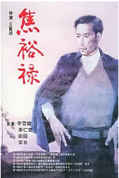
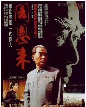
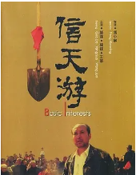
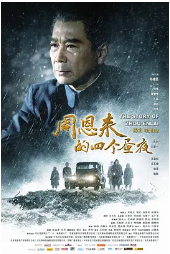

## 

[豆瓣评分: ]()

## 焦裕禄

[豆瓣评分: 7.8](https://movie.douban.com/subject/1439400/)

导演: [王冀邢](https://www.douban.com/personage/27482818/)

编剧: [方义华](https://www.douban.com/personage/27567851/)

主演: [李雪健](https://www.douban.com/personage/27480654/) / [李仁堂](https://www.douban.com/personage/27533386/) / [周宗印](https://www.douban.com/personage/27567852/) / [田元](https://www.douban.com/personage/30462382/) / [张英](https://www.douban.com/personage/27494939/) / [芦珊](https://www.douban.com/personage/35661532/) / [梁音](https://www.douban.com/personage/27494682/) / [邓雪松](https://www.douban.com/personage/35661514/)

上映日期: 1990

片长: 100分钟

## 周恩来

[豆瓣评分: 8.8](https://movie.douban.com/subject/1448751/)

导演: [丁荫楠](https://www.douban.com/personage/27529769/)

编剧: [丁荫楠](https://www.douban.com/personage/27529769/)

主演: [王铁成](https://www.douban.com/personage/27528684/) / [郑小娟](https://www.douban.com/personage/27558129/) / [张云立](https://www.douban.com/personage/27484892/) / [陈惠良](https://www.douban.com/personage/30438752/) / [蓝天野](https://www.douban.com/personage/27487425/) / [王卫国](https://www.douban.com/personage/27547601/) / [张艳丽](https://www.douban.com/personage/27561505/) / [卢奇](https://www.douban.com/personage/27482746/) / [顾岚](https://www.douban.com/personage/27504233/) / [林艺](https://movie.douban.com/subject_search?search_text=林艺) / [刘怀正](https://www.douban.com/personage/27483001/) / [高长利](https://www.douban.com/personage/27562912/) / [郭法曾](https://www.douban.com/personage/27483002/) / [于是之](https://www.douban.com/personage/27495469/) / [赵箭](https://www.douban.com/personage/27567139/) / [李维新](https://www.douban.com/personage/27561264/) / [王庚](https://movie.douban.com/subject_search?search_text=王庚) / [李雪红](https://www.douban.com/personage/27558130/) / [苏政](https://movie.douban.com/subject_search?search_text=苏政) / [王希钟](https://www.douban.com/personage/27528689/) / [黎继明](https://movie.douban.com/subject_search?search_text=黎继明) / [辛静](https://www.douban.com/personage/27558138/) / [刘群](https://www.douban.com/personage/30438750/) / [王慧源](https://movie.douban.com/subject_search?search_text=王慧源) / [郑振瑶](https://www.douban.com/personage/27529989/) / [刘锡田](https://www.douban.com/personage/27483297/) / [张安安](https://www.douban.com/personage/27558128/) / [吴若甫](https://www.douban.com/personage/27227568/)

上映日期: 1992-01-09(中国香港)

片长: 164分钟(中国大陆) / 249分钟(电视剪辑版)

## 信天游

[豆瓣评分: 7.6](https://movie.douban.com/subject/1891219/)

导演: [冯小宁](https://www.douban.com/personage/27481216/)

编剧: [张挺](https://www.douban.com/personage/27567248/) / [冯小宁](https://www.douban.com/personage/27481216/) / [何建明](https://www.douban.com/personage/30116808/)

主演: [郭达](https://www.douban.com/personage/27481215/) / [杨金锁](https://movie.douban.com/subject_search?search_text=杨金锁) / [王军](https://www.douban.com/personage/27567045/) / [李琴娥](https://movie.douban.com/subject_search?search_text=李琴娥) / [刘小微](https://www.douban.com/personage/27547676/) / [骆玉润](https://movie.douban.com/subject_search?search_text=骆玉润) / [肖建国](https://movie.douban.com/subject_search?search_text=肖建国) / [袁广成](https://www.douban.com/personage/30412296/) / [李明](https://www.douban.com/personage/27495340/)

上映日期: 2004-12-03(中国大陆)

片长: 96分钟

## 周恩来的四个昼夜

[豆瓣评分: 7.3](https://movie.douban.com/subject/19994974/)

导演: [陈力](https://www.douban.com/personage/27483091/)

编剧: [田运章](https://www.douban.com/personage/27552040/) / [江月](https://www.douban.com/personage/27552041/)

主演: [孙维民](https://www.douban.com/personage/27482930/) / [何伟](https://www.douban.com/personage/27547592/) / [储智博](https://www.douban.com/personage/27495214/) / [牛犇](https://www.douban.com/personage/27504331/) / [郝岩](https://www.douban.com/personage/27570870/) / [柏青](https://www.douban.com/personage/27483043/)

上映日期: 2013-07-16(中国大陆)

片长: 103分钟