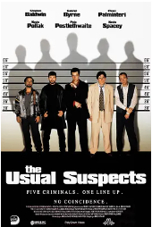
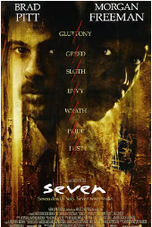
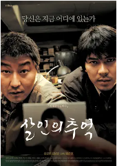
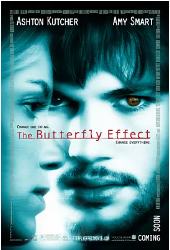
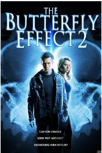
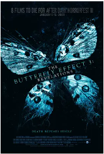
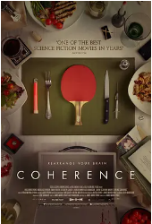

## 

[豆瓣评分: ]()

## 非常嫌疑犯

[豆瓣评分: 8.6](https://movie.douban.com/subject/1292214/)

导演: [布莱恩·辛格](https://www.douban.com/personage/27255349/)

编剧: [克里斯托弗·麦奎里](https://www.douban.com/personage/27504593/)

主演: [史蒂芬·鲍德温](https://www.douban.com/personage/27253905/) / [加布里埃尔·伯恩](https://www.douban.com/personage/27250637/) / [本尼西奥·德尔·托罗](https://www.douban.com/personage/27246760/) / [凯文·波拉克](https://www.douban.com/personage/27246905/) / [凯文·史派西](https://www.douban.com/personage/27260200/) / [查兹·帕尔明特瑞](https://www.douban.com/personage/27253944/) / [皮特·波斯尔思韦特](https://www.douban.com/personage/27212714/) / [苏茜·爱米斯](https://www.douban.com/personage/27219658/) / [吉安卡罗·埃斯波西托](https://www.douban.com/personage/27253904/) / [丹·哈达亚](https://www.douban.com/personage/27230978/) / [保罗·巴特尔](https://www.douban.com/personage/27231119/) / [卡尔·布瑞斯勒](https://www.douban.com/personage/27583462/) / [菲力浦·西蒙](https://www.douban.com/personage/27583463/) / [杰克·希勒](https://www.douban.com/personage/27583464/) / [克里斯汀·艾斯布鲁克](https://www.douban.com/personage/27291591/)

上映日期: 1995-01-25(圣丹斯电影节) / 1995-09-15(美国)

片长: 106分钟

## 七宗罪

[豆瓣评分: 8.8](https://movie.douban.com/subject/1292223/)

导演: [大卫·芬奇](https://www.douban.com/personage/27218213/)

编剧: [安德鲁·凯文·沃克](https://www.douban.com/personage/27228567/)

主演: [摩根·弗里曼](https://www.douban.com/personage/27260301/) / [布拉德·皮特](https://www.douban.com/personage/27260220/) / [凯文·史派西](https://www.douban.com/personage/27260200/) / [格温妮斯·帕特洛](https://www.douban.com/personage/27224709/) / [安德鲁·凯文·沃克](https://www.douban.com/personage/27228567/) / [约翰·卡西尼](https://www.douban.com/personage/27508537/) / [雷格·E·凯蒂](https://www.douban.com/personage/27283238/) / [李·厄米](https://www.douban.com/personage/27261444/)

上映日期: 1995-09-22(美国)

片长: 127分钟

## 记忆碎片

[豆瓣评分: 8.7](https://movie.douban.com/subject/1304447/)

导演: [克里斯托弗·诺兰](https://www.douban.com/personage/27260291/)

编剧: [克里斯托弗·诺兰](https://www.douban.com/personage/27260291/) / [乔纳森·诺兰](https://www.douban.com/personage/27488802/)

主演: [盖·皮尔斯](https://www.douban.com/personage/27241420/) / [凯瑞-安·莫斯](https://www.douban.com/personage/27228308/) / [乔·潘托里亚诺](https://www.douban.com/personage/27255320/) / [小马克·布恩](https://www.douban.com/personage/27237844/) / [拉什·费加](https://www.douban.com/personage/27583716/) / [乔雅·福克斯](https://www.douban.com/personage/27215018/) / [斯蒂芬·托布罗斯基](https://www.douban.com/personage/27224786/) / [哈里特·桑塞姆·哈里斯](https://www.douban.com/personage/27305958/) / [托马斯·列农](https://www.douban.com/personage/27230945/) / [考乐姆·吉斯·雷尼](https://www.douban.com/personage/27255404/) / [金伯利·坎贝尔](https://www.douban.com/personage/27583717/) / [玛丽安妮·穆勒雷尔](https://www.douban.com/personage/27338080/) / [拉里·霍尔登](https://www.douban.com/personage/27250983/)

上映日期: 2000-09-05(威尼斯电影节) / 2000-10-20(英国) / 2001-05-25(美国)

片长: 113分钟

## 杀人回忆

[豆瓣评分: 8.9](https://movie.douban.com/subject/1300299/)

导演: [奉俊昊](https://www.douban.com/personage/27268658/)

编剧: [奉俊昊](https://www.douban.com/personage/27268658/) / [沈成宝](https://www.douban.com/personage/27481315/) / [金光林](https://www.douban.com/personage/27571120/)

主演: [宋康昊](https://www.douban.com/personage/27236979/) / [金相庆](https://www.douban.com/personage/27225150/) / [金雷夏](https://www.douban.com/personage/27419395/) / [宋在浩](https://www.douban.com/personage/27239498/) / [边希峰](https://www.douban.com/personage/27386652/) / [高瑞熙](https://www.douban.com/personage/27419377/) / [柳泰浩](https://www.douban.com/personage/27486699/) / [朴努植](https://www.douban.com/personage/27551236/) / [朴海日](https://www.douban.com/personage/27425036/) / [全美善](https://www.douban.com/personage/27244534/) / [徐永嬅](https://www.douban.com/personage/27482137/) / [崔钟律](https://www.douban.com/personage/30245465/) / [刘承睦](https://www.douban.com/personage/27570984/) / [申贤宗](https://www.douban.com/personage/34907809/) / [李在应](https://www.douban.com/personage/27252813/) / [郑仁仙](https://www.douban.com/personage/27399376/) / [吴龙](https://www.douban.com/personage/27544020/) / [朴真宇](https://www.douban.com/personage/27500389/) / [朴泰京](https://www.douban.com/personage/34951338/) / [沈成宝](https://www.douban.com/personage/27481315/)

上映日期: 2003-05-02(韩国)

片长: 132分钟

## 蝴蝶效应

[豆瓣评分: 8.9](https://movie.douban.com/subject/1292343/)

导演: [埃里克·布雷斯](https://www.douban.com/personage/27507544/) / [J·麦基·格鲁伯](https://www.douban.com/personage/27513833/)

编剧: [J·麦基·格鲁伯](https://www.douban.com/personage/27513833/) / [埃里克·布雷斯](https://www.douban.com/personage/27507544/)

主演: [阿什顿·库彻](https://www.douban.com/personage/27246771/) / [梅洛拉·沃尔特斯](https://www.douban.com/personage/27233011/) / [艾米·斯马特](https://www.douban.com/personage/27205738/) / [埃尔登·汉森](https://www.douban.com/personage/27255431/) / [威廉姆·李·斯科特](https://www.douban.com/personage/27215069/) / [约翰·帕特里克·阿梅多利](https://www.douban.com/personage/27205846/) / [艾琳·戈洛瓦娅](https://www.douban.com/personage/27224051/) / [凯文·G·施密特](https://www.douban.com/personage/27352384/) / [杰西·詹姆斯](https://www.douban.com/personage/27309586/) / [罗根·勒曼](https://www.douban.com/personage/27259351/) / [莎拉·威多斯](https://www.douban.com/personage/27583507/) / [杰克·凯斯](https://www.douban.com/personage/27583506/) / [卡梅隆·布莱特](https://www.douban.com/personage/27210290/) / [埃里克·斯托尔兹](https://www.douban.com/personage/27233551/) / [考乐姆·吉斯·雷尼](https://www.douban.com/personage/27255404/) / [凯文·杜兰](https://www.douban.com/personage/27219494/)

上映日期: 2004-01-23(美国)

片长: 113分钟 / 120分钟(导演剪辑版)

## 蝴蝶效应 2

[豆瓣评分: 6.2](https://movie.douban.com/subject/1578509/)

导演: [约翰·R·莱昂耐迪](https://www.douban.com/personage/27218238/)

编剧: [Michael D. Weiss](https://movie.douban.com/subject_search?search_text=Michael D. Weiss)

主演: [埃里克·里夫利](https://www.douban.com/personage/27228399/) / [埃莉卡·杜兰斯](https://www.douban.com/personage/27223673/) / [达斯汀·米利甘](https://www.douban.com/personage/27228406/) / [吉娜·赫尔顿](https://www.douban.com/personage/27237688/) / [林赛·麦克斯维尔](https://www.douban.com/personage/27255728/)

上映日期: 2006-10-10(美国)

片长: 92分钟

## 神探

[豆瓣评分: 8.5](https://movie.douban.com/subject/2027938/)

导演: [杜琪峰](https://www.douban.com/personage/27366073/) / [韦家辉](https://www.douban.com/personage/27223567/)

编剧: [韦家辉](https://www.douban.com/personage/27223567/) / [欧健儿](https://www.douban.com/personage/27531801/)

主演: [刘青云](https://www.douban.com/personage/27212942/) / [安志杰](https://www.douban.com/personage/27251120/) / [林家栋](https://www.douban.com/personage/27256092/) / [林熙蕾](https://www.douban.com/personage/27247123/) / [李国麟](https://www.douban.com/personage/27495115/) / [李彩宁](https://www.douban.com/personage/27437629/) / [陈慧珊](https://www.douban.com/personage/27225750/) / [林雪](https://www.douban.com/personage/27480239/) / [张兆辉](https://www.douban.com/personage/27211534/) / [刘锦玲](https://www.douban.com/personage/27317084/) / [郭少芸](https://www.douban.com/personage/27492253/) / [郑保瑞](https://www.douban.com/personage/27480351/)

上映日期: 2008-02-22(中国大陆) / 2007-11-29(中国香港) / 2007-09-06(威尼斯电影节)

片长: 90分钟 / 89分钟(国际版)

## 蝴蝶效应 3：启示

[豆瓣评分: 6.7](https://movie.douban.com/subject/3077413/)

导演: [塞斯·格罗斯曼](https://www.douban.com/personage/27256286/)

编剧: [Holly Brix](https://movie.douban.com/subject_search?search_text=Holly Brix)

主演: [克里斯·卡马克](https://www.douban.com/personage/27242202/) / [蕾切尔·敏纳](https://www.douban.com/personage/27228393/) / [Melissa Jones](https://movie.douban.com/subject_search?search_text=Melissa Jones)

上映日期: 2009-01-09

片长: 90 分钟 / Germany: 105 分钟(European Film Market)

## 彗星来的那一夜

[豆瓣评分: 8.6](https://movie.douban.com/subject/25807345/)

导演: [詹姆斯·沃德·布柯特](https://www.douban.com/personage/27569470/)

编剧: [詹姆斯·沃德·布柯特](https://www.douban.com/personage/27569470/) / [亚历克斯·马努吉安](https://www.douban.com/personage/27553912/)

主演: [艾米丽·芭尔多尼](https://www.douban.com/personage/27494500/) / [莫瑞·史特林](https://www.douban.com/personage/27357704/) / [尼古拉斯·布兰登](https://www.douban.com/personage/27205775/) / [劳伦·斯卡法莉娅](https://www.douban.com/personage/27566255/) / [伊丽莎白·格瑞斯](https://www.douban.com/personage/27261907/) / [雨果·阿姆斯特朗](https://www.douban.com/personage/27553913/) / [亚历克斯·马努吉安](https://www.douban.com/personage/27553912/) / [劳伦·马赫](https://www.douban.com/personage/27553914/)

上映日期: 2013-09-19(奇幻电影节) / 2014-08-06(美国)

片长: 89分钟

## 无双

[豆瓣评分: 8.0](https://movie.douban.com/subject/26425063/)

导演: [庄文强](https://www.douban.com/personage/27220431/)

编剧: [庄文强](https://www.douban.com/personage/27220431/)

主演: [周润发](https://www.douban.com/personage/27250655/) / [郭富城](https://www.douban.com/personage/27247145/) / [张静初](https://www.douban.com/personage/27222391/) / [冯文娟](https://www.douban.com/personage/27548835/) / [廖启智](https://www.douban.com/personage/27481227/) / [周家怡](https://www.douban.com/personage/27481006/) / [王耀庆](https://www.douban.com/personage/27494973/) / [方中信](https://www.douban.com/personage/27238843/) / [高捷](https://www.douban.com/personage/27499509/) / [邢佳栋](https://www.douban.com/personage/27493524/) / [张松枝](https://www.douban.com/personage/27503472/) / [张建声](https://www.douban.com/personage/27483766/) / [吴嘉龙](https://www.douban.com/personage/27420654/) / [孙佳君](https://www.douban.com/personage/27256427/)

上映日期: 2018-09-30(中国大陆) / 2018-10-04(中国香港)

片长: 130分钟

